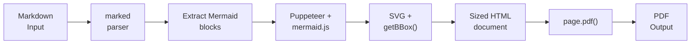

# Contributing to Markdown Mermaid Converter

Thanks for your interest in contributing! This guide covers everything you need to get started.

## Development Setup

1. **Clone the repository**
   ```bash
   git clone https://github.com/costajohnt/markdown-mermaid-converter.git
   cd markdown-mermaid-converter
   ```

2. **Install dependencies** (requires Node.js 18+)
   ```bash
   npm install
   ```
   This also runs a `postinstall` script that copies the bundled Mermaid IIFE into `src/vendor/`.

3. **Build**
   ```bash
   npm run build
   ```

## Testing

| Command              | Description                                |
|----------------------|--------------------------------------------|
| `npm test`           | Unit tests (CLI, converter, cache, renderer) |
| `npm run test:e2e`   | End-to-end tests with sample documents     |
| `npm run test:all`   | All unit + e2e tests                       |

Tests use Node.js built-in test runner (`node:test`) -- no extra framework needed.

## Linting

```bash
npm run lint
```

We use ESLint with `@typescript-eslint` in strict mode. Please fix any lint errors before submitting a PR.

## Code Style

- **TypeScript strict mode** is enabled in `tsconfig.json`.
- Follow the existing patterns in the codebase. Keep functions focused and well-typed.
- Use `const` by default; avoid `any` types.

## Project Structure

```
src/                    # CLI tool (main codebase)
  cli.ts                # CLI entry point (supports stdin)
  converter.ts          # Main pipeline: parse -> render -> assemble -> PDF
  mermaidRenderer.ts    # Renders Mermaid code to SVG via Puppeteer
  diagramCache.ts       # Simple cache for rendered diagrams
  types.ts              # Shared interfaces and constants
  vendor/               # Bundled mermaid.min.js (no CDN dependency)
mermaid-to-pdf-mcp/     # MCP server (thin wrapper that shells out to CLI)
test-fixtures/          # Sample files for testing
```

## Architecture

### Rendering Pipeline

The converter transforms Markdown to PDF through a multi-stage pipeline. The following diagram shows the data flow:



**Pipeline stages:**

1. **Parse** -- Markdown is split into text blocks and fenced Mermaid code blocks using a regex pattern.
2. **Render** -- Each Mermaid block is rendered to SVG in a headless Chromium page (via Puppeteer) using a locally bundled `mermaid.min.js` (no CDN dependency). Exact dimensions are extracted via `getBBox()`.
3. **Scale** -- SVGs are scaled to fit page width (never upscaled). Tall diagrams overflow across pages.
4. **Assemble** -- Sized SVGs are embedded in a styled HTML document. Headings are absorbed into diagram containers to prevent orphaning during PDF page breaks.
5. **PDF** -- A second Puppeteer browser instance generates the final PDF via `page.pdf()`.

### Module Responsibility Map

| File | Responsibility |
|------|---------------|
| `src/cli.ts` | CLI entry point -- parses arguments, reads from file or stdin, orchestrates conversion, handles `--json` output |
| `src/converter.ts` | Main pipeline -- coordinates parsing, rendering, HTML assembly, and PDF generation. Exposes the `Converter` class with `convertFile()` and `convertString()` methods |
| `src/mermaidRenderer.ts` | Mermaid-to-SVG rendering -- manages a singleton Puppeteer browser, loads bundled `mermaid.min.js`, returns SVG string with measured dimensions |
| `src/diagramCache.ts` | Diagram caching -- simple in-memory cache keyed by mermaid code + theme, avoids re-rendering duplicate diagrams |
| `src/types.ts` | Shared types and constants -- `ConversionOptions`, `PageSize`, `RenderedDiagram`, defaults, validation constants, `CliJsonOutput` interface |
| `src/vendor/mermaid.min.js` | Bundled Mermaid IIFE (v11.x) -- copied from `node_modules` by postinstall script, no network dependency at runtime |
| `mermaid-to-pdf-mcp/` | MCP server -- thin wrapper that shells out to the CLI binary, exposes `convert_markdown_to_pdf` tool |

## Submitting a Pull Request

1. **Create a feature branch** from `main`.
2. Make your changes with clear, focused commits.
3. Ensure **all tests pass** (`npm run test:all`) and **lint is clean** (`npm run lint`).
4. Open a PR targeting the `main` branch.
5. Describe what your PR does and why. Link any related issues.

## Reporting Issues

Use [GitHub Issues](https://github.com/costajohnt/markdown-mermaid-converter/issues). Include:
- Steps to reproduce
- Expected vs. actual behavior
- Node.js version and OS
- Sample Markdown input (if applicable)

## License

By contributing, you agree that your contributions will be licensed under the [MIT License](LICENSE).
