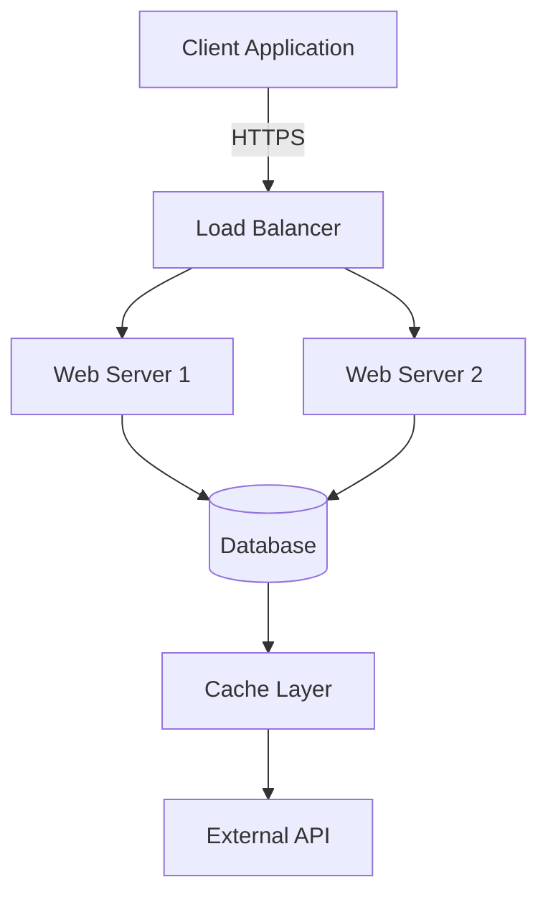

# Mermaid to PDF CLI Tool

Transform your Markdown documentation with Mermaid diagrams into professional PDFs with perfectly rendered diagrams embedded as high-quality images.


## 🚀 Quick Installation

### Install CLI Tool Globally

```bash
npm install -g mermaid-to-pdf-cli
```

### Basic Usage

```bash
# Convert a markdown file to PDF
mermaid-to-pdf document.md

# Custom output file and options
mermaid-to-pdf document.md -o output.pdf -t dark -q high

# Show help
mermaid-to-pdf --help
```

## ✨ Features

- 📄 **Smart Conversion**: Convert Markdown files to PDF with full formatting preservation
- 🎨 **Diagram Rendering**: Automatically detect and render Mermaid diagrams as high-quality images
- ⚡ **Performance Optimized**: Browser pooling and diagram caching for 30% faster conversion
- 🖥️ **Command Line Interface**: Easy-to-use CLI with progress reporting
- 🔧 **Configurable**: Customizable quality, themes, page sizes, and output paths
- 🛡️ **Enterprise Ready**: Input validation, security features, and comprehensive error handling

## 📋 CLI Options

```bash
Usage: mermaid-to-pdf <input.md> [options]

Options:
  -o, --output <file>    Output PDF file path (default: input.pdf)
  -t, --theme <theme>    Mermaid theme (default: light)
  -q, --quality <level>  PDF quality: draft, standard, high (default: high)
  -p, --page <size>      Page size: A4, Letter, Legal (default: A4)
  -h, --help            Show this help message

Examples:
  mermaid-to-pdf document.md
  mermaid-to-pdf document.md -o output.pdf -t dark -q high
```

## 📝 Example Usage

### Simple Flowchart

Create a file `example.md`:

```markdown
# Project Documentation

## System Architecture



This flowchart shows our system architecture with load balancing.
```

Convert to PDF:

```bash
mermaid-to-pdf example.md -o architecture.pdf -t dark -q high
```

## 🔧 Requirements

### System Requirements
- **Node.js**: 18.x or higher
- **Operating System**: Windows 10+, macOS 10.14+, or Linux (Ubuntu 18.04+)
- **Memory**: Minimum 2GB RAM (4GB recommended)
- **Disk Space**: 100MB free space

### Dependencies
- **Puppeteer**: 23.0.2+ (for browser automation)
- **Marked**: 12.0.0+ (for Markdown parsing)

## 📄 License

MIT License - see [LICENSE](LICENSE) file for details.

## 🔗 Links

- **Repository**: [https://github.com/costajohnt/mermaid-to-pdf-cli](https://github.com/costajohnt/mermaid-to-pdf-cli)
- **Issues**: [GitHub Issues](https://github.com/costajohnt/mermaid-to-pdf-cli/issues)
- **Mermaid Documentation**: [https://mermaid.js.org/](https://mermaid.js.org/)