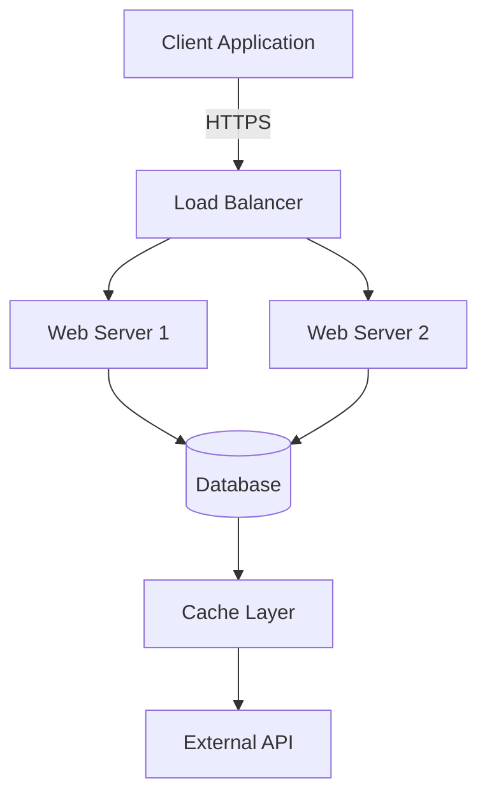

# Mermaid to PDF Tools

Transform your Markdown documentation with Mermaid diagrams into professional PDFs with perfectly rendered diagrams embedded as high-quality images.


## 🚀 Quick Installation

### CLI Tool (Command Line)

```bash
npm install -g mermaid-to-pdf-cli
```

**Usage:**
```bash
# Convert a markdown file to PDF
mermaid-to-pdf document.md

# Custom output file and options
mermaid-to-pdf document.md -o output.pdf -t dark -q high
```

### MCP Server (For LLMs like Claude Desktop)

```bash
npm install -g mermaid-to-pdf-mcp-server
```

**Claude Desktop Setup:** Add to `claude_desktop_config.json`:
```json
{
  "mcpServers": {
    "mermaid-to-pdf": {
      "command": "mermaid-to-pdf-mcp",
      "args": []
    }
  }
}
```

## ✨ Features

### Core Features
- 📄 **Smart Conversion**: Convert Markdown files to PDF with full formatting preservation
- 🎨 **Diagram Rendering**: Automatically detect and render Mermaid diagrams as high-quality images
- ⚡ **Performance Optimized**: Browser pooling and diagram caching for 30% faster conversion
- 🔧 **Configurable**: Customizable quality, themes, page sizes, and output paths
- 🛡️ **Enterprise Ready**: Input validation, security features, and comprehensive error handling

### CLI Tool Features
- 🖥️ **Command Line Interface**: Easy-to-use CLI with progress reporting
- 📁 **File-based**: Convert individual Markdown files to PDF
- 🚀 **Standalone**: No dependencies on external services

### MCP Server Features
- 🤖 **LLM Optimized**: Built-in custom instructions guide LLMs on best practices
- 🔌 **MCP Compatible**: Works with Claude Desktop and other MCP clients
- 📝 **Content-based**: Convert Markdown content directly (no file I/O required)
- 🎯 **Smart Guidance**: Provides workflow recommendations for creating visual documentation
- 🔧 **Multiple Tools**: 5 specialized tools for different conversion needs
- 🛡️ **Protocol Compliant**: Proper JSON-RPC communication with stderr logging

## 📋 CLI Options

```bash
Usage: mermaid-to-pdf <input.md> [options]

Options:
  -o, --output <file>    Output PDF file path (default: input.pdf)
  -t, --theme <theme>    Mermaid theme (default: light)
  -q, --quality <level>  PDF quality: draft, standard, high (default: high)
  -p, --page <size>      Page size: A4, Letter, Legal (default: A4)
  -h, --help            Show this help message

Examples:
  mermaid-to-pdf document.md
  mermaid-to-pdf document.md -o output.pdf -t dark -q high
```

## 📝 Example Usage

### Simple Flowchart

Create a file `example.md`:

```markdown
# Project Documentation

## System Architecture



This flowchart shows our system architecture with load balancing.
```

Convert to PDF:

```bash
mermaid-to-pdf example.md -o architecture.pdf -t dark -q high
```

## 🤖 MCP Server Usage

### For LLMs (Recommended Workflow)

When a user asks for documentation with diagrams:

1. **Get custom instructions** (LLMs call this automatically):
   ```json
   {"name": "get_custom_instructions", "arguments": {}}
   ```

2. **Create rich Markdown content** with appropriate Mermaid diagrams:
   - Flowcharts for processes and workflows
   - Sequence diagrams for system interactions
   - Class diagrams for software architecture  
   - ER diagrams for database designs

3. **Convert to professional PDF**:
   ```json
   {
     "name": "convert_markdown_to_pdf",
     "arguments": {
       "markdown": "# My Document\n\n```mermaid\nflowchart TD\n    A[Start] --> B[End]\n```",
       "options": {
         "quality": "high",
         "theme": "light"
       }
     }
   }
   ```

### Available MCP Tools

- **`convert_markdown_to_pdf`**: Convert content to PDF (returns base64)
- **`convert_markdown_file_to_pdf`**: Convert file to file  
- **`extract_mermaid_diagrams`**: Get individual diagram images
- **`validate_mermaid_syntax`**: Check diagram syntax
- **`get_custom_instructions`**: Get LLM guidance for optimal usage

### Smart Guidance for LLMs

The MCP server provides built-in instructions that guide LLMs to:
- **Create comprehensive documentation** with appropriate diagrams
- **Follow proven workflows** for visual content creation
- **Use the right diagram types** for different scenarios
- **Optimize PDF output** with proper quality and formatting settings

**Example**: When user says *"Create API documentation"*, the LLM will automatically:
1. Create Markdown with API architecture diagrams
2. Add sequence diagrams for key endpoints  
3. Include authentication flow charts
4. Convert everything to a professional PDF

## 🔧 Requirements

### System Requirements
- **Node.js**: 18.x or higher
- **Operating System**: Windows 10+, macOS 10.14+, or Linux (Ubuntu 18.04+)
- **Memory**: Minimum 2GB RAM (4GB recommended)
- **Disk Space**: 100MB free space

### Dependencies
- **Puppeteer**: 23.0.2+ (for browser automation)
- **Marked**: 12.0.0+ (for Markdown parsing)

## 📄 License

MIT License - see [LICENSE](LICENSE) file for details.

## 🔗 Links

- **Repository**: [https://github.com/costajohnt/mermaid-to-pdf-vscode](https://github.com/costajohnt/mermaid-to-pdf-vscode)
- **Issues**: [GitHub Issues](https://github.com/costajohnt/mermaid-to-pdf-vscode/issues)
- **CLI Package**: [mermaid-to-pdf-cli](https://www.npmjs.com/package/mermaid-to-pdf-cli)
- **MCP Package**: [mermaid-to-pdf-mcp-server](https://www.npmjs.com/package/mermaid-to-pdf-mcp-server)
- **Mermaid Documentation**: [https://mermaid.js.org/](https://mermaid.js.org/)