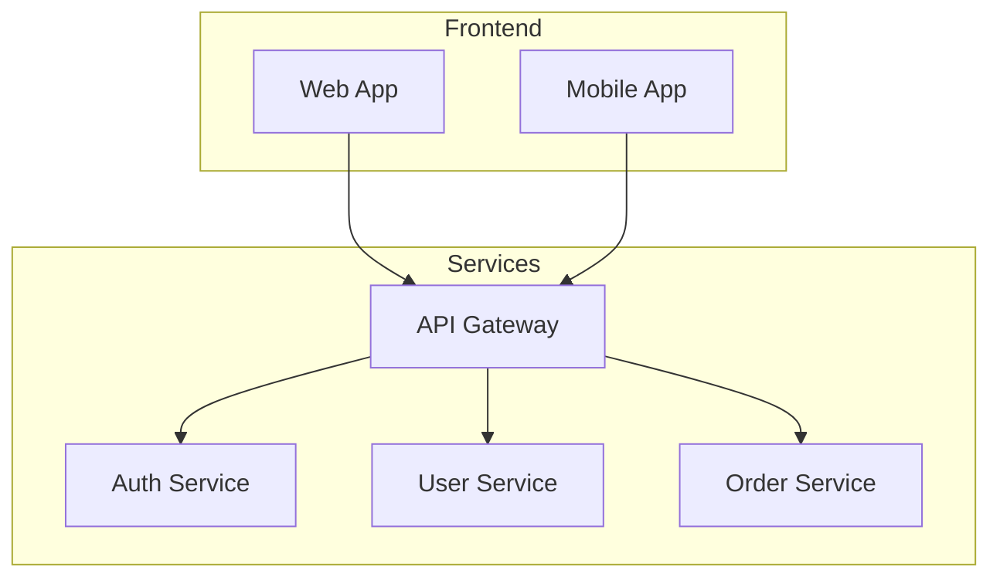
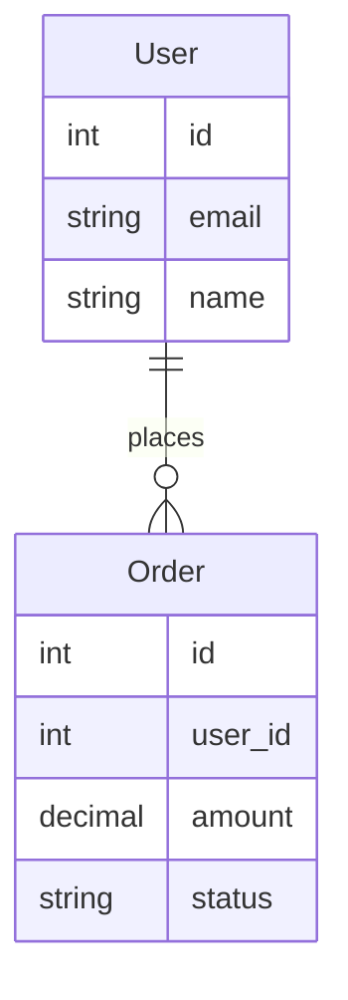

# Mermaid to PDF Tools

Transform your ideas into professional PDF documents with beautiful diagrams - just by asking for them.


## 🤖 For AI Users

**The magic way**: Just ask your AI to create PDF documents with diagrams. The AI will automatically write beautiful documentation and convert it to PDF for you.

### For Claude Desktop Users

1. **Install the MCP server:**
   ```bash
   npm install -g mermaid-to-pdf-mcp-server
   ```

2. **Add to Claude Desktop config** (`claude_desktop_config.json`):
   ```json
   {
     "mcpServers": {
       "mermaid-to-pdf": {
         "command": "mermaid-to-pdf-mcp",
         "args": []
       }
     }
   }
   ```

3. **Restart Claude Desktop**

### For Claude Code Users

If you use Claude Code, you can configure the MCP server using Claude Code's built-in MCP management:

1. **Install the MCP server:**
   ```bash
   npm install -g mermaid-to-pdf-mcp-server
   ```

2. **Add the MCP server to Claude Code:**

   **Option A: User scope (available across all projects):**
   ```bash
   claude mcp add --scope user mermaid-to-pdf mermaid-to-pdf-mcp
   ```

   **Option B: Project scope (for a specific project, creates `.mcp.json`):**
   ```bash
   # Navigate to your project directory first
   claude mcp add --scope project mermaid-to-pdf mermaid-to-pdf-mcp
   ```

   **Option C: Local scope (private to you in current project):**
   ```bash
   # Navigate to your project directory first  
   claude mcp add --scope local mermaid-to-pdf mermaid-to-pdf-mcp
   ```

3. **Verify the server is configured:**
   ```bash
   claude mcp list
   ```

**Alternative: Manual Configuration**

You can also create a `.mcp.json` file in your project root:
```json
{
  "mcpServers": {
    "mermaid-to-pdf": {
      "command": "mermaid-to-pdf-mcp",
      "args": []
    }
  }
}
```

### How to Use

Simply ask Claude to create PDF documents with visuals. Here are some examples:

**"Create a PDF document that explains how Twitter works with diagrams."**

**"Make a PDF guide for our new employee onboarding process with flowcharts."** 

**"Generate a PDF that documents our API architecture with sequence diagrams."**

**"Create a project timeline PDF with Gantt charts for the Q1 roadmap."**

The AI will automatically:
- Write comprehensive documentation in Markdown
- Add relevant Mermaid diagrams (flowcharts, sequences, ERDs, etc.)
- Convert everything to a professional PDF
- Return the PDF file to you

### What Makes This Special

- **No manual work**: Just describe what you want
- **Professional quality**: High-resolution diagrams, proper formatting
- **Multiple diagram types**: Flowcharts, sequence diagrams, database schemas, timelines
- **Instant results**: From idea to polished PDF in seconds
- **Smart AI guidance**: The AI knows best practices for visual documentation

---

## 🖥️ For Developers (Command Line)

**The direct way**: Convert your existing Markdown files with Mermaid diagrams to PDF.

### Installation

```bash
npm install -g mermaid-to-pdf-cli
```

### Basic Usage

```bash
# Convert any markdown file to PDF
mermaid-to-pdf your-document.md

# With custom options
mermaid-to-pdf document.md -o output.pdf -t dark -q high
```

### CLI Options

```bash
Usage: mermaid-to-pdf <input.md> [options]

Options:
  -o, --output <file>    Output PDF file path (default: input.pdf)
  -t, --theme <theme>    Mermaid theme (default: light)
  -q, --quality <level>  PDF quality: draft, standard, high (default: high)
  -p, --page <size>      Page size: A4, Letter, Legal (default: A4)
  -h, --help            Show this help message
```

---

## ✨ Features

### What You Get
- 📄 **Professional PDFs**: Clean typography and proper formatting
- 🎨 **Crisp Diagrams**: High-resolution rendering (2x scale factor)
- ⚡ **Fast Performance**: Browser pooling and diagram caching
- 🔧 **Configurable**: Custom themes, quality levels, and page sizes
- 🛡️ **Reliable**: Comprehensive error handling and validation

### Supported Diagram Types
- **Flowcharts**: Process flows, decision trees, workflows
- **Sequence Diagrams**: API interactions, user journeys, system communications
- **Class Diagrams**: Software architecture, object relationships
- **ER Diagrams**: Database schemas, data relationships
- **Gantt Charts**: Project timelines, milestones, schedules
- **State Diagrams**: System states, user interface flows
- **Git Graphs**: Development workflows, branching strategies

---

## 🎯 Perfect For

### Business Users (with AI)
- **Project documentation** with timelines and process flows
- **System overviews** for stakeholders with architecture diagrams
- **Process documentation** with clear visual workflows
- **Training materials** with step-by-step diagrams

### Technical Teams (CLI or AI)
- **API documentation** with sequence diagrams and examples
- **System architecture** documentation with component diagrams
- **Database documentation** with ER diagrams and schemas
- **Development workflows** with git flow diagrams

### Content Creators
- **Technical tutorials** with explanatory diagrams
- **Product specifications** with user flow diagrams
- **Research reports** with data flow visualizations
- **Presentation materials** in PDF format

---

## 🚀 Examples

### With AI (Recommended)
Just ask Claude:

> "Create a PDF that explains our microservices architecture. Include a system overview diagram, database relationships, and API interaction flows."

Claude will create something like this automatically, then convert it to PDF:

```markdown
# Microservices Architecture Guide

## System Overview
Our platform uses a distributed microservices architecture...



## Database Design
The system uses separate databases for each service...


```

### With CLI
Create `architecture.md` with your content, then:
```bash
mermaid-to-pdf architecture.md -q high -t light
```

---

## 🔧 Requirements

- **Node.js**: 18.x or higher
- **Operating System**: Windows 10+, macOS 10.14+, or Linux (Ubuntu 18.04+)
- **Memory**: 2GB RAM minimum (4GB recommended)

---

## 🔗 Links

- **Repository**: [https://github.com/costajohnt/mermaid-to-pdf-vscode](https://github.com/costajohnt/mermaid-to-pdf-vscode)
- **Issues**: [GitHub Issues](https://github.com/costajohnt/mermaid-to-pdf-vscode/issues)
- **CLI Package**: [mermaid-to-pdf-cli](https://www.npmjs.com/package/mermaid-to-pdf-cli)
- **MCP Package**: [mermaid-to-pdf-mcp-server](https://www.npmjs.com/package/mermaid-to-pdf-mcp-server)
- **Mermaid Documentation**: [https://mermaid.js.org/](https://mermaid.js.org/)

---

## 📄 License

MIT License - see [LICENSE](LICENSE) file for details.