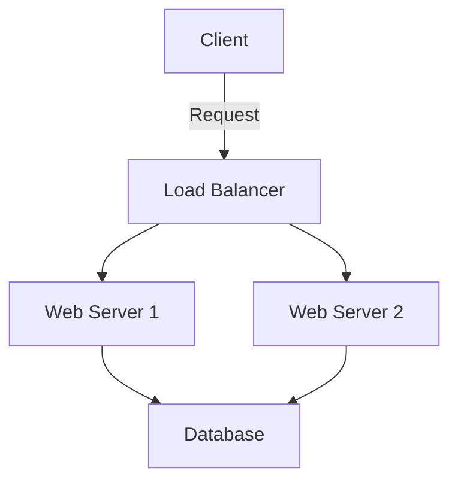
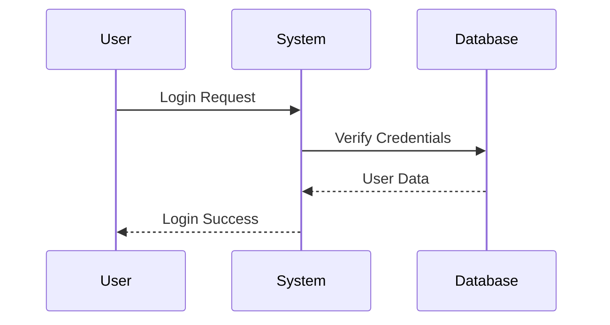

# Mermaid to PDF - VSCode Extension

Convert Markdown files with Mermaid diagrams to beautiful PDFs with properly rendered diagram images.


## Features

- 📄 Convert Markdown files to PDF
- 🎨 Automatically render Mermaid diagrams as images
- 📊 Embed rendered diagrams directly in the PDF
- 🖱️ Right-click context menu integration
- 📁 Works with files in the explorer and active editor

## Usage

### Convert from Editor
1. Open a Markdown file containing Mermaid diagrams
2. Right-click in the editor
3. Select "Convert Markdown to PDF with Mermaid"

### Convert from Explorer
1. Right-click on a Markdown file in the Explorer
2. Select "Convert Markdown to PDF with Mermaid"

### Command Palette
1. Open Command Palette (Ctrl/Cmd + Shift + P)
2. Type "Convert Markdown to PDF with Mermaid"
3. Press Enter

## Example Markdown with Mermaid

```markdown
# Project Documentation

## Architecture Overview



## Process Flow


```

## Requirements

- VSCode 1.74.0 or higher
- Node.js installed on your system

## Installation

1. Install from VSCode Marketplace (coming soon)
2. Or install from VSIX file

## Known Issues

- Large Mermaid diagrams may take a few seconds to render
- Some complex Mermaid features might not render perfectly

## Contributing

Contributions are welcome! Please feel free to submit a Pull Request.

## License

MIT