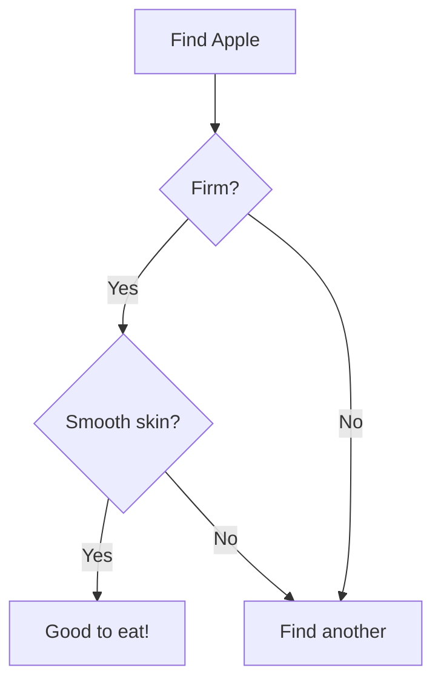
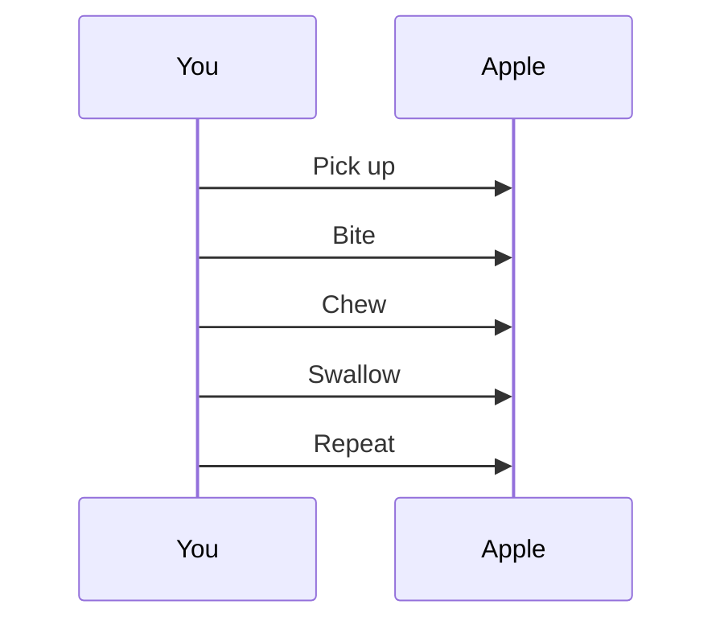

# How to Eat an Apple

## Apple Selection

## Preparation

## Eating Process

## Benefits

- **Immediate**: Fiber and energy
- **Short-term**: Vitamins and antioxidants  
- **Long-term**: Heart health and digestion

## Tips

1. **Spiral Method**: Rotate while eating
2. **Section Method**: Eat in quarters
3. Always wash first
4. Eat around the core

Remember: "An apple a day keeps the doctor away!"