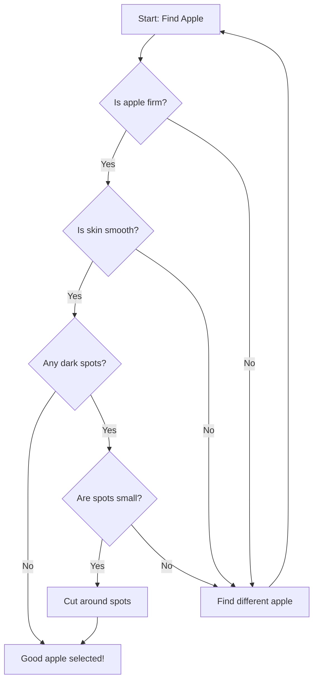
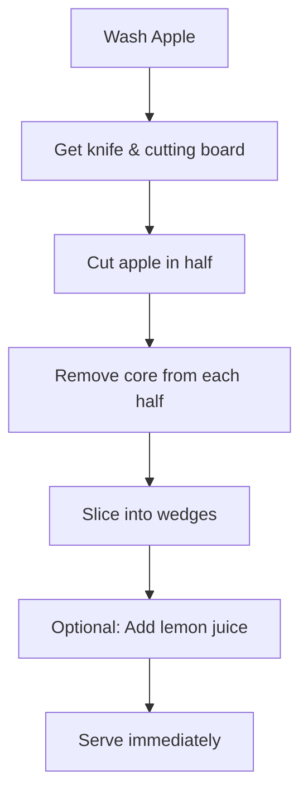
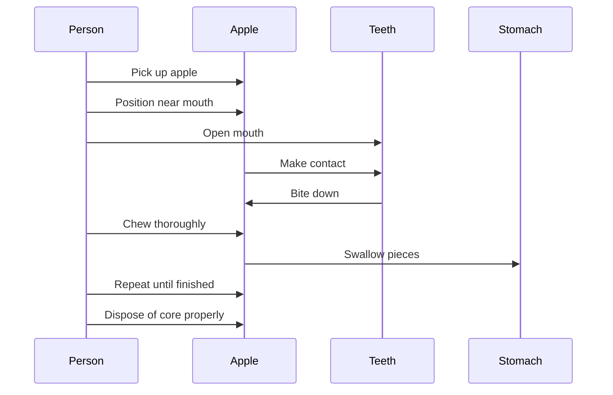
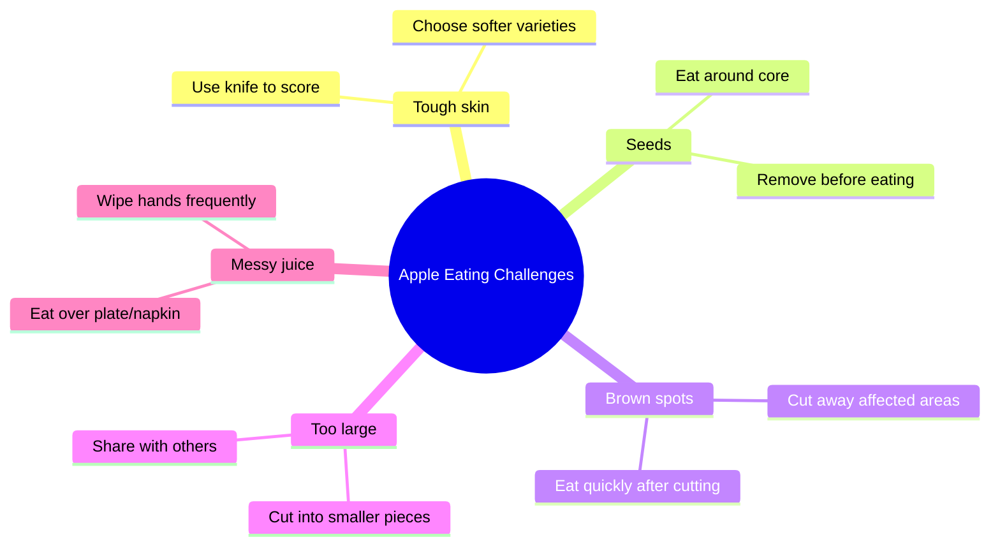
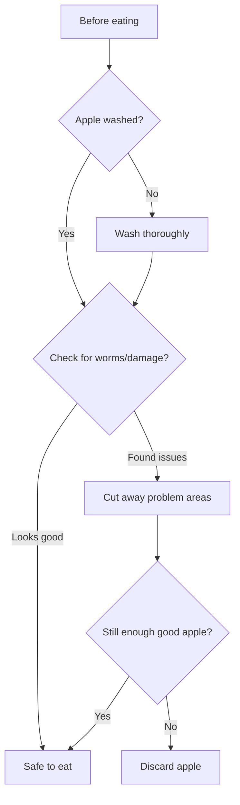

# The Complete Guide to Eating an Apple

## Overview

Eating an apple is a fundamental life skill that combines nutrition, technique, and enjoyment. This guide provides a comprehensive approach to apple consumption with visual flowcharts and best practices.

## Apple Selection Process



## Preparation Methods

### Method 1: Whole Apple Consumption


### Method 2: Sliced Apple



## The Eating Process



## Optimal Eating Techniques

### The Spiral Method
1. Start at the top of the apple
2. Rotate the apple as you take bites
3. Work your way down in a spiral pattern
4. Minimizes waste and ensures even consumption

### The Sectional Method
1. Divide apple mentally into 4-6 sections
2. Eat one section completely before moving to next
3. Rotate apple to access all sections
4. Good for maintaining grip and control

## Nutritional Benefits Timeline

```mermaid
timeline
    title Apple Consumption Benefits
    section Immediate (0-30 min)
        : Fiber intake begins
        : Natural sugars provide energy
        : Hydration from water content
    section Short-term (30 min - 2 hours)
        : Vitamin C absorption
        : Antioxidants enter bloodstream
        : Digestive benefits from fiber
    section Long-term (Daily consumption)
        : Improved heart health
        : Better digestion
        : Potential weight management
```

## Common Challenges and Solutions



## Apple Varieties and Eating Characteristics

| Variety | Firmness | Sweetness | Best Eating Method |
|---------|----------|-----------|-------------------|
| Honeycrisp | Very firm | Sweet | Whole or sliced |
| Gala | Medium | Sweet-tart | Whole |
| Granny Smith | Very firm | Tart | Sliced with accompaniment |
| Red Delicious | Soft | Sweet | Whole |
| Fuji | Firm | Very sweet | Whole or sliced |

## Safety Considerations



## Conclusion

Eating an apple successfully requires proper selection, optional preparation, and mindful consumption. Following these guidelines ensures maximum enjoyment and nutritional benefit from your apple-eating experience.

Remember: "An apple a day keeps the doctor away" - but only if eaten properly!