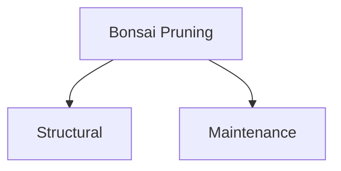

# Bonsai Trimming Guide

## Types of Pruning

### Structural Pruning
- Basic tree shaping
- Early spring timing
- Remove max 1/3 foliage

### Maintenance Pruning  
- Shape refinement
- Growing season timing
- Controls growth

## Tools Needed
- Concave cutters
- Pruning shears
- Bonsai scissors
- Cut paste