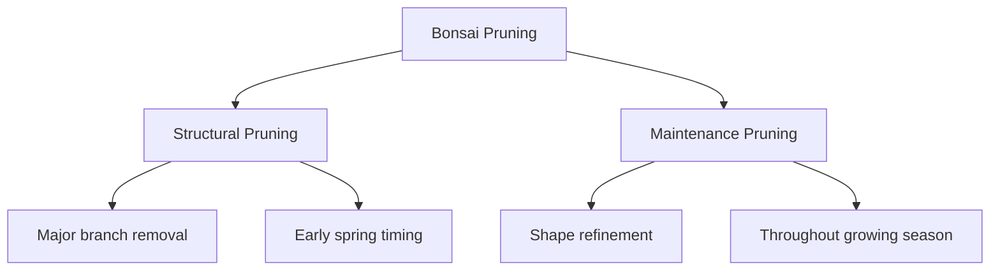
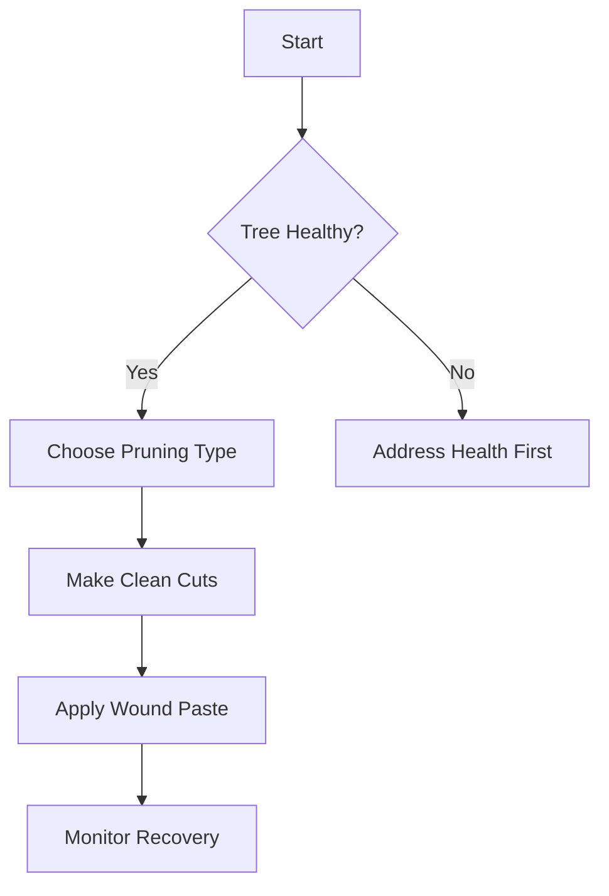

# Bonsai Tree Trimming Guide

## Introduction

Bonsai tree trimming is essential for maintaining the health and aesthetic appeal of miniature trees. This guide covers structural and maintenance pruning techniques.

## Pruning Types

### Structural Pruning
- **Purpose**: Basic tree shaping through large branch removal
- **Timing**: Early spring or late autumn
- **Safety**: Remove max 1/3 of foliage

### Maintenance Pruning
- **Purpose**: Shape refinement and growth control
- **Timing**: Throughout growing season
- **Benefit**: Counters apical dominance

## Process Flow

## Essential Tools
- **Concave Cutters**: Clean cuts that heal faster
- **Pruning Shears**: For thick branches
- **Bonsai Scissors**: Precision trimming
- **Cut Paste**: Wound protection

## Best Practices
- Never remove more than 1/3 of foliage in one session
- Use sharp, clean tools
- Allow full recovery between major pruning
- Seal large wounds with paste

## Common Mistakes
- Over-pruning (removing too much at once)
- Wrong timing (structural pruning during active growth)
- Poor cuts from dull tools
- Combining pruning with repotting