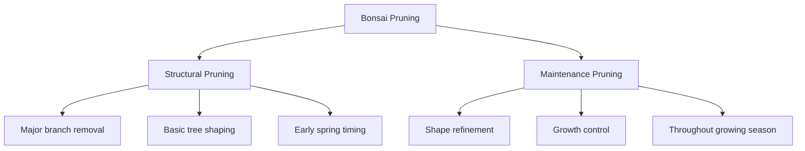
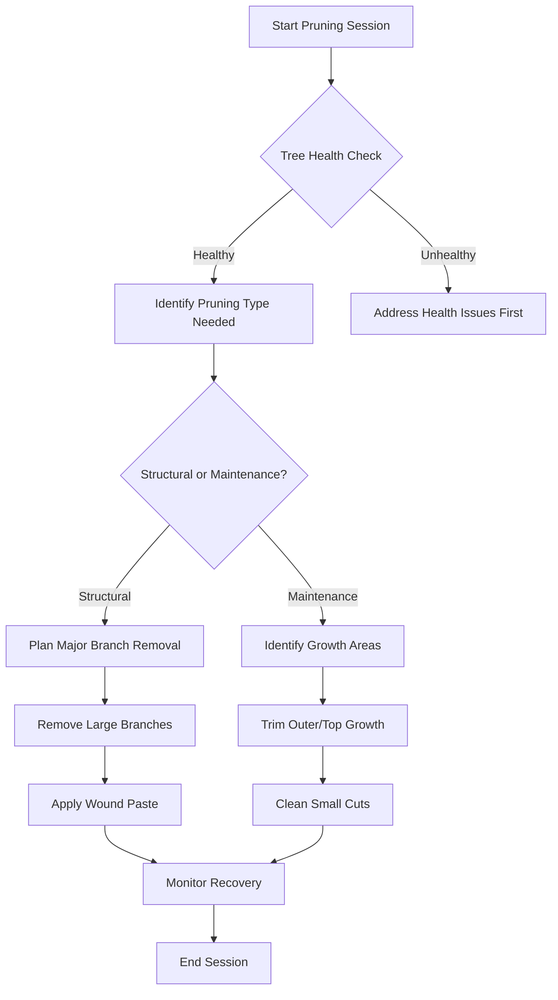
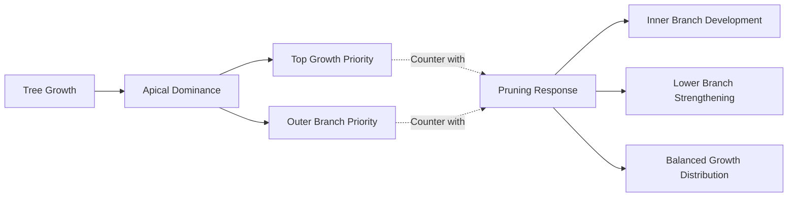
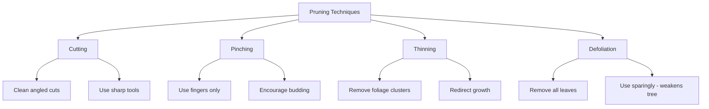
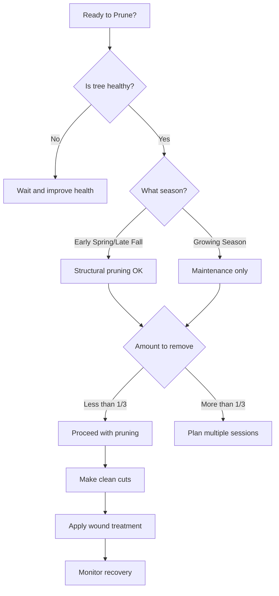

# Bonsai Tree Trimming Guide

## Introduction

Bonsai tree trimming is an essential skill for maintaining the health and aesthetic appeal of your miniature trees. This guide covers the fundamental techniques of structural and maintenance pruning that will help you shape and maintain your bonsai effectively.

## Types of Pruning

### Structural Pruning

**Purpose**: Gives the tree its basic shape and structure through removal of large branches.

**Timing**: Early spring or late autumn, before and after the growing season.

**Key Points**:
- Irreversible decisions - choose branches carefully
- Can remove up to 1/3 of foliage safely
- Allow full recovery before root work
- Creates the foundation design

### Maintenance Pruning

**Purpose**: Maintains and refines existing tree shape while controlling growth patterns.

**Timing**: Throughout the growing season (spring to fall for outdoor bonsai).

**Benefits**:
- Counters apical dominance
- Encourages inner branch development
- Maintains desired proportions

## Pruning Process Flow

## Growth Pattern Understanding

## Essential Tools and Techniques

### Required Tools
- **Concave Cutters**: For clean cuts that heal faster
- **Sharp Pruning Shears**: For thick branches  
- **Bonsai Scissors**: For precision trimming
- **Cut Paste**: For wound protection

### Pruning Techniques

## Best Practices Decision Tree

## Safety Guidelines

### Pruning Limits
- **Rule of thumb**: Never remove more than 1/3 of foliage in one session
- **Recovery time**: Allow full recovery between major pruning sessions
- **Wound care**: Always seal large cuts with protective paste

### Tool Maintenance
- Keep all tools sharp for clean cuts
- Clean tools between trees to prevent disease transmission
- Make precise cuts to minimize wound size

## Timing Calendar

```mermaid
gantt
    title Bonsai Pruning Schedule
    dateFormat  MM
    section Structural Pruning
    Optimal Window    :active, struct1, 02, 04
    Alternate Window  :struct2, 10, 11
    
    section Maintenance Pruning  
    Active Season     :maint1, 03, 10
    Reduced Activity  :maint2, 11, 02
```

## Common Mistakes to Avoid

- **Over-pruning**: Removing too much foliage at once
- **Wrong timing**: Structural pruning during active growth
- **Poor cuts**: Using dull tools or improper cutting angles  
- **Ignoring recovery**: Not allowing adequate healing time
- **Simultaneous stress**: Combining pruning with repotting

## Conclusion

Successful bonsai trimming requires patience, observation, and understanding of tree biology. By following these guidelines and practicing regularly, you'll develop the skills needed to maintain healthy, beautifully shaped bonsai trees. Remember that each cut is a design decision that will influence your tree's future development.