# Complete Guide to Cat Care

## Introduction

Cats make wonderful companions, bringing joy and comfort to millions of homes worldwide. This comprehensive guide covers everything you need to know about caring for your feline friend, from basic needs to advanced health management.

## Cat Life Stages

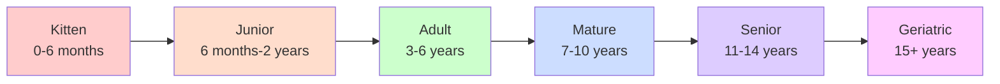

## Essential Cat Care Components

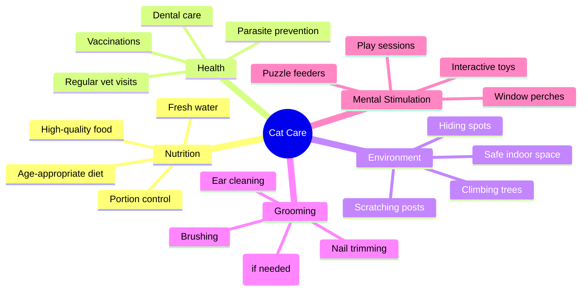

## Daily Care Routine

```mermaid
gantt
    title Daily Cat Care Schedule
    dateFormat HH:mm
    axisFormat %H:%M
    
    section Morning
    Feed breakfast           :done, morning1, 07:00, 30m
    Clean litter box         :done, morning2, 07:30, 15m
    Fresh water              :done, morning3, 07:45, 5m
    Play session             :active, morning4, 08:00, 20m
    
    section Afternoon
    Check food/water         :afternoon1, 12:00, 10m
    Interactive play         :afternoon2, 14:00, 15m
    
    section Evening
    Feed dinner              :evening1, 18:00, 30m
    Clean litter box         :evening2, 18:30, 15m
    Grooming session         :evening3, 19:00, 15m
    Play before bed          :evening4, 21:00, 20m
```

## Nutrition Guidelines

### Feeding Requirements by Age

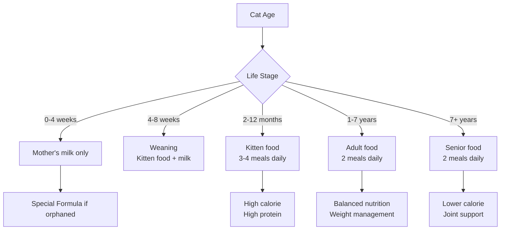

### Water Intake

- Cats need approximately 3.5-4.5 ounces of water per 5 pounds of body weight daily
- Fresh water should be available at all times
- Consider a water fountain to encourage drinking
- Wet food provides additional hydration

## Health Management

### Vaccination Schedule

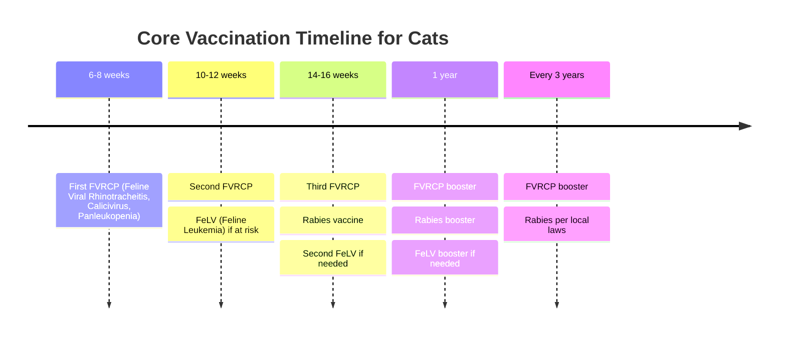

### Common Health Issues

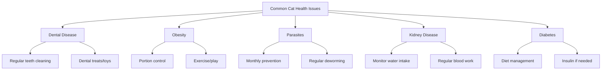

## Environmental Enrichment

### Indoor Cat Setup

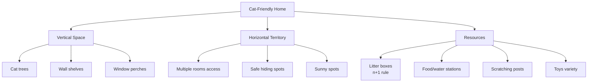

## Behavior and Training

### Understanding Cat Communication

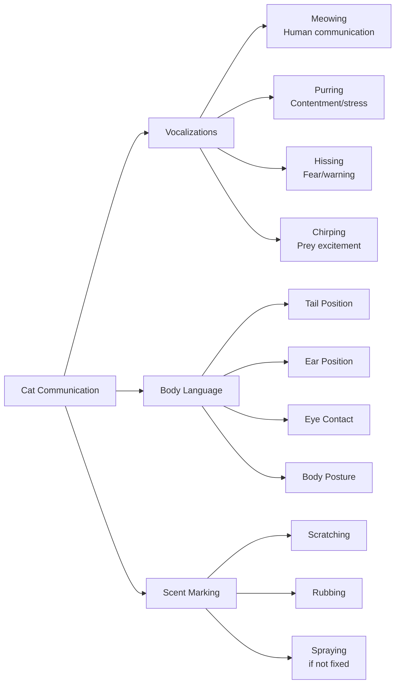

### Litter Box Management

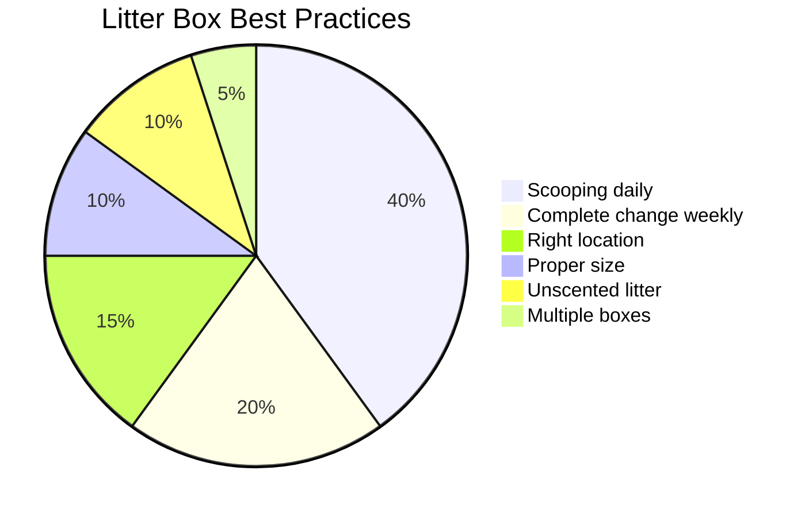

## Grooming Needs

### Grooming Frequency by Coat Type

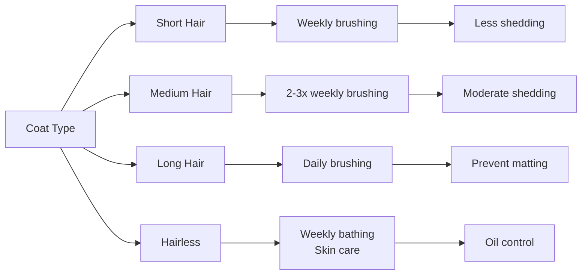

## Emergency Preparedness

### Emergency Kit Checklist

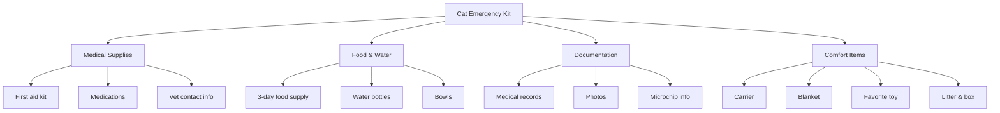

### Warning Signs - When to See a Vet

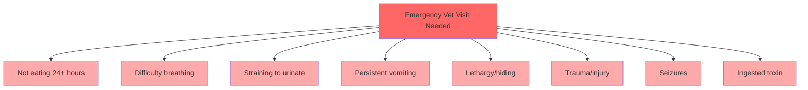

## Indoor vs Outdoor Considerations

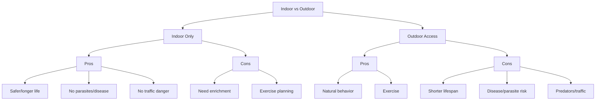

## Senior Cat Care

### Age-Related Changes

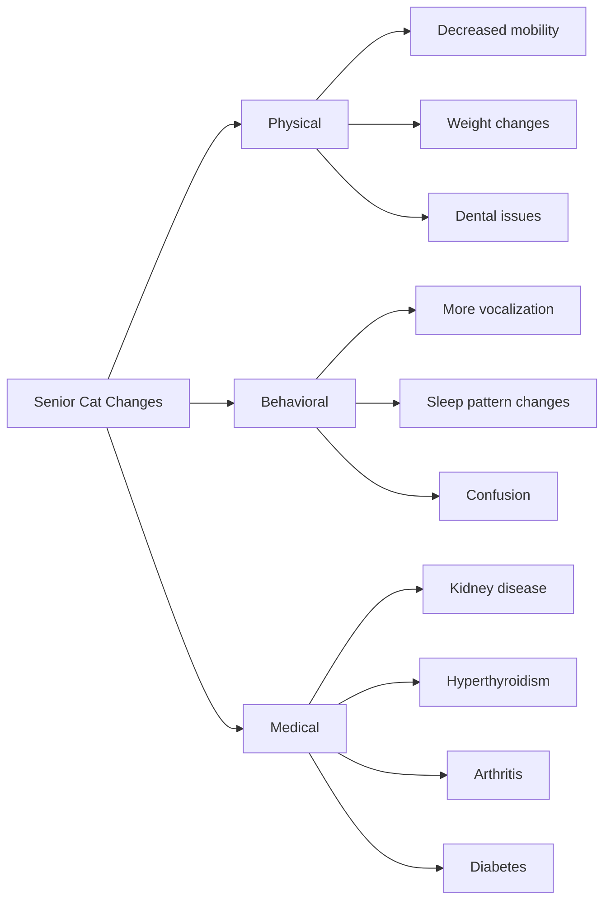

## Multi-Cat Household Management

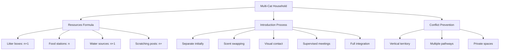

## Cost of Cat Ownership

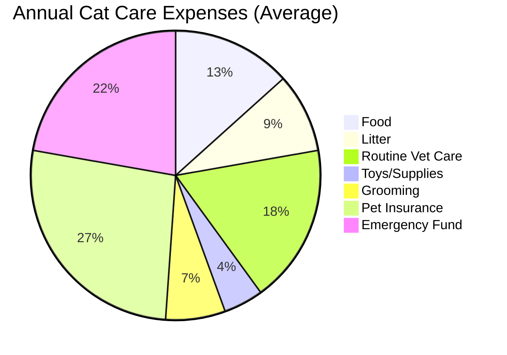

## Seasonal Care Considerations

```mermaid
gantt
    title Seasonal Cat Care Focus Areas
    dateFormat MM
    axisFormat %b
    
    section Winter
    Keep warm          :01, 03
    Monitor water      :01, 03
    Indoor enrichment  :01, 03
    
    section Spring
    Shedding season    :03, 03
    Flea prevention    :04, 02
    Allergy watch      :03, 03
    
    section Summer
    Hydration focus    :06, 03
    Cool spaces        :06, 03
    Parasite control   :06, 03
    
    section Fall
    Weight monitoring  :09, 03
    Coat preparation   :09, 03
    Heating safety     :10, 02
```

## Conclusion

Caring for a cat is a rewarding responsibility that requires attention to their physical, mental, and emotional needs. By following this comprehensive guide and maintaining regular veterinary care, you can ensure your feline companion lives a long, healthy, and happy life.

Remember that every cat is unique, and what works for one may not work for another. Pay attention to your cat's individual preferences and needs, and don't hesitate to consult with your veterinarian for personalized advice.

## Quick Reference Contact List

- **Emergency Vet**: [Your local 24-hour emergency clinic]
- **Regular Veterinarian**: [Your vet's contact information]
- **ASPCA Poison Control**: 1-888-426-4435
- **Local Animal Control**: [Your local number]
- **Pet Insurance**: [Your provider's information]

---

*This guide serves as a general reference. Always consult with a qualified veterinarian for specific health concerns or medical advice regarding your cat.*