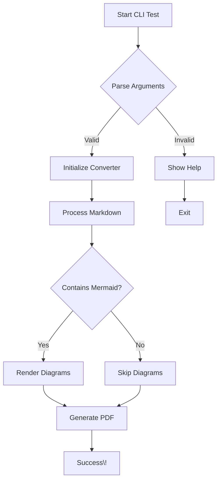
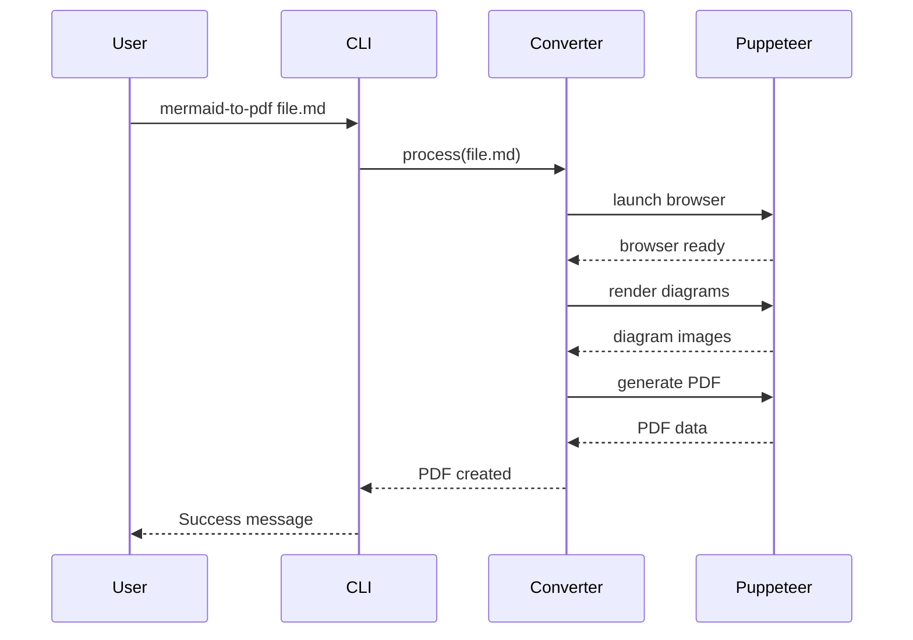
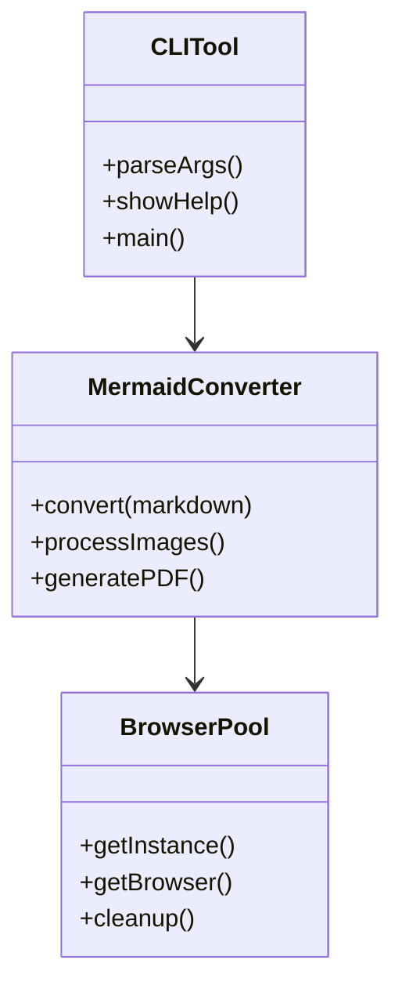

# Complex Test Document

This document tests various features of the CLI tool.

## Multiple Diagrams

### Flowchart


### Sequence Diagram


### Class Diagram


## Code Examples

### TypeScript
```typescript
interface ConversionOptions {
    quality: 'draft' | 'standard' | 'high';
    theme: 'light' | 'dark';
    pageSize: 'A4' | 'Letter' | 'Legal';
}

class MermaidToPdfCli {
    async convert(file: string, options: ConversionOptions): Promise<string> {
        console.log(`Converting ${file}...`);
        return 'success';
    }
}
```

### JavaScript
```javascript
function testCLI() {
    const args = process.argv.slice(2);
    if (args.length === 0) {
        console.log('Please provide a markdown file');
        return;
    }
    
    console.log(`Processing: ${args[0]}`);
}
```

## Features Tested

| Feature | Status | Notes |
|---------|--------|-------|
| Basic Markdown | ✅ | Headers, text, lists |
| Code Blocks | ✅ | Syntax highlighting |
| Mermaid Diagrams | ✅ | Multiple diagram types |
| Custom Output | ✅ | -o flag working |
| Theme Support | ✅ | -t flag working |
| Quality Settings | ✅ | -q flag working |

## Summary

This CLI tool successfully:
- Parses markdown files
- Renders Mermaid diagrams
- Generates high-quality PDFs
- Supports customization options
- Provides progress feedback

**CLI is production ready\! 🎉**
EOF < /dev/null