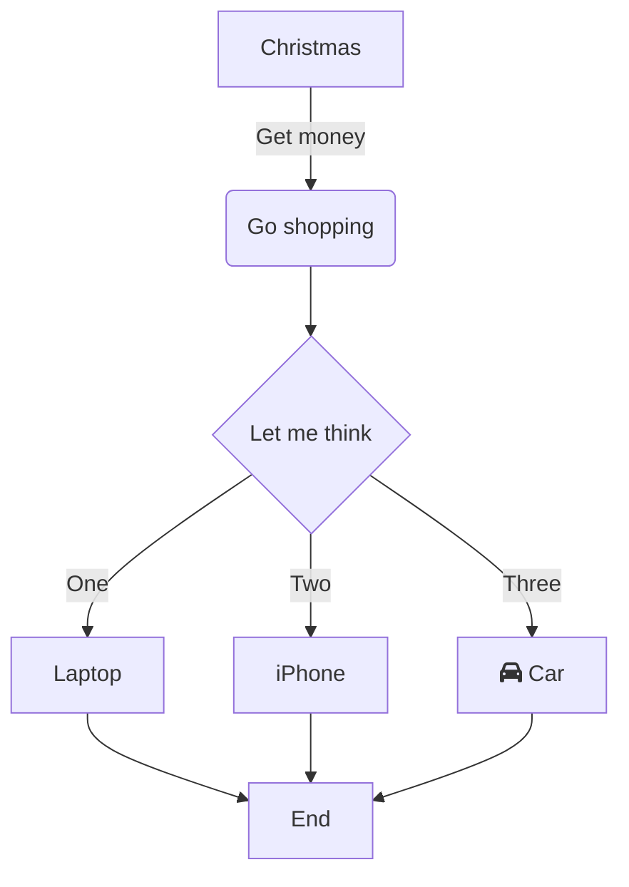
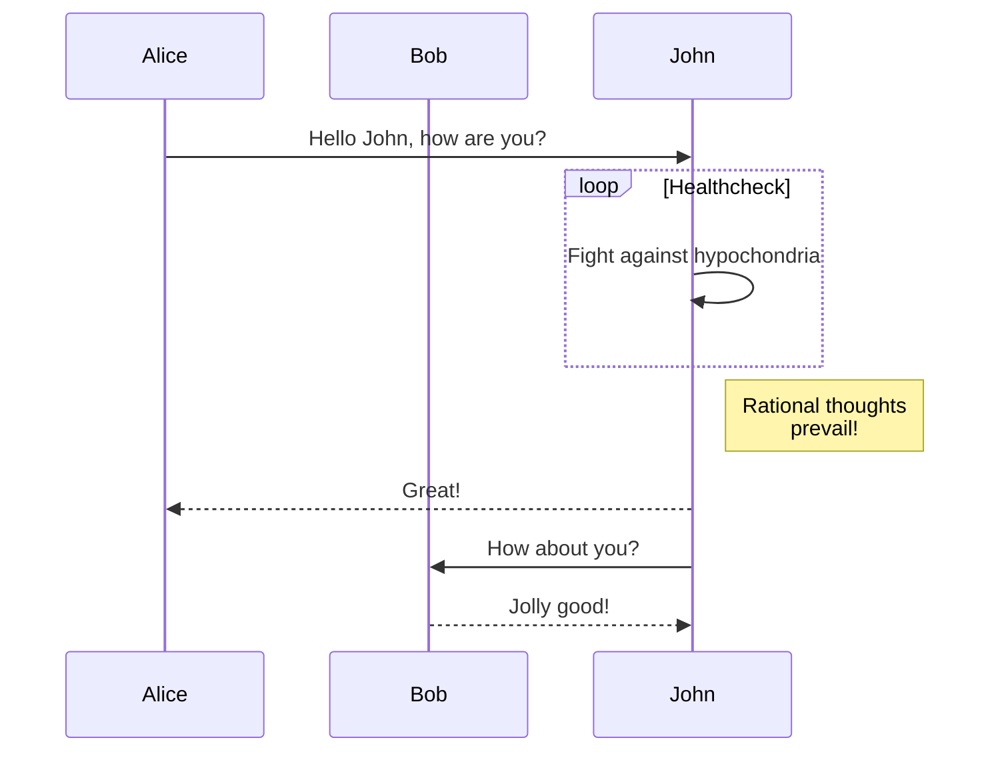
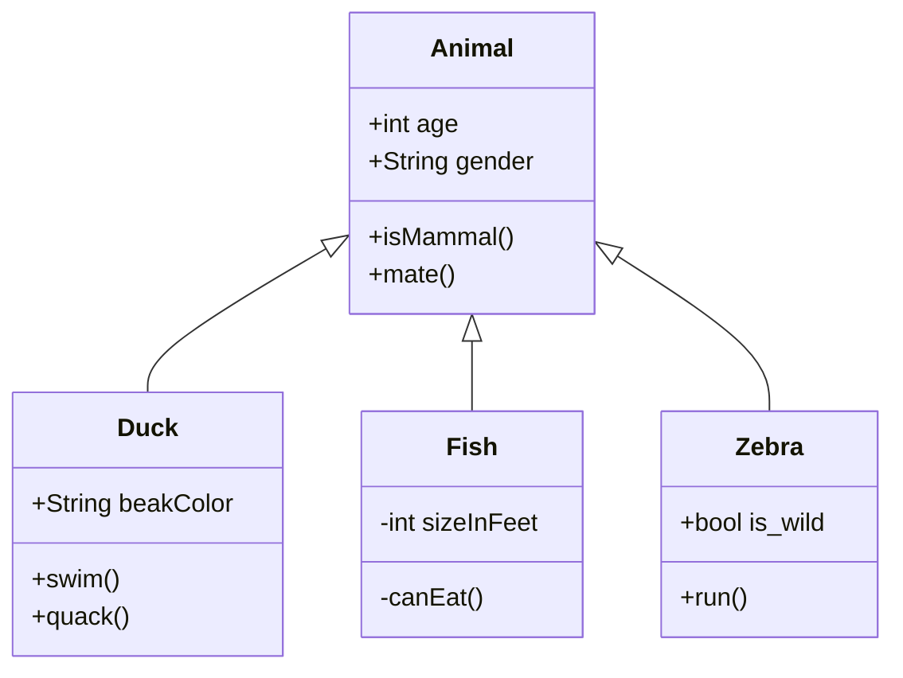

# Comprehensive Confluence Conversion Test

This document tests all aspects of the Markdown to Confluence conversion functionality.

## Text Formatting

Here we test various **bold**, *italic*, and ***bold italic*** text formatting.

We also test `inline code` and ~~strikethrough~~ text.

### Special Characters and Escaping

Text with special XML characters: `<script>`, `&amp;`, `"quotes"`, and `'apostrophes'`.

## Links and References

- [External link](https://github.com/costajohnt/markdown-mermaid-converter)
- [Link with title](https://docs.atlassian.com/atlassian-confluence/ "Confluence Documentation")
- Relative link: [README](./README.md)

## Code Blocks

### JavaScript
```javascript
function fibonacci(n) {
  if (n <= 1) return n;
  return fibonacci(n - 1) + fibonacci(n - 2);
}

console.log(fibonacci(10)); // 55
```

### Python
```python
def quick_sort(arr):
    if len(arr) <= 1:
        return arr
    pivot = arr[len(arr) // 2]
    left = [x for x in arr if x < pivot]
    middle = [x for x in arr if x == pivot]
    right = [x for x in arr if x > pivot]
    return quick_sort(left) + middle + quick_sort(right)

print(quick_sort([3,6,8,10,1,2,1]))
```

### No Language Specified
```
This is a code block without language specification.
It should still be properly formatted.
```

## Lists

### Unordered Lists
- First level item
- Another first level item
  - Second level item
  - Another second level item
    - Third level item
    - Another third level item
- Back to first level

### Ordered Lists
1. First numbered item
2. Second numbered item
   1. Nested numbered item
   2. Another nested numbered item
      1. Deep nested item
      2. Another deep nested item
3. Third numbered item

### Mixed Lists
1. Ordered item
   - Unordered sub-item
   - Another unordered sub-item
2. Another ordered item
   1. Ordered sub-item
   2. Another ordered sub-item

## Tables

### Simple Table
| Column 1 | Column 2 | Column 3 |
|----------|----------|----------|
| Row 1 A  | Row 1 B  | Row 1 C  |
| Row 2 A  | Row 2 B  | Row 2 C  |

### Complex Table with Formatting
| Feature | Status | Notes |
|---------|--------|-------|
| **Bold text** | ✅ Complete | Works correctly |
| *Italic text* | ✅ Complete | Also works |
| `Code spans` | ✅ Complete | `inline code` |
| Links | ✅ Complete | [GitHub](https://github.com) |

## Blockquotes

> This is a simple blockquote.

> This is a blockquote with **bold text** and *italic text*.
> 
> It can span multiple paragraphs.
> 
> > And even contain nested blockquotes.

## Mermaid Diagrams

### Flowchart


### Sequence Diagram


### Class Diagram


## Images

### External Image


### Image with Title


## Horizontal Rules

Content above the rule.

---

Content below the rule.

---

## Edge Cases

### Empty Elements
- 
- Empty list item above
- Normal list item

### Special Markdown
~~This text should be struck through~~

### Nested Formatting
**Bold with *italic inside* and `code` too**

### Long Content
Lorem ipsum dolor sit amet, consectetur adipiscing elit. Sed do eiusmod tempor incididunt ut labore et dolore magna aliqua. Ut enim ad minim veniam, quis nostrud exercitation ullamco laboris nisi ut aliquip ex ea commodo consequat. Duis aute irure dolor in reprehenderit in voluptate velit esse cillum dolore eu fugiat nulla pariatur. Excepteur sint occaecat cupidatat non proident, sunt in culpa qui officia deserunt mollit anim id est laborum.

## Final Notes

This document tests:
- ✅ All text formatting options
- ✅ Multiple mermaid diagram types
- ✅ Complex nested lists
- ✅ Tables with formatting
- ✅ Code blocks in various languages
- ✅ Blockquotes with nesting
- ✅ Links and images
- ✅ Special characters and edge cases

If all of these render correctly in Confluence Storage Format, the converter is working properly!