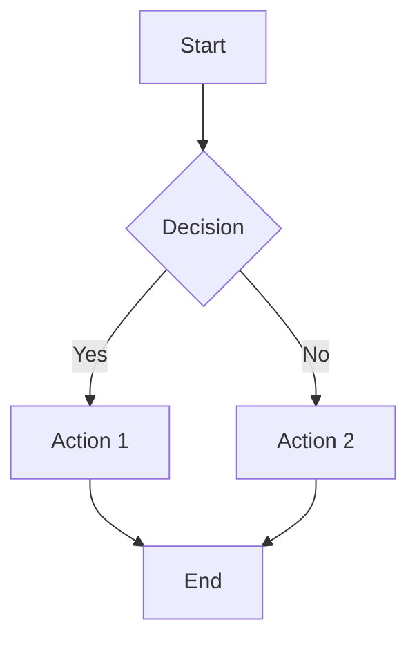

# My Confluence Test Document

This is a test document to upload to Confluence.

## Features Demonstrated

### Text Formatting
- **Bold text** works great
- *Italic text* is supported  
- `Inline code` formatting
- ~~Strikethrough text~~

### Lists
1. First numbered item
2. Second numbered item
   - Nested bullet point
   - Another nested item
3. Third numbered item

### Code Block
```javascript
function greetUser(name) {
    console.log(`Hello, ${name}!`);
    return `Welcome to Confluence, ${name}`;
}

greetUser("World");
```

### Mermaid Diagram


### Table
| Feature | Status | Notes |
|---------|--------|-------|
| Markdown | ✅ Working | All basic formatting |
| Mermaid | ✅ Working | Renders as images |
| Upload | 🧪 Testing | Manual test |

### Blockquote
> This is a blockquote to test how it renders in Confluence.
> It should appear as a quote block.

## Summary
This document tests the key features of the Markdown to Confluence converter.