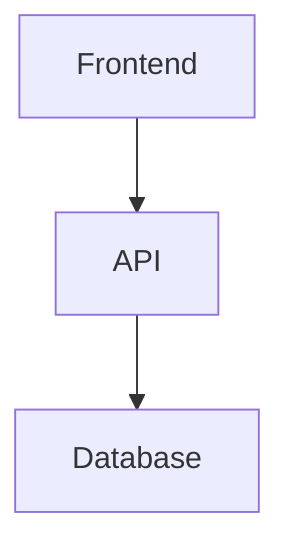
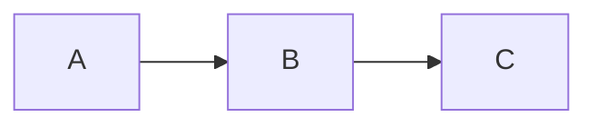
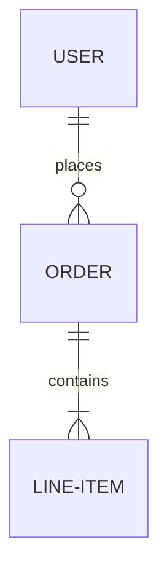
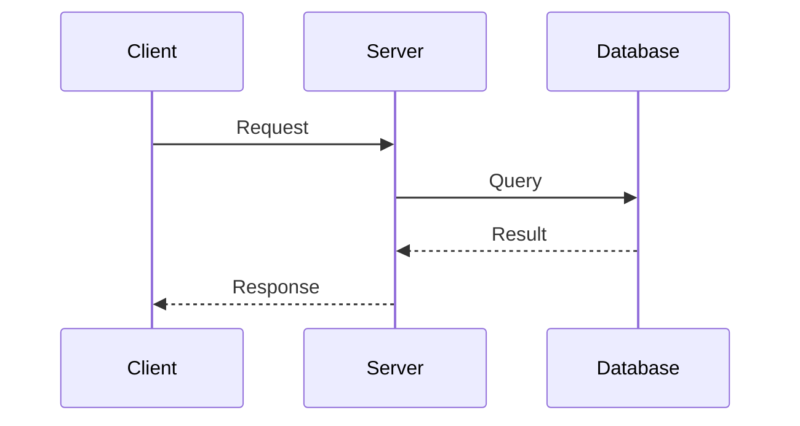

# Google Slides Integration

The Mermaid Converter CLI supports converting Markdown documents with Mermaid diagrams into Google Slides presentations. This feature automatically maps your document structure to presentation slides.

## Quick Start

1. **Set up authentication** (see [Authentication Guide](./GOOGLE_SLIDES_AUTH.md))
2. **Convert to Google Slides**:
   ```bash
   mermaid-converter convert document.md -f google-slides
   ```

## How It Works

### Slide Mapping Algorithm

The converter uses a smart algorithm to map your Markdown content to slides:

| Markdown Element | Slide Behavior |
|-----------------|----------------|
| Document title | Title slide |
| `# Heading 1` | Section slide |
| `## Heading 2` | New content slide |
| `### Heading 3+` | Content within current slide |
| Paragraphs | Bullet points or text blocks |
| Lists | Formatted bullet points |
| Code blocks | Dedicated code slide |
| Mermaid diagrams | Full-slide diagram |

### Example Conversion

**Input Markdown:**
```markdown
# My Presentation

## Introduction
Welcome to our presentation.

This covers the following topics:
- Topic 1
- Topic 2

## Architecture Diagram



## Conclusion
Thank you for your attention.
```

**Generated Slides:**
1. **Title slide**: "My Presentation"
2. **Content slide**: "Introduction" with bullet points
3. **Diagram slide**: Architecture diagram (full slide)
4. **Content slide**: "Conclusion" with text

## Usage Examples

### Basic Conversion

```bash
# Convert to Google Slides with default settings
mermaid-converter convert presentation.md -f google-slides

# Specify output file
mermaid-converter convert presentation.md -f google-slides -o my-presentation.json

# Use custom template options
mermaid-converter convert presentation.md -f google-slides \
  --template '{"theme": "modern", "makePublic": true}'
```

### Batch Conversion

```bash
# Convert multiple files
mermaid-converter convert docs/*.md -f google-slides --batch

# Process with concurrency
mermaid-converter convert docs/*.md -f google-slides --batch -c 2
```

### Watch Mode

```bash
# Auto-convert when files change
mermaid-converter watch docs/ -f google-slides
```

## Configuration Options

### Theme Selection

Choose from Google Slides built-in themes:

```bash
mermaid-converter convert doc.md -f google-slides \
  --template '{"theme": "modern"}'
```

**Available themes:**
- `simple` (default)
- `modern`
- `focus`
- `shift`
- `momentum`
- `paradigm`

### Layout Preferences

Control slide layouts:

```bash
mermaid-converter convert doc.md -f google-slides \
  --template '{"layoutPreference": "title_and_body"}'
```

**Available layouts:**
- `title_and_body` (default)
- `title_only`
- `blank`

### Sharing Options

Automatically share presentations:

```bash
# Share with specific users
mermaid-converter convert doc.md -f google-slides \
  --template '{"shareWithEmails": ["user1@example.com", "user2@example.com"]}'

# Make presentation public
mermaid-converter convert doc.md -f google-slides \
  --template '{"makePublic": true}'

# Combine sharing options
mermaid-converter convert doc.md -f google-slides \
  --template '{
    "shareWithEmails": ["team@company.com"],
    "makePublic": false
  }'
```

### Google Drive Organization

Organize presentations in specific folders:

```bash
mermaid-converter convert doc.md -f google-slides \
  --template '{"folderId": "1ABC123DEF456GHI789JKL"}'
```

To find a folder ID:
1. Open Google Drive
2. Navigate to the desired folder
3. Check the URL: `https://drive.google.com/drive/folders/FOLDER_ID_HERE`

## Output Format

The CLI saves presentation information as a JSON file containing:

```json
{
  "presentationId": "1ABC123...",
  "presentationUrl": "https://docs.google.com/presentation/d/1ABC123.../edit",
  "editUrl": "https://docs.google.com/presentation/d/1ABC123.../edit",
  "shareUrl": "https://docs.google.com/presentation/d/1ABC123.../edit?usp=sharing",
  "slideCount": 5,
  "title": "My Presentation"
}
```

## Advanced Features

### Complex Document Structures

The converter handles complex documents intelligently:

```markdown
# Main Title

## Section 1
Content for section 1

### Subsection 1.1
This becomes content within the section 1 slide

### Subsection 1.2
More content for the same slide

## Section 2
New slide for section 2



Final paragraph content
```

**Result**: 4 slides (title + 2 content slides + 1 diagram slide)

### Multiple Diagrams

Each diagram gets its own slide:

```markdown
# System Overview

## Database Schema


## Process Flow

```

**Result**: Both diagrams get dedicated slides with appropriate titles.

### Code Examples

Code blocks are formatted specially:

```markdown
# Implementation

## Python Example
```python
def fibonacci(n):
    if n <= 1:
        return n
    return fibonacci(n-1) + fibonacci(n-2)
```

## JavaScript Example
```javascript
const factorial = (n) => {
    return n <= 1 ? 1 : n * factorial(n - 1);
};
```
```

**Result**: Each code block gets a dedicated slide with syntax-appropriate formatting.

## Troubleshooting

### Common Issues

**"Could not load the default credentials"**
- Follow the [Authentication Guide](./GOOGLE_SLIDES_AUTH.md)
- Ensure `GOOGLE_APPLICATION_CREDENTIALS` is set correctly

**"The caller does not have permission"**
- Enable Google Slides API and Google Drive API
- Check service account permissions

**"Request exceeded quota"**
- Google APIs have rate limits
- Try again after a few minutes
- Consider upgrading your API quotas

**Diagrams not rendering**
- Check that Mermaid syntax is valid
- Verify diagram types are supported
- Look for timeout issues with complex diagrams

### Debugging Tips

**Use verbose mode:**
```bash
mermaid-converter convert doc.md -f google-slides --verbose
```

**Check API usage:**
- Monitor quotas in Google Cloud Console
- Review service account activity

**Validate Markdown:**
- Test with simple documents first
- Verify Mermaid diagrams render locally

## Performance Considerations

### Optimization Tips

1. **Limit concurrent requests**: Use `-c 1` for large batches
2. **Simplify complex diagrams**: Large diagrams may timeout
3. **Monitor API quotas**: Google has usage limits
4. **Use caching**: Multiple conversions of the same content are cached

### Scaling for Large Documents

For documents with many diagrams:

```bash
# Reduce concurrency to avoid timeouts
mermaid-converter convert large-doc.md -f google-slides -c 1

# Process in smaller batches
mermaid-converter convert chapter*.md -f google-slides --batch -c 1
```

## Integration Examples

### CI/CD Pipeline

```yaml
# GitHub Actions example
- name: Convert docs to Google Slides
  run: |
    npm install -g @mermaid-converter/cli
    mermaid-converter convert docs/presentation.md -f google-slides
  env:
    GOOGLE_APPLICATION_CREDENTIALS: ${{ secrets.GOOGLE_SERVICE_ACCOUNT_KEY }}
```

### Node.js Script

```javascript
const { exec } = require('child_process');

function convertToSlides(inputFile) {
  return new Promise((resolve, reject) => {
    exec(`mermaid-converter convert ${inputFile} -f google-slides`, 
      (error, stdout, stderr) => {
        if (error) reject(error);
        else resolve(stdout);
      });
  });
}

// Usage
convertToSlides('presentation.md')
  .then(result => console.log('Conversion completed:', result))
  .catch(error => console.error('Conversion failed:', error));
```

## API Reference

### Command Line Options

| Option | Description | Example |
|--------|-------------|---------|
| `-f google-slides` | Specify Google Slides format | Required |
| `--google-auth <path>` | Service account key file | Optional if using env var |
| `--template <json>` | Format-specific options | JSON string |
| `--overwrite` | Replace existing output | Boolean flag |
| `--verbose` | Detailed logging | Boolean flag |

### Template Options Schema

```typescript
interface GoogleSlidesOptions {
  title?: string;                    // Custom presentation title
  theme?: 'simple' | 'modern' | 'focus' | 'shift' | 'momentum' | 'paradigm';
  layoutPreference?: 'title_and_body' | 'title_only' | 'blank';
  shareWithEmails?: string[];        // Auto-share with users
  folderId?: string;                 // Google Drive folder ID
  makePublic?: boolean;              // Make publicly accessible
}
```

## Related Documentation

- [Authentication Guide](./GOOGLE_SLIDES_AUTH.md) - Set up Google Cloud credentials
- [CLI Usage Guide](./CLI_USAGE.md) - General CLI usage
- [Template System](./TEMPLATES.md) - Template customization
- [Troubleshooting](./TROUBLESHOOTING.md) - Common issues and solutions

## Contributing

To improve Google Slides integration:

1. **Report Issues**: Use [GitHub Issues](https://github.com/costajohnt/mermaid-to-pdf-vscode/issues)
2. **Feature Requests**: Suggest new slide mapping features
3. **Submit PRs**: Contribute improvements to the conversion algorithm

## Changelog

### Version 1.0.0
- ✅ Initial Google Slides integration
- ✅ Automatic slide mapping from markdown structure
- ✅ Mermaid diagram embedding
- ✅ Theme and layout customization
- ✅ Sharing and permissions management
- ✅ Batch processing support