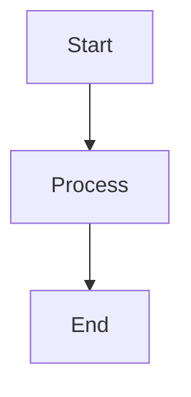

# Google Slides Authentication Guide

This guide explains how to set up Google Cloud credentials to use the Google Slides integration feature of the Mermaid Converter CLI.

## Overview

The Google Slides integration allows you to convert Markdown documents with Mermaid diagrams into Google Slides presentations. This requires authentication with Google Cloud APIs using a service account.

## Prerequisites

- A Google account
- Access to Google Cloud Console
- The Mermaid Converter CLI installed

## Step 1: Create a Google Cloud Project

1. Go to the [Google Cloud Console](https://console.cloud.google.com/)
2. Click "Select a project" at the top of the page
3. Click "NEW PROJECT"
4. Enter a project name (e.g., "mermaid-converter")
5. Click "CREATE"

## Step 2: Enable Required APIs

1. In your project, go to "APIs & Services" > "Library"
2. Search for and enable the following APIs:
   - **Google Slides API**
   - **Google Drive API**

For each API:
1. Click on the API name
2. Click "ENABLE"
3. Wait for the API to be enabled

## Step 3: Create a Service Account

1. Go to "APIs & Services" > "Credentials"
2. Click "CREATE CREDENTIALS" > "Service account"
3. Fill in the service account details:
   - **Name**: `mermaid-converter-service`
   - **Description**: `Service account for Mermaid Converter CLI`
4. Click "CREATE AND CONTINUE"
5. For the role, select "Editor" (or create a custom role with specific permissions)
6. Click "CONTINUE"
7. Skip the "Grant users access" section and click "DONE"

## Step 4: Generate Service Account Key

1. In the "Credentials" page, find your service account
2. Click on the service account email
3. Go to the "Keys" tab
4. Click "ADD KEY" > "Create new key"
5. Select "JSON" as the key type
6. Click "CREATE"
7. The JSON key file will be downloaded to your computer
8. **Important**: Store this file securely and never commit it to version control!

## Step 5: Set Up Authentication

### Option A: Environment Variable (Recommended)

1. Set the `GOOGLE_APPLICATION_CREDENTIALS` environment variable to point to your JSON key file:

```bash
export GOOGLE_APPLICATION_CREDENTIALS="/path/to/your/service-account-key.json"
```

2. Add this to your shell profile (`.bashrc`, `.zshrc`, etc.) to make it persistent.

### Option B: Command Line Parameter

Use the `--google-auth` parameter when running the CLI:

```bash
mermaid-converter convert document.md -f google-slides --google-auth /path/to/your/service-account-key.json
```

## Step 6: Test the Integration

Create a test Markdown file:

```markdown
# My Presentation

## Introduction
This is a test presentation.

## Diagram Example


## Conclusion
This concludes our test.
```

Convert it to Google Slides:

```bash
mermaid-converter convert test.md -f google-slides
```

If successful, you should see output similar to:

```
✅ Created Google Slides presentation: My Presentation (4 slides, 2.3s)
📄 Presentation URL: https://docs.google.com/presentation/d/[ID]/edit
✏️  Edit URL: https://docs.google.com/presentation/d/[ID]/edit
💾 Presentation details saved to: test_slides.json
```

## Troubleshooting

### "ADC (Application Default Credentials) could not be loaded"

This error means the service account credentials are not properly configured.

**Solutions:**
- Check that `GOOGLE_APPLICATION_CREDENTIALS` points to a valid JSON file
- Verify the JSON file contains valid service account credentials
- Use the `--google-auth` parameter to specify the path directly

### "The caller does not have permission"

This error means the service account doesn't have the required permissions.

**Solutions:**
- Ensure the Google Slides API and Google Drive API are enabled
- Check that the service account has the "Editor" role
- Try creating a custom role with these specific permissions:
  - `drive.files.create`
  - `drive.files.get`
  - `drive.permissions.create`
  - `presentations.presentations.create`
  - `presentations.presentations.batchUpdate`

### "Quota exceeded" or "Rate limit exceeded"

Google APIs have usage limits and quotas.

**Solutions:**
- Wait a moment and try again
- Check your API quotas in the Google Cloud Console
- Consider implementing retry logic or reducing request frequency

## Security Best Practices

1. **Never commit credentials to version control**
   - Add your JSON key file to `.gitignore`
   - Use environment variables or secure secret management

2. **Limit service account permissions**
   - Use the principle of least privilege
   - Create custom roles with only required permissions

3. **Rotate credentials periodically**
   - Generate new service account keys regularly
   - Delete old unused keys

4. **Monitor API usage**
   - Check the Google Cloud Console for unexpected usage
   - Set up alerts for quota usage

## Advanced Configuration

### Custom Themes and Layouts

The CLI supports various Google Slides themes:

```bash
mermaid-converter convert document.md -f google-slides \
  --template '{"theme": "modern", "layoutPreference": "title_and_body"}'
```

Available themes:
- `simple` (default)
- `modern`
- `focus`
- `shift`
- `momentum`
- `paradigm`

### Sharing Presentations

You can automatically share presentations with specific users:

```bash
mermaid-converter convert document.md -f google-slides \
  --template '{"shareWithEmails": ["user1@example.com", "user2@example.com"], "makePublic": false}'
```

### Organizing in Google Drive Folders

Specify a Google Drive folder ID to organize your presentations:

```bash
mermaid-converter convert document.md -f google-slides \
  --template '{"folderId": "1ABC123DEF456GHI789JKL"}'
```

## API Limits and Quotas

Google Slides API has the following default limits:
- **Requests per 100 seconds per user**: 100
- **Requests per 100 seconds**: 100

For higher usage, you may need to request quota increases in the Google Cloud Console.

## Support

If you encounter issues:

1. Check the [Google Cloud Console](https://console.cloud.google.com/) for API errors
2. Review the [Google Slides API documentation](https://developers.google.com/slides)
3. File an issue on the [project repository](https://github.com/costajohnt/mermaid-to-pdf-vscode/issues)

## Related Documentation

- [CLI Usage Guide](./CLI_USAGE.md)
- [Template System](./TEMPLATES.md)
- [Troubleshooting](./TROUBLESHOOTING.md)