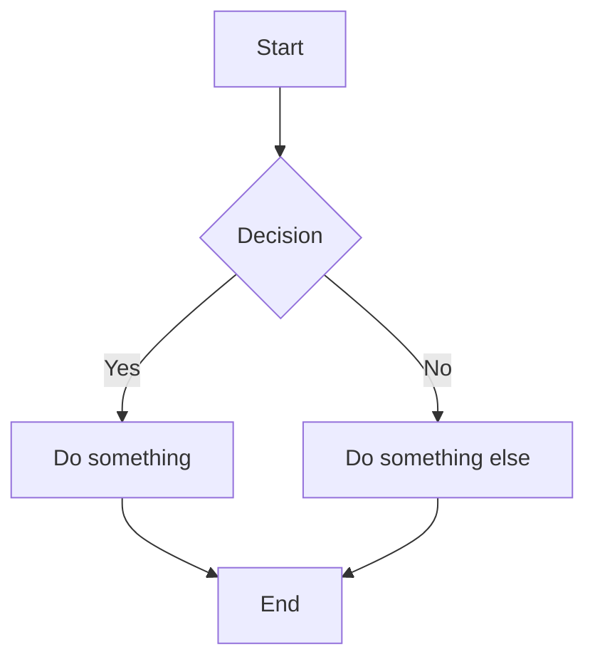
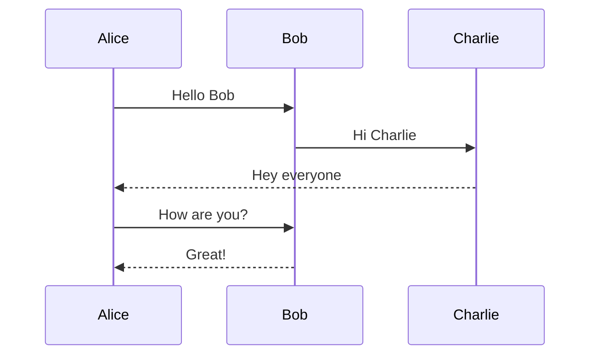
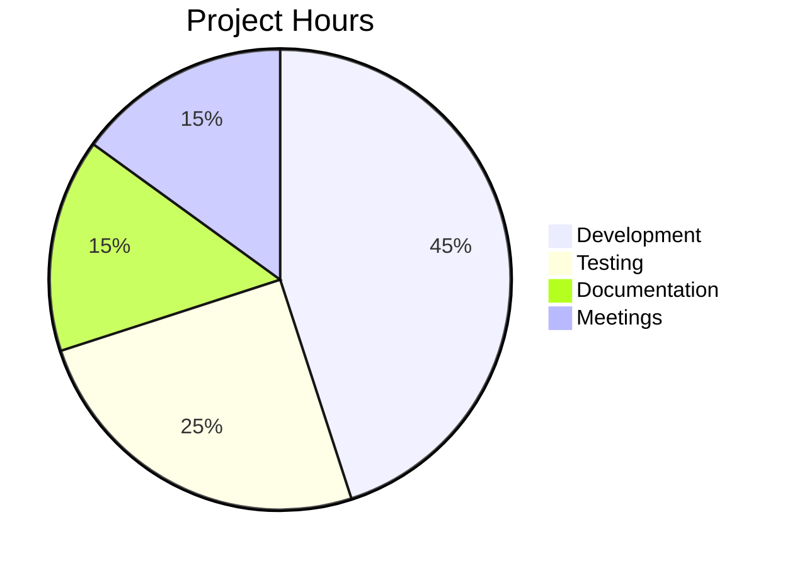
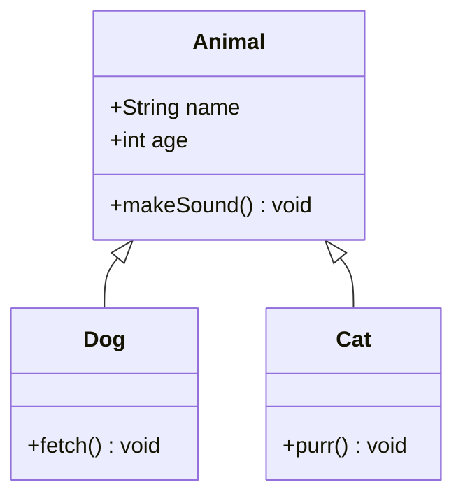

# SVG-First Rendering Redesign — Implementation Plan

> **For Claude:** REQUIRED SUB-SKILL: Use superpowers:executing-plans to implement this plan task-by-task.

**Goal:** Rewrite the markdown-mermaid-converter to use SVG extraction with measured dimensions instead of PNG screenshots, producing high-quality PDFs with correct diagram sizing.

**Architecture:** Parse markdown for mermaid blocks, render each to SVG in Puppeteer (extracting the SVG string + getBBox dimensions), apply width-first scaling, embed sized SVGs in a single HTML document, and generate PDF with page.pdf(). MCP server becomes a thin CLI wrapper.

**Tech Stack:** TypeScript, Puppeteer, Mermaid.js (bundled), marked, node:test

**Design doc:** `docs/plans/2026-02-24-svg-rendering-redesign.md`

---

### Task 1: Create types.ts — shared type definitions

**Files:**
- Create: `src/types.ts`

**Step 1: Write the types file**

```typescript
// src/types.ts

export interface ConversionOptions {
    theme: 'light' | 'dark';
    pageSize: 'A4' | 'Letter' | 'Legal';
    margins: {
        top: string;
        right: string;
        bottom: string;
        left: string;
    };
}

export interface RenderedDiagram {
    svgString: string;
    width: number;
    height: number;
}

export interface DiagramCacheEntry {
    diagram: RenderedDiagram;
    timestamp: number;
}

export interface PageDimensions {
    /** Full page width in px */
    pageWidth: number;
    /** Full page height in px */
    pageHeight: number;
    /** Usable content width after margins in px */
    contentWidth: number;
    /** Usable content height after margins in px */
    contentHeight: number;
}

export const PAGE_DIMENSIONS: Record<string, { widthMm: number; heightMm: number }> = {
    'A4': { widthMm: 210, heightMm: 297 },
    'Letter': { widthMm: 215.9, heightMm: 279.4 },
    'Legal': { widthMm: 215.9, heightMm: 355.6 },
};

export const DEFAULT_OPTIONS: ConversionOptions = {
    theme: 'light',
    pageSize: 'A4',
    margins: {
        top: '15mm',
        right: '15mm',
        bottom: '15mm',
        left: '15mm',
    },
};

/** Minimum scale factor before we allow vertical overflow rather than shrinking further */
export const MIN_SCALE = 0.6;
```

**Step 2: Verify it compiles**

Run: `cd /Users/johncosta/dev/mermaid-to-pdf-vscode && npx tsc --noEmit src/types.ts`
Expected: No errors

**Step 3: Commit**

```bash
git add src/types.ts
git commit -m "feat: add shared type definitions for SVG rendering pipeline"
```

---

### Task 2: Bundle mermaid.js locally

**Files:**
- Create: `src/vendor/` directory
- Modify: `package.json` (add mermaid as dependency)

**Step 1: Install mermaid as a dependency**

Run: `cd /Users/johncosta/dev/mermaid-to-pdf-vscode && npm install mermaid@11`

**Step 2: Create a script to copy the bundled mermaid.min.js to vendor/**

We need the browser-ready bundle, not the ESM module. After install, locate and copy it:

```bash
mkdir -p src/vendor
cp node_modules/mermaid/dist/mermaid.min.js src/vendor/mermaid.min.js
```

**Step 3: Verify the file exists and is usable**

Run: `head -1 src/vendor/mermaid.min.js | cut -c1-80`
Expected: Should show minified JS content (not an ESM import/export)

Note: If `mermaid.min.js` is ESM-only in v11, we may need to use the CDN download approach instead. Check the file and adapt. The goal is a self-contained browser bundle.

**Step 4: Add a postinstall script to package.json to keep vendor in sync**

In `package.json`, add to scripts:
```json
"postinstall": "mkdir -p src/vendor && cp node_modules/mermaid/dist/mermaid.min.js src/vendor/mermaid.min.js"
```

**Step 5: Commit**

```bash
git add src/vendor/mermaid.min.js package.json package-lock.json
git commit -m "feat: bundle mermaid.js locally for offline support"
```

---

### Task 3: Rewrite mermaidRenderer.ts — SVG extraction

This is the core change. The renderer now returns SVG strings with dimensions instead of saving PNG files.

**Files:**
- Rewrite: `src/mermaidRenderer.ts`
- Test: `src/mermaidRenderer.test.ts`

**Step 1: Write the failing test**

```typescript
// src/mermaidRenderer.test.ts
import { test, describe, after } from 'node:test';
import { strict as assert } from 'node:assert';
import { renderMermaidToSvg, closeBrowser } from './mermaidRenderer.js';

describe('mermaidRenderer', () => {
    after(async () => {
        await closeBrowser();
    });

    test('renders a simple flowchart to SVG with dimensions', async () => {
        const result = await renderMermaidToSvg('flowchart LR\n    A --> B');

        assert.ok(result.svgString.includes('<svg'), 'should contain SVG element');
        assert.ok(result.svgString.includes('</svg>'), 'should have closing SVG tag');
        assert.ok(result.width > 0, 'width should be positive');
        assert.ok(result.height > 0, 'height should be positive');
    });

    test('renders a sequence diagram to SVG', async () => {
        const result = await renderMermaidToSvg(
            'sequenceDiagram\n    Alice->>Bob: Hello\n    Bob-->>Alice: Hi'
        );

        assert.ok(result.svgString.includes('<svg'));
        assert.ok(result.width > 0);
        assert.ok(result.height > 0);
    });

    test('throws on invalid mermaid syntax', async () => {
        await assert.rejects(
            () => renderMermaidToSvg('this is not valid mermaid'),
            { message: /Failed to render/ }
        );
    });

    test('rejects empty input', async () => {
        await assert.rejects(
            () => renderMermaidToSvg(''),
            { message: /non-empty string/ }
        );
    });
});
```

**Step 2: Run test to verify it fails**

Run: `cd /Users/johncosta/dev/mermaid-to-pdf-vscode && npm run build && node --test dist/mermaidRenderer.test.js`
Expected: FAIL — `renderMermaidToSvg` and `closeBrowser` don't exist yet

**Step 3: Write the implementation**

```typescript
// src/mermaidRenderer.ts
import * as puppeteer from 'puppeteer';
import { readFileSync } from 'fs';
import { resolve, dirname } from 'path';
import { fileURLToPath } from 'url';
import { RenderedDiagram } from './types.js';

const __filename = fileURLToPath(import.meta.url);
const __dirname = dirname(__filename);

// Load bundled mermaid.js once at module level
const mermaidJsPath = resolve(__dirname, '../src/vendor/mermaid.min.js');
let mermaidJsSource: string;
try {
    mermaidJsSource = readFileSync(mermaidJsPath, 'utf-8');
} catch {
    // Fallback for when running from dist/
    const fallbackPath = resolve(__dirname, 'vendor/mermaid.min.js');
    mermaidJsSource = readFileSync(fallbackPath, 'utf-8');
}

let browser: puppeteer.Browser | null = null;

async function getBrowser(): Promise<puppeteer.Browser> {
    if (!browser || !browser.connected) {
        browser = await puppeteer.launch({
            headless: true,
            args: [
                '--no-sandbox',
                '--disable-setuid-sandbox',
                '--disable-dev-shm-usage',
                '--disable-gpu',
            ],
        });
    }
    return browser;
}

export async function closeBrowser(): Promise<void> {
    if (browser) {
        await browser.close().catch(() => {});
        browser = null;
    }
}

export async function renderMermaidToSvg(
    mermaidCode: string,
    theme: 'light' | 'dark' = 'light'
): Promise<RenderedDiagram> {
    if (!mermaidCode || typeof mermaidCode !== 'string' || !mermaidCode.trim()) {
        throw new Error('Invalid mermaid code: Code must be a non-empty string');
    }

    const b = await getBrowser();
    const page = await b.newPage();
    page.setDefaultTimeout(30000);

    try {
        const mermaidTheme = theme === 'dark' ? 'dark' : 'default';

        const html = `<!DOCTYPE html>
<html><head><meta charset="UTF-8"></head>
<body>
<div id="container"><div class="mermaid" id="diagram">${escapeHtml(mermaidCode)}</div></div>
<script>${mermaidJsSource}</script>
<script>
(async () => {
    try {
        mermaid.initialize({
            startOnLoad: false,
            theme: '${mermaidTheme}',
            securityLevel: 'loose',
            flowchart: { useMaxWidth: false },
            sequence: { useMaxWidth: false },
            gantt: { useMaxWidth: false },
            class: { useMaxWidth: false },
            state: { useMaxWidth: false },
            er: { useMaxWidth: false },
            journey: { useMaxWidth: false },
            pie: { useMaxWidth: false },
        });
        await mermaid.run({ nodes: [document.getElementById('diagram')] });
        window.__renderComplete = true;
    } catch (e) {
        window.__renderError = e.message || String(e);
        window.__renderComplete = true;
    }
})();
</script>
</body></html>`;

        await page.setContent(html, { waitUntil: 'domcontentloaded' });

        // Wait for render to complete
        await page.waitForFunction(() => (window as any).__renderComplete === true, {
            timeout: 30000,
        });

        // Check for render error
        const renderError = await page.evaluate(() => (window as any).__renderError);
        if (renderError) {
            throw new Error(`Failed to render Mermaid diagram: ${renderError}`);
        }

        // Extract SVG and measure dimensions
        const result = await page.evaluate(() => {
            const svg = document.querySelector('#diagram svg') as SVGSVGElement;
            if (!svg) throw new Error('No SVG element found after render');

            const bbox = svg.getBBox();
            // Add small padding to bbox to avoid clipping
            const width = Math.ceil(bbox.width + bbox.x * 2 + 10);
            const height = Math.ceil(bbox.height + bbox.y * 2 + 10);

            // Set explicit viewBox based on measured dimensions
            svg.setAttribute('viewBox', `0 0 ${width} ${height}`);
            svg.removeAttribute('style'); // Remove mermaid's inline styles
            svg.setAttribute('width', String(width));
            svg.setAttribute('height', String(height));

            return {
                svgString: svg.outerHTML,
                width,
                height,
            };
        });

        return result;
    } finally {
        await page.close().catch(() => {});
    }
}

function escapeHtml(text: string): string {
    return text
        .replace(/&/g, '&amp;')
        .replace(/</g, '&lt;')
        .replace(/>/g, '&gt;');
}
```

Note: The `escapeHtml` on mermaid code is intentional — mermaid.run() will parse the text content, not HTML. We need to prevent any raw `<` or `>` in diagram labels from being interpreted as HTML tags before mermaid processes them.

However, **this may need adjustment**: mermaid expects certain characters. If tests fail due to escaping, remove the escapeHtml call and instead inject the code via page.evaluate() rather than inline HTML. The test will tell us.

**Step 4: Run tests to verify they pass**

Run: `cd /Users/johncosta/dev/mermaid-to-pdf-vscode && npm run build && node --test dist/mermaidRenderer.test.js`
Expected: All 4 tests PASS

**Step 5: Handle the vendor path for dist/**

The compiled JS runs from `dist/`, but vendor files are in `src/vendor/`. Add a build step to copy vendor:

In `package.json`, update build script:
```json
"build": "tsc && cp -r src/vendor dist/vendor"
```

**Step 6: Rebuild and retest**

Run: `cd /Users/johncosta/dev/mermaid-to-pdf-vscode && npm run build && node --test dist/mermaidRenderer.test.js`
Expected: All tests PASS

**Step 7: Commit**

```bash
git add src/mermaidRenderer.ts src/mermaidRenderer.test.ts package.json
git commit -m "feat: rewrite mermaid renderer to extract SVG with measured dimensions"
```

---

### Task 4: Update diagramCache.ts — cache SVG strings

**Files:**
- Rewrite: `src/diagramCache.ts`
- Test: `src/diagramCache.test.ts`

**Step 1: Write the failing test**

```typescript
// src/diagramCache.test.ts
import { test, describe } from 'node:test';
import { strict as assert } from 'node:assert';
import { DiagramCache } from './diagramCache.js';

describe('DiagramCache', () => {
    test('returns null for cache miss', () => {
        const cache = new DiagramCache();
        assert.equal(cache.get('flowchart LR\n    A --> B'), null);
    });

    test('stores and retrieves SVG diagrams', () => {
        const cache = new DiagramCache();
        const diagram = { svgString: '<svg>test</svg>', width: 100, height: 50 };

        cache.set('flowchart LR\n    A --> B', diagram);
        const result = cache.get('flowchart LR\n    A --> B');

        assert.deepEqual(result, diagram);
    });

    test('returns null for different code', () => {
        const cache = new DiagramCache();
        const diagram = { svgString: '<svg>test</svg>', width: 100, height: 50 };

        cache.set('flowchart LR\n    A --> B', diagram);
        assert.equal(cache.get('flowchart LR\n    A --> C'), null);
    });

    test('trims whitespace for consistent hashing', () => {
        const cache = new DiagramCache();
        const diagram = { svgString: '<svg>test</svg>', width: 100, height: 50 };

        cache.set('  flowchart LR\n    A --> B  ', diagram);
        const result = cache.get('flowchart LR\n    A --> B');

        assert.deepEqual(result, diagram);
    });
});
```

**Step 2: Run test to verify it fails**

Run: `npm run build && node --test dist/diagramCache.test.js`
Expected: FAIL — API mismatch (old cache has getOrRender, not get/set)

**Step 3: Write the implementation**

```typescript
// src/diagramCache.ts
import { createHash } from 'crypto';
import { RenderedDiagram, DiagramCacheEntry } from './types.js';

export class DiagramCache {
    private cache = new Map<string, DiagramCacheEntry>();

    private hash(code: string): string {
        return createHash('sha256').update(code.trim()).digest('hex');
    }

    get(mermaidCode: string): RenderedDiagram | null {
        const entry = this.cache.get(this.hash(mermaidCode));
        return entry ? entry.diagram : null;
    }

    set(mermaidCode: string, diagram: RenderedDiagram): void {
        this.cache.set(this.hash(mermaidCode), {
            diagram,
            timestamp: Date.now(),
        });
    }

    clear(): void {
        this.cache.clear();
    }
}
```

**Step 4: Run tests**

Run: `npm run build && node --test dist/diagramCache.test.js`
Expected: All 4 tests PASS

**Step 5: Commit**

```bash
git add src/diagramCache.ts src/diagramCache.test.ts
git commit -m "feat: rewrite diagram cache to store SVG strings with dimensions"
```

---

### Task 5: Write converter.ts — the main conversion pipeline

This is the biggest task. It replaces `finalConverter.ts` with the new SVG-based pipeline.

**Files:**
- Create: `src/converter.ts`
- Test: `src/converter.test.ts`

**Step 1: Write the failing test**

```typescript
// src/converter.test.ts
import { test, describe, after } from 'node:test';
import { strict as assert } from 'node:assert';
import { promises as fs } from 'fs';
import { join } from 'path';
import { tmpdir } from 'os';
import { Converter } from './converter.js';
import { closeBrowser } from './mermaidRenderer.js';

describe('Converter', () => {
    after(async () => {
        await closeBrowser();
    });

    test('converts plain markdown (no mermaid) to PDF', async () => {
        const converter = new Converter();
        const md = '# Hello World\n\nThis is a test document.\n';
        const tmpDir = await fs.mkdtemp(join(tmpdir(), 'converter-test-'));
        const inputPath = join(tmpDir, 'test.md');
        const outputPath = join(tmpDir, 'test.pdf');

        await fs.writeFile(inputPath, md);
        await converter.convertFile(inputPath, outputPath);

        const stat = await fs.stat(outputPath);
        assert.ok(stat.size > 0, 'PDF should have content');

        // PDF magic bytes
        const buf = await fs.readFile(outputPath);
        assert.equal(buf.slice(0, 5).toString(), '%PDF-');

        await fs.rm(tmpDir, { recursive: true });
    });

    test('converts markdown with mermaid diagram to PDF', async () => {
        const converter = new Converter();
        const md = '# Test\n\n```mermaid\nflowchart LR\n    A --> B\n```\n\nSome text after.\n';
        const tmpDir = await fs.mkdtemp(join(tmpdir(), 'converter-test-'));
        const inputPath = join(tmpDir, 'test.md');
        const outputPath = join(tmpDir, 'test.pdf');

        await fs.writeFile(inputPath, md);
        const result = await converter.convertFile(inputPath, outputPath);

        assert.equal(result.diagramCount, 1);
        const stat = await fs.stat(outputPath);
        assert.ok(stat.size > 0);

        await fs.rm(tmpDir, { recursive: true });
    });

    test('converts markdown string to PDF buffer', async () => {
        const converter = new Converter();
        const md = '# Hello\n\nWorld\n';
        const buf = await converter.convertString(md);

        assert.ok(buf.length > 0);
        assert.equal(buf.slice(0, 5).toString(), '%PDF-');
    });

    test('handles multiple diagrams', async () => {
        const converter = new Converter();
        const md = [
            '# Multi Diagram Test',
            '',
            '```mermaid',
            'flowchart LR',
            '    A --> B',
            '```',
            '',
            'Middle text.',
            '',
            '```mermaid',
            'sequenceDiagram',
            '    Alice->>Bob: Hello',
            '```',
            '',
            'End text.',
        ].join('\n');

        const buf = await converter.convertString(md);
        assert.ok(buf.length > 0);
    });

    test('handles failed diagram gracefully', async () => {
        const converter = new Converter();
        const md = '# Test\n\n```mermaid\ninvalid diagram code here\n```\n\nText continues.\n';

        // Should NOT throw — should embed error box and continue
        const buf = await converter.convertString(md);
        assert.ok(buf.length > 0);
        assert.equal(buf.slice(0, 5).toString(), '%PDF-');
    });
});
```

**Step 2: Run test to verify it fails**

Run: `npm run build && node --test dist/converter.test.js`
Expected: FAIL — `Converter` class doesn't exist

**Step 3: Write the implementation**

```typescript
// src/converter.ts
import { promises as fs } from 'fs';
import * as path from 'path';
import { marked } from 'marked';
import * as puppeteer from 'puppeteer';
import { renderMermaidToSvg, closeBrowser } from './mermaidRenderer.js';
import { DiagramCache } from './diagramCache.js';
import {
    ConversionOptions,
    DEFAULT_OPTIONS,
    PAGE_DIMENSIONS,
    MIN_SCALE,
    RenderedDiagram,
    PageDimensions,
} from './types.js';

export interface ConversionResult {
    diagramCount: number;
    fileSize: number;
}

export class Converter {
    private options: ConversionOptions;
    private cache = new DiagramCache();

    constructor(options: Partial<ConversionOptions> = {}) {
        this.options = { ...DEFAULT_OPTIONS, ...options };
        if (options.margins) {
            this.options.margins = { ...DEFAULT_OPTIONS.margins, ...options.margins };
        }
    }

    /** Convert a markdown file to PDF file */
    async convertFile(inputPath: string, outputPath: string): Promise<ConversionResult> {
        const markdown = await fs.readFile(inputPath, 'utf-8');
        const pdfBuffer = await this.convertString(markdown);
        await fs.writeFile(outputPath, pdfBuffer);
        return {
            diagramCount: this.countMermaidBlocks(markdown),
            fileSize: pdfBuffer.length,
        };
    }

    /** Convert a markdown string to a PDF Buffer */
    async convertString(markdown: string): Promise<Buffer> {
        // Step 1: Render all mermaid diagrams to SVG
        const { html: processedHtml, diagramCount } = await this.processMermaidBlocks(markdown);

        // Step 2: Convert processed markdown to full HTML document
        const fullHtml = this.buildHtmlDocument(processedHtml);

        // Step 3: Generate PDF from the HTML
        return await this.generatePdf(fullHtml);
    }

    private countMermaidBlocks(markdown: string): number {
        return [...markdown.matchAll(/```mermaid\n([\s\S]*?)```/g)].length;
    }

    private async processMermaidBlocks(
        markdown: string
    ): Promise<{ html: string; diagramCount: number }> {
        const mermaidRegex = /```mermaid\n([\s\S]*?)```/g;
        const matches = [...markdown.matchAll(mermaidRegex)];

        if (matches.length === 0) {
            // No mermaid — just convert markdown to HTML
            const html = await marked(markdown, { gfm: true });
            return { html, diagramCount: 0 };
        }

        const pageDims = this.getPageDimensions();

        // Render all diagrams (could parallelize, but sequential is safer for Puppeteer)
        const renderedDiagrams: Array<{ match: RegExpMatchArray; svg: string } | { match: RegExpMatchArray; error: string }> = [];

        for (const match of matches) {
            const code = match[1].trim();
            try {
                // Check cache first
                let diagram = this.cache.get(code);
                if (!diagram) {
                    diagram = await renderMermaidToSvg(code, this.options.theme);
                    this.cache.set(code, diagram);
                }

                const svgHtml = this.buildDiagramHtml(diagram, pageDims);
                renderedDiagrams.push({ match, svg: svgHtml });
            } catch (err) {
                const message = err instanceof Error ? err.message : String(err);
                renderedDiagrams.push({ match, error: message });
            }
        }

        // Replace mermaid blocks with rendered SVGs or error boxes
        let processed = markdown;
        for (const entry of renderedDiagrams) {
            if ('svg' in entry) {
                processed = processed.replace(entry.match[0], entry.svg);
            } else {
                const errorHtml = this.buildErrorHtml(entry.match[1].trim(), entry.error);
                processed = processed.replace(entry.match[0], errorHtml);
            }
        }

        // Convert the processed markdown (with SVG divs) to HTML
        const html = await marked(processed, { gfm: true });
        return { html, diagramCount: matches.length };
    }

    private buildDiagramHtml(diagram: RenderedDiagram, pageDims: PageDimensions): string {
        const { svgString, width: naturalWidth, height: naturalHeight } = diagram;
        const { contentWidth, contentHeight } = pageDims;

        // Width-first scaling: fit to page width, never upscale
        let scale = Math.min(contentWidth / naturalWidth, 1.0);

        // Enforce readability floor
        if (scale < MIN_SCALE) {
            scale = MIN_SCALE;
        }

        const displayWidth = Math.round(naturalWidth * scale);
        const displayHeight = Math.round(naturalHeight * scale);

        // Determine if diagram fits on one page
        const allowBreak = displayHeight > contentHeight;
        const breakClass = allowBreak ? ' allow-break' : '';

        // Rewrite SVG dimensions with viewBox for scaling
        const scaledSvg = svgString
            .replace(/width="[^"]*"/, `width="${displayWidth}"`)
            .replace(/height="[^"]*"/, `height="${displayHeight}"`)
            // Ensure viewBox preserves natural dimensions
            .replace(/viewBox="[^"]*"/, `viewBox="0 0 ${naturalWidth} ${naturalHeight}"`);

        return `<div class="mermaid-diagram${breakClass}">${scaledSvg}</div>`;
    }

    private buildErrorHtml(code: string, error: string): string {
        return `<div class="mermaid-error">
<strong>Diagram render failed</strong>
<pre><code>${code.replace(/</g, '&lt;').replace(/>/g, '&gt;')}</code></pre>
<p>${error.replace(/</g, '&lt;').replace(/>/g, '&gt;')}</p>
</div>`;
    }

    private getPageDimensions(): PageDimensions {
        const pageDef = PAGE_DIMENSIONS[this.options.pageSize] || PAGE_DIMENSIONS['A4'];
        const margins = this.options.margins;

        // Convert mm to approximate px (96 DPI)
        const mmToPx = (mm: number) => mm * (96 / 25.4);
        const parseMm = (val: string): number => {
            const match = val.match(/^(\d+(?:\.\d+)?)(mm|cm|in|px)$/);
            if (!match) return 15 * (96 / 25.4); // default 15mm
            const num = parseFloat(match[1]);
            switch (match[2]) {
                case 'mm': return mmToPx(num);
                case 'cm': return mmToPx(num * 10);
                case 'in': return num * 96;
                case 'px': return num;
                default: return mmToPx(15);
            }
        };

        const pageWidth = mmToPx(pageDef.widthMm);
        const pageHeight = mmToPx(pageDef.heightMm);
        const marginLeft = parseMm(margins.left);
        const marginRight = parseMm(margins.right);
        const marginTop = parseMm(margins.top);
        const marginBottom = parseMm(margins.bottom);

        return {
            pageWidth,
            pageHeight,
            contentWidth: pageWidth - marginLeft - marginRight,
            contentHeight: pageHeight - marginTop - marginBottom,
        };
    }

    private buildHtmlDocument(bodyHtml: string): string {
        const theme = this.options.theme;
        const bg = theme === 'dark' ? '#0d1117' : 'white';
        const fg = theme === 'dark' ? '#e6edf3' : '#24292e';
        const border = theme === 'dark' ? '#30363d' : '#d1d9e0';
        const codeBg = theme === 'dark' ? '#161b22' : '#f6f8fa';

        return `<!DOCTYPE html>
<html>
<head>
<meta charset="UTF-8">
<style>
* { margin: 0; padding: 0; box-sizing: border-box; }

body {
    font-family: -apple-system, BlinkMacSystemFont, 'Segoe UI', Roboto, 'Helvetica Neue', Arial, sans-serif;
    line-height: 1.6;
    color: ${fg};
    background: ${bg};
}

h1, h2, h3, h4, h5, h6 {
    margin: 20px 0 10px 0;
    font-weight: 600;
    line-height: 1.25;
}
h1 { font-size: 2em; border-bottom: 1px solid ${border}; padding-bottom: 0.3em; }
h2 { font-size: 1.5em; border-bottom: 1px solid ${border}; padding-bottom: 0.3em; }
h3 { font-size: 1.25em; }

p { margin: 10px 0; }
ul, ol { margin: 10px 0; padding-left: 24px; }
li { margin: 4px 0; }

pre {
    background: ${codeBg};
    border-radius: 6px;
    padding: 12px;
    margin: 10px 0;
    overflow: auto;
    border: 1px solid ${border};
}
code {
    background: ${codeBg};
    border-radius: 3px;
    padding: 0.2em 0.4em;
    font-size: 85%;
    font-family: 'SFMono-Regular', Consolas, 'Liberation Mono', Menlo, monospace;
}
pre code { background: transparent; padding: 0; }

blockquote {
    border-left: 0.25em solid ${border};
    color: #656d76;
    padding: 0 12px;
    margin: 10px 0;
}

table { border-collapse: collapse; width: 100%; margin: 10px 0; }
table th, table td { border: 1px solid ${border}; padding: 6px 13px; }
table th { font-weight: 600; background: ${codeBg}; }

hr { height: 0.25em; background: ${border}; border: 0; margin: 16px 0; }
a { color: #0969da; text-decoration: none; }

.mermaid-diagram {
    text-align: center;
    margin: 20px 0;
    page-break-inside: avoid;
    break-inside: avoid;
}
.mermaid-diagram.allow-break {
    page-break-inside: auto;
    break-inside: auto;
}
.mermaid-diagram svg {
    display: inline-block;
}

.mermaid-error {
    margin: 16px 0;
    padding: 16px;
    background: #fff3cd;
    border: 1px solid #ffc107;
    border-radius: 6px;
    color: #664d03;
    page-break-inside: avoid;
}
.mermaid-error pre { background: #f8f9fa; margin: 8px 0; }

@media print {
    body { background: white; }
    .mermaid-diagram { break-inside: avoid; }
    .mermaid-diagram.allow-break { break-inside: auto; }
}
</style>
</head>
<body>
${bodyHtml}
</body>
</html>`;
    }

    private async generatePdf(html: string): Promise<Buffer> {
        const browser = await puppeteer.launch({
            headless: true,
            args: ['--no-sandbox', '--disable-setuid-sandbox', '--disable-dev-shm-usage'],
        });

        try {
            const page = await browser.newPage();
            await page.setContent(html, { waitUntil: ['domcontentloaded', 'networkidle0'] });

            // Wait for any SVGs to be painted
            await page.evaluate(() => new Promise(r => requestAnimationFrame(() => requestAnimationFrame(r))));

            const pdfBuffer = await page.pdf({
                format: this.options.pageSize as any,
                printBackground: true,
                margin: this.options.margins,
                displayHeaderFooter: false,
            });

            await page.close();
            return Buffer.from(pdfBuffer);
        } finally {
            await browser.close();
        }
    }
}
```

**Step 4: Run tests**

Run: `npm run build && node --test dist/converter.test.js`
Expected: All 5 tests PASS

**Step 5: Commit**

```bash
git add src/converter.ts src/converter.test.ts
git commit -m "feat: new SVG-based converter with measured layout and width-first scaling"
```

---

### Task 6: Rewrite cli.ts — add stdin support, wire up new converter

**Files:**
- Rewrite: `src/cli.ts`
- Update: `src/cli.test.ts`

**Step 1: Write the failing test**

```typescript
// src/cli.test.ts
import { test, describe } from 'node:test';
import { strict as assert } from 'node:assert';
import { Converter } from './converter.js';

describe('CLI Tool Tests', () => {
    test('Converter can be instantiated with defaults', () => {
        const converter = new Converter();
        assert.ok(converter);
        assert.ok(typeof converter.convertFile === 'function');
        assert.ok(typeof converter.convertString === 'function');
    });

    test('Converter accepts valid options', () => {
        const converter = new Converter({
            theme: 'dark',
            pageSize: 'Letter',
        });
        assert.ok(converter);
    });

    test('CLI module exports main', async () => {
        const { main } = await import('./cli.js');
        assert.ok(main);
    });
});
```

**Step 2: Run test to verify it fails**

Run: `npm run build && node --test dist/cli.test.js`
Expected: FAIL — new Converter API doesn't match old test expectations

**Step 3: Write the CLI implementation**

```typescript
// src/cli.ts
#!/usr/bin/env node

import { resolve, basename } from 'path';
import { promises as fs } from 'fs';
import { Converter } from './converter.js';
import { closeBrowser } from './mermaidRenderer.js';

export async function main(argv: string[] = process.argv.slice(2)) {
    if (argv.length === 0 || argv.includes('--help') || argv.includes('-h')) {
        console.log(`
markdown-mermaid-converter — Convert Markdown with Mermaid diagrams to PDF

Usage:
  markdown-mermaid-converter <input.md> [options]
  cat input.md | markdown-mermaid-converter -o output.pdf

Options:
  -o, --output <file>   Output PDF file path (default: <input>.pdf)
  -t, --theme <theme>   light | dark (default: light)
  -p, --page <size>     A4 | Letter | Legal (default: A4)
  -h, --help            Show this help message

Examples:
  markdown-mermaid-converter document.md
  markdown-mermaid-converter document.md -o output.pdf -t dark
  cat README.md | markdown-mermaid-converter -o readme.pdf
`);
        process.exit(0);
    }

    // Parse arguments
    let inputFile: string | null = null;
    let outputFile: string | null = null;
    let theme: 'light' | 'dark' = 'light';
    let pageSize: 'A4' | 'Letter' | 'Legal' = 'A4';

    for (let i = 0; i < argv.length; i++) {
        switch (argv[i]) {
            case '-o':
            case '--output':
                outputFile = argv[++i];
                break;
            case '-t':
            case '--theme':
                theme = argv[++i] as 'light' | 'dark';
                break;
            case '-p':
            case '--page':
                pageSize = argv[++i] as 'A4' | 'Letter' | 'Legal';
                break;
            default:
                if (!argv[i].startsWith('-')) {
                    inputFile = argv[i];
                }
                break;
        }
    }

    try {
        const converter = new Converter({ theme, pageSize });
        let markdown: string;

        if (inputFile) {
            // File input
            const resolvedInput = resolve(inputFile);
            if (!outputFile) {
                outputFile = resolvedInput.replace(/\.md$/i, '.pdf');
            }
            markdown = await fs.readFile(resolvedInput, 'utf-8');
        } else if (!process.stdin.isTTY) {
            // Stdin input
            markdown = await readStdin();
            if (!outputFile) {
                console.error('Error: --output is required when reading from stdin');
                process.exit(1);
            }
        } else {
            console.error('Error: No input file specified. Use --help for usage.');
            process.exit(1);
            return; // unreachable but helps TS
        }

        const resolvedOutput = resolve(outputFile!);
        console.error(`Converting to ${resolvedOutput}...`);

        const pdfBuffer = await converter.convertString(markdown);
        await fs.writeFile(resolvedOutput, pdfBuffer);

        console.error(`Done. ${(pdfBuffer.length / 1024).toFixed(1)} KB written.`);
    } catch (err) {
        console.error(`Error: ${err instanceof Error ? err.message : String(err)}`);
        process.exit(1);
    } finally {
        await closeBrowser();
    }
}

function readStdin(): Promise<string> {
    return new Promise((resolve, reject) => {
        const chunks: Buffer[] = [];
        process.stdin.on('data', chunk => chunks.push(chunk));
        process.stdin.on('end', () => resolve(Buffer.concat(chunks).toString('utf-8')));
        process.stdin.on('error', reject);
    });
}

main().catch(err => {
    console.error(err);
    process.exit(1);
});
```

**Step 4: Run tests**

Run: `npm run build && node --test dist/cli.test.js`
Expected: All 3 tests PASS

**Step 5: Commit**

```bash
git add src/cli.ts src/cli.test.ts
git commit -m "feat: rewrite CLI with stdin support and new converter"
```

---

### Task 7: Delete old files

**Files:**
- Delete: `src/finalConverter.ts`

**Step 1: Remove the old converter**

```bash
rm src/finalConverter.ts
```

**Step 2: Verify build still passes**

Run: `npm run build`
Expected: Clean build (no references to finalConverter remain)

If there are references, grep for them and update:
Run: `grep -r "finalConverter" src/`
Fix any remaining imports.

**Step 3: Run all tests**

Run: `npm run build && node --test dist/cli.test.js dist/diagramCache.test.js dist/mermaidRenderer.test.js dist/converter.test.js`
Expected: All tests PASS

**Step 4: Commit**

```bash
git add -A
git commit -m "chore: remove old PNG-based finalConverter"
```

---

### Task 8: End-to-end test with a real document

**Files:**
- Create: `test-fixtures/sample.md`
- Create: `src/e2e.test.ts`

**Step 1: Create a sample markdown file with multiple diagram types**

```markdown
# Sample Document

This is a test document with multiple Mermaid diagram types.

## Flowchart



Some text between diagrams.

## Sequence Diagram



## Simple Pie Chart



## Class Diagram



## Regular Content

This section has no diagrams. It should render normally.

- Item 1
- Item 2
- Item 3

> A blockquote for good measure.

| Column A | Column B |
|----------|----------|
| Value 1  | Value 2  |
| Value 3  | Value 4  |

The end.
```

**Step 2: Write the e2e test**

```typescript
// src/e2e.test.ts
import { test, describe, after } from 'node:test';
import { strict as assert } from 'node:assert';
import { promises as fs } from 'fs';
import { join } from 'path';
import { tmpdir } from 'os';
import { Converter } from './converter.js';
import { closeBrowser } from './mermaidRenderer.js';

describe('End-to-end', () => {
    after(async () => {
        await closeBrowser();
    });

    test('converts sample.md with 4 diagram types to PDF', async () => {
        const converter = new Converter();
        const samplePath = join(process.cwd(), 'test-fixtures', 'sample.md');
        const tmpDir = await fs.mkdtemp(join(tmpdir(), 'e2e-test-'));
        const outputPath = join(tmpDir, 'sample.pdf');

        const result = await converter.convertFile(samplePath, outputPath);

        assert.equal(result.diagramCount, 4, 'should find 4 mermaid diagrams');
        assert.ok(result.fileSize > 1000, 'PDF should be substantial');

        const buf = await fs.readFile(outputPath);
        assert.equal(buf.slice(0, 5).toString(), '%PDF-');

        // Log size for manual inspection
        console.log(`PDF size: ${(result.fileSize / 1024).toFixed(1)} KB`);

        await fs.rm(tmpDir, { recursive: true });
    });

    test('converts with dark theme', async () => {
        const converter = new Converter({ theme: 'dark' });
        const md = '# Dark Theme\n\n```mermaid\nflowchart LR\n    A --> B\n```\n';
        const buf = await converter.convertString(md);

        assert.ok(buf.length > 0);
        assert.equal(buf.slice(0, 5).toString(), '%PDF-');
    });

    test('converts with Letter page size', async () => {
        const converter = new Converter({ pageSize: 'Letter' });
        const md = '# Letter Size\n\nHello world.\n';
        const buf = await converter.convertString(md);

        assert.ok(buf.length > 0);
    });
});
```

**Step 3: Run the e2e test**

Run: `npm run build && node --test dist/e2e.test.js`
Expected: All 3 tests PASS

**Step 4: Manually inspect the PDF output**

Run a quick manual conversion and open the result:
```bash
node dist/cli.js test-fixtures/sample.md -o /tmp/test-output.pdf
open /tmp/test-output.pdf
```

Verify:
- All 4 diagrams render correctly
- No excessive whitespace between text and diagrams
- Diagrams are properly sized (not too small, not overflowing)
- Text is readable
- Regular markdown elements (tables, blockquotes, lists) look good

**Step 5: Commit**

```bash
git add test-fixtures/sample.md src/e2e.test.ts
git commit -m "test: add end-to-end test with multi-diagram sample document"
```

---

### Task 9: Simplify MCP server to thin CLI wrapper

**Files:**
- Rewrite: `mermaid-to-pdf-mcp/src/converter.ts`
- Delete: `mermaid-to-pdf-mcp/src/diagramAnalyzer.ts`
- Update: `mermaid-to-pdf-mcp/src/types.ts`
- Update: `mermaid-to-pdf-mcp/src/index.ts`

**Step 1: Simplify the MCP converter to only call the CLI**

```typescript
// mermaid-to-pdf-mcp/src/converter.ts
import fs from 'fs/promises';
import path from 'path';
import { exec } from 'child_process';
import { promisify } from 'util';
import { ConversionOptions, ConversionResult, FileConversionResult } from './types.js';

const execAsync = promisify(exec);

export class MermaidConverter {
    constructor(private logger: any) {}

    private async findCli(): Promise<string> {
        // Try global install first
        try {
            await execAsync('which markdown-mermaid-converter');
            return 'markdown-mermaid-converter';
        } catch {
            // Try local build
            const localCli = path.resolve(import.meta.dirname, '../../../dist/cli.js');
            try {
                await fs.access(localCli);
                return `node ${localCli}`;
            } catch {
                throw new Error('CLI tool not found. Install globally or build the CLI package.');
            }
        }
    }

    async convertMarkdownToPdf(markdown: string, options: ConversionOptions = {}): Promise<ConversionResult> {
        const startTime = Date.now();
        const tempDir = await fs.mkdtemp('/tmp/mcp-mermaid-');

        try {
            const inputFile = path.join(tempDir, 'input.md');
            const outputFile = path.join(tempDir, 'output.pdf');
            await fs.writeFile(inputFile, markdown, 'utf-8');

            const cli = await this.findCli();
            const args = [
                `"${inputFile}"`,
                `-o "${outputFile}"`,
                options.theme ? `-t ${options.theme}` : '',
                options.pageSize ? `-p ${options.pageSize}` : '',
            ].filter(Boolean).join(' ');

            await execAsync(`${cli} ${args}`, { timeout: 60000 });

            const pdfBuffer = await fs.readFile(outputFile);
            const diagramCount = (markdown.match(/```mermaid\n/g) || []).length;

            return {
                pdfBase64: pdfBuffer.toString('base64'),
                metadata: {
                    fileSize: pdfBuffer.length,
                    diagramCount,
                    processingTime: Date.now() - startTime,
                },
            };
        } finally {
            await fs.rm(tempDir, { recursive: true, force: true }).catch(() => {});
        }
    }

    async convertFileToFile(
        inputPath: string,
        outputPath?: string,
        options: ConversionOptions = {}
    ): Promise<FileConversionResult> {
        const resolvedOutput = outputPath || inputPath.replace(/\.md$/i, '.pdf');
        const cli = await this.findCli();
        const args = [
            `"${inputPath}"`,
            `-o "${resolvedOutput}"`,
            options.theme ? `-t ${options.theme}` : '',
            options.pageSize ? `-p ${options.pageSize}` : '',
        ].filter(Boolean).join(' ');

        const startTime = Date.now();
        await execAsync(`${cli} ${args}`, { timeout: 60000 });

        const stat = await fs.stat(resolvedOutput);
        const markdown = await fs.readFile(inputPath, 'utf-8');
        const diagramCount = (markdown.match(/```mermaid\n/g) || []).length;

        return {
            outputPath: resolvedOutput,
            metadata: {
                fileSize: stat.size,
                diagramCount,
                processingTime: Date.now() - startTime,
            },
        };
    }

    async convertFileToFileFromContent(
        markdown: string,
        outputPath: string,
        options: ConversionOptions = {}
    ): Promise<FileConversionResult> {
        const result = await this.convertMarkdownToPdf(markdown, options);
        await fs.writeFile(outputPath, Buffer.from(result.pdfBase64, 'base64'));
        return { outputPath, metadata: result.metadata };
    }

    async cleanup(): Promise<void> {
        // No browser to clean up — CLI handles its own lifecycle
    }
}
```

**Step 2: Simplify types.ts**

```typescript
// mermaid-to-pdf-mcp/src/types.ts
export interface ConversionOptions {
    title?: string;
    theme?: 'light' | 'dark';
    pageSize?: 'A4' | 'Letter' | 'Legal';
}

export interface ConversionResult {
    pdfBase64: string;
    metadata: {
        fileSize: number;
        diagramCount: number;
        processingTime: number;
    };
}

export interface FileConversionResult {
    outputPath: string;
    metadata: ConversionResult['metadata'];
}
```

**Step 3: Delete diagramAnalyzer.ts**

```bash
rm mermaid-to-pdf-mcp/src/diagramAnalyzer.ts
```

**Step 4: Update index.ts — remove extract/validate tools, simplify**

Remove the `extract_mermaid_diagrams` and `validate_mermaid_syntax` tools since they required direct browser access. Keep the three conversion tools. Remove browser idle management, response caching, and progress tracking (all unnecessary now that the CLI handles everything).

Update imports in index.ts to remove references to deleted types (MermaidDiagram, ValidationResult, CacheEntry).

**Step 5: Build the MCP server**

Run: `cd /Users/johncosta/dev/mermaid-to-pdf-vscode/mermaid-to-pdf-mcp && npm run build`
Expected: Clean build

**Step 6: Commit**

```bash
git add -A
git commit -m "refactor: simplify MCP server to thin CLI wrapper"
```

---

### Task 10: Final cleanup and verification

**Files:**
- Update: `package.json` (clean up scripts)
- Update: `CLAUDE.md` if needed

**Step 1: Update package.json build and test scripts**

```json
{
  "scripts": {
    "build": "tsc && cp -r src/vendor dist/vendor",
    "start": "node dist/cli.js",
    "dev": "tsx src/cli.ts",
    "test": "npm run build && node --test dist/cli.test.js dist/diagramCache.test.js dist/mermaidRenderer.test.js dist/converter.test.js",
    "test:e2e": "npm run build && node --test dist/e2e.test.js",
    "postinstall": "mkdir -p src/vendor && cp node_modules/mermaid/dist/mermaid.min.js src/vendor/mermaid.min.js"
  }
}
```

**Step 2: Run full test suite**

Run: `cd /Users/johncosta/dev/mermaid-to-pdf-vscode && npm test`
Expected: All unit tests PASS

Run: `npm run test:e2e`
Expected: All e2e tests PASS

**Step 3: Run a manual conversion and verify quality**

```bash
node dist/cli.js test-fixtures/sample.md -o /tmp/final-test.pdf
open /tmp/final-test.pdf
```

Check:
- [ ] Diagrams are vector quality (zoom in, should be crisp)
- [ ] No excessive whitespace around diagrams
- [ ] Diagrams fit page width appropriately
- [ ] Text flows naturally around diagrams
- [ ] Tables, code blocks, blockquotes render correctly
- [ ] Page breaks don't split small diagrams

**Step 4: Test stdin mode**

```bash
cat test-fixtures/sample.md | node dist/cli.js -o /tmp/stdin-test.pdf
open /tmp/stdin-test.pdf
```

**Step 5: Commit final cleanup**

```bash
git add -A
git commit -m "chore: finalize build scripts and test suite"
```
