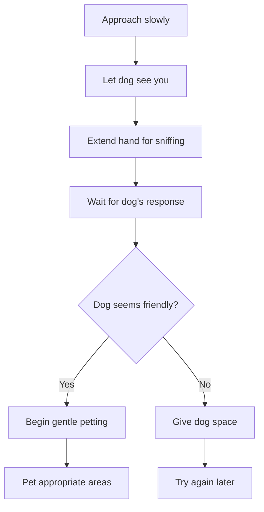
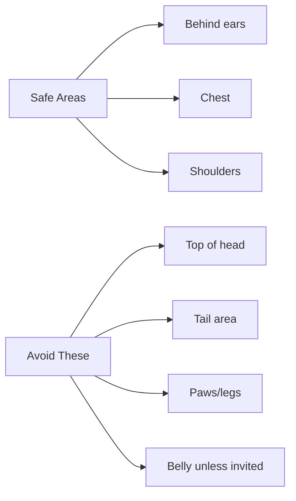
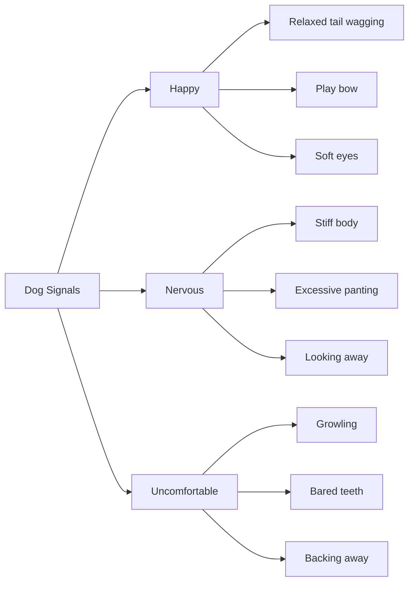

# How to Pet a Dog: A Quick Guide

## Basic Approach

Always approach a dog calmly and let them see you coming. Here's the recommended sequence:

## Best Petting Locations

Different areas of a dog's body have different comfort levels:

## Reading Dog Body Language

Understanding what a dog is telling you is crucial for safe interaction:

## Quick Tips
- Always ask the owner's permission first
- Move slowly and speak softly
- Let the dog come to you when possible
- Stop if the dog shows any signs of discomfort
- Never force interaction with an unwilling dog