# The Complete Guide to Walking Your Dog

## Introduction

Dog walking is an essential activity that provides exercise, mental stimulation, and bonding opportunities for both you and your furry companion. This comprehensive guide covers everything you need to know about safe and effective dog walking practices.

## Pre-Walk Preparation

### Equipment Checklist

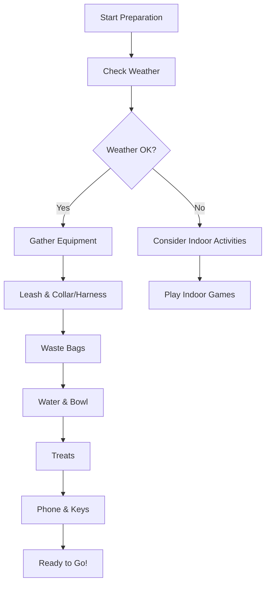

### Safety Assessment

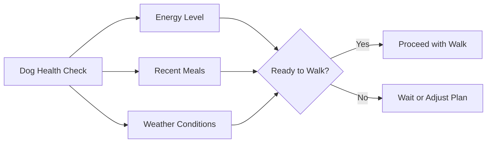

## The Walking Process

### Step-by-Step Walking Procedure

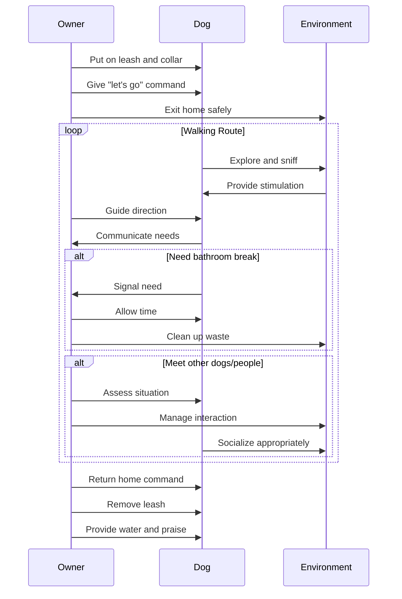

## Route Planning and Safety

### Choosing the Right Route

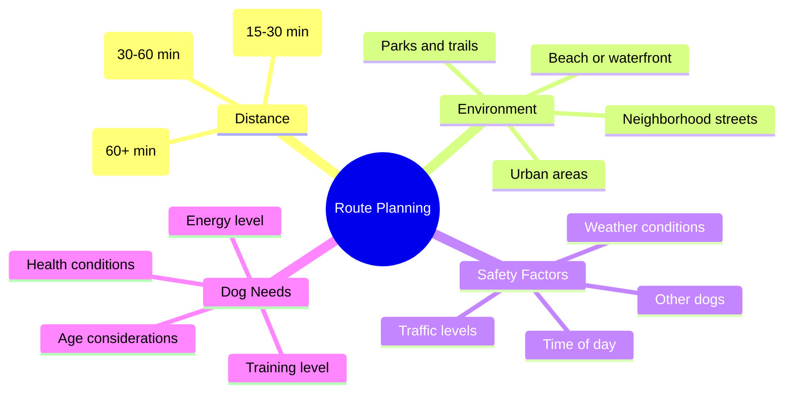

### Traffic Safety Protocol

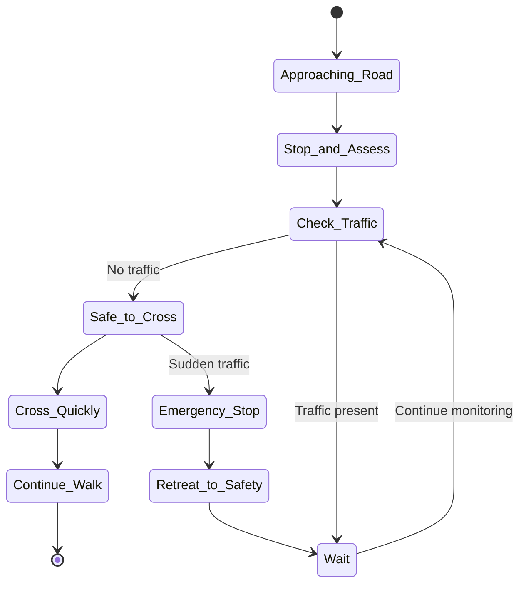

## Behavioral Management

### Common Walking Challenges and Solutions

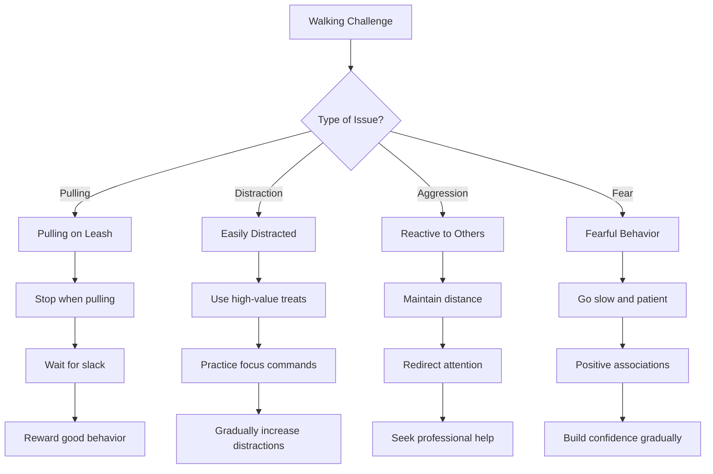

## Post-Walk Care

### After the Walk Routine

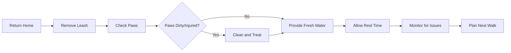

## Seasonal Considerations

### Weather-Specific Guidelines

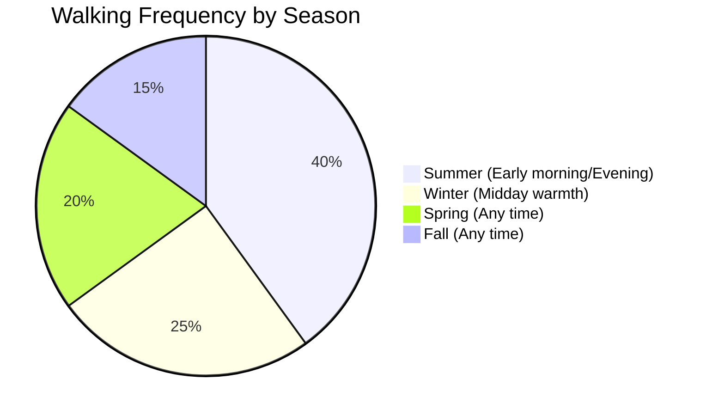

### Temperature Safety Guide

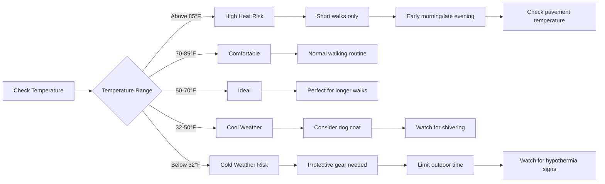

## Health Benefits

### Benefits for Dogs and Owners

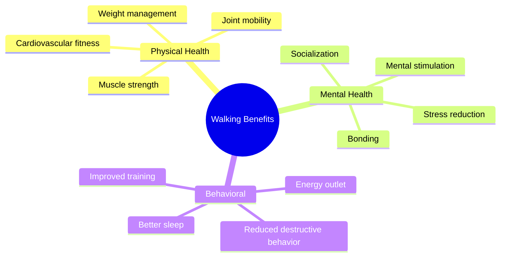

## Emergency Procedures

### Emergency Response Protocol

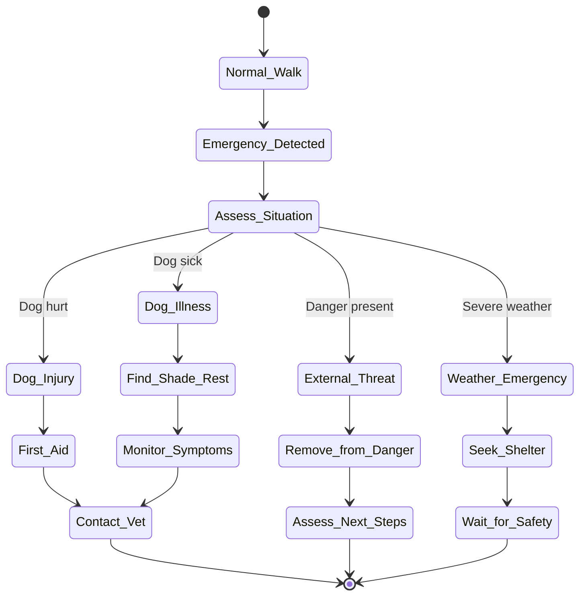

## Training Integration

### Using Walks for Training Opportunities

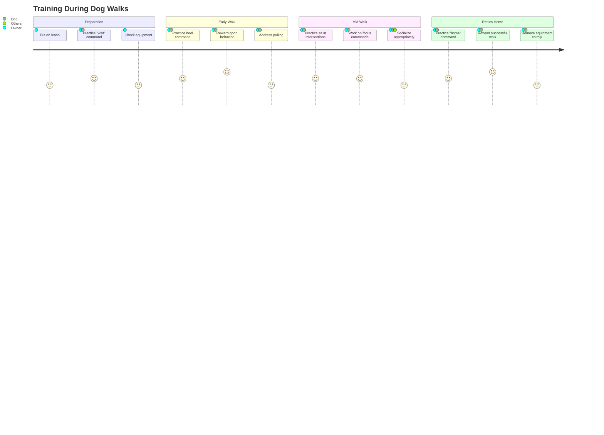

## Conclusion

Regular dog walking is one of the most important activities for maintaining your dog's physical and mental health. By following this guide and using the structured approaches outlined above, you'll ensure safe, enjoyable, and beneficial walks for both you and your canine companion.

Remember: Every dog is unique, so adjust these guidelines based on your dog's specific needs, age, breed, and health condition. When in doubt, consult with your veterinarian or a professional dog trainer.

---

*This guide provides general recommendations for dog walking. Always consult with a veterinarian for specific health concerns or behavioral issues.*