# The Garden Cycle: A Year in Nature

A garden follows a beautiful, cyclical pattern throughout the year, with each season bringing its own activities, changes, and rewards. This document explores the continuous cycle of gardening through the seasons.

## The Seasonal Garden Cycle

```mermaid
graph TB
    Spring[🌱 Spring<br/>Planting & Growth] --> Summer[☀️ Summer<br/>Maintenance & Harvest]
    Summer --> Fall[🍂 Fall<br/>Harvest & Preparation]
    Fall --> Winter[❄️ Winter<br/>Rest & Planning]
    Winter --> Spring
    
    Spring -.-> |"Plant seeds<br/>Prepare soil"| SpringActions[Seedlings emerge<br/>Soil warming<br/>First sprouts]
    Summer -.-> |"Water & tend<br/>Harvest crops"| SummerActions[Full growth<br/>Flowering<br/>Fruit production]
    Fall -.-> |"Final harvest<br/>Clean up"| FallActions[Seed collection<br/>Composting<br/>Tool maintenance]
    Winter -.-> |"Plan next year<br/>Order seeds"| WinterActions[Garden rest<br/>Indoor planning<br/>Seed catalogs]
```

## Plant Life Cycle in the Garden

Each plant in the garden follows its own growth cycle, from seed to maturity and back to seed production:

```mermaid
flowchart LR
    A[🌰 Seed] --> B[🌱 Germination]
    B --> C[🌿 Seedling]
    C --> D[🍃 Vegetative Growth]
    D --> E[🌸 Flowering]
    E --> F[🍅 Fruit/Seed Production]
    F --> G[🌰 New Seeds]
    G --> A
    
    B -.-> |"Water + Warmth<br/>+ Light"| Requirements1[Proper conditions needed]
    D -.-> |"Nutrients + Space<br/>+ Sunlight"| Requirements2[Growing conditions]
    E -.-> |"Pollinators<br/>+ Weather"| Requirements3[Reproduction support]
```

## Garden Activities Through the Year

The gardener's work follows the natural rhythm of the seasons:

## The Continuous Cycle

The beauty of gardening lies in its continuous nature. Each year builds upon the last:

- **Seeds saved** from this year's harvest become next year's plants
- **Compost created** from garden waste feeds future soil
- **Lessons learned** improve each season's success
- **Perennial plants** return stronger each year

This cycle connects us to the rhythm of nature and provides sustenance, beauty, and satisfaction throughout the year. The garden is never truly finished—it's always growing, changing, and beginning anew.

---

*A garden is a living testament to the cycles of nature, where every ending is a new beginning.*