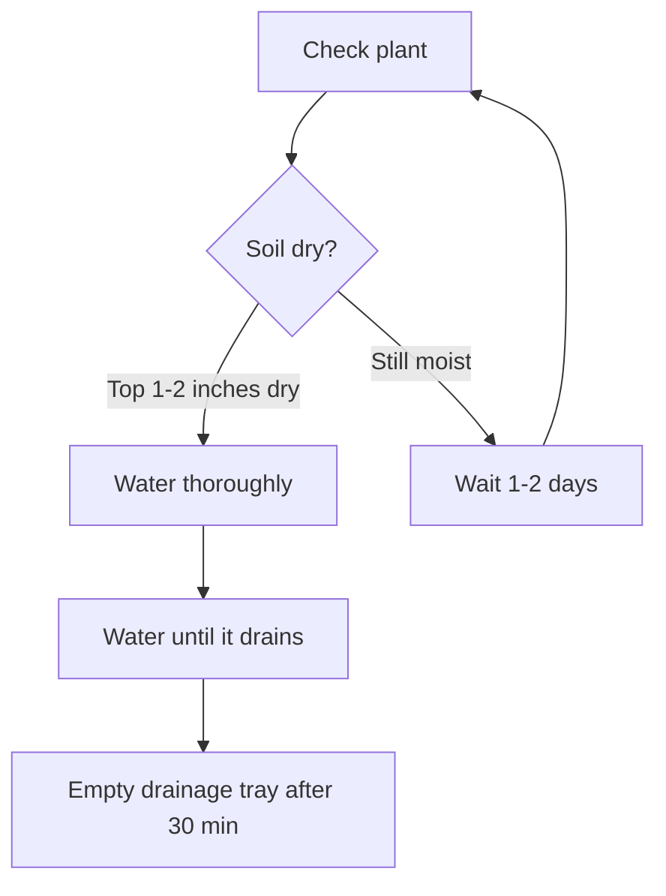
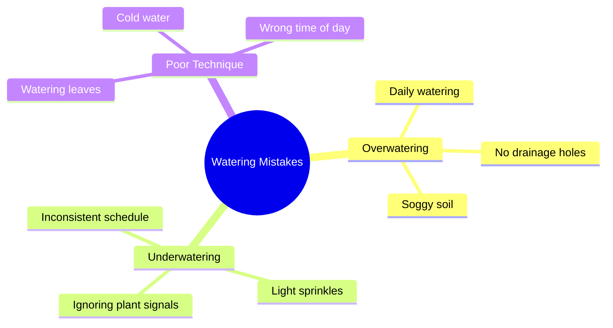

# House Plant Watering Guide

## Quick Assessment Process

## Watering Schedule by Plant Type

```mermaid
gantt
    title Weekly Watering Schedule
    dateFormat X
    axisFormat %d
    
    section Succulents
    Water once :1, 7
    
    section Tropical Plants
    Check twice weekly :1, 3
    Check twice weekly :5, 7
    
    section Ferns
    Water regularly :1, 2
    Water regularly :3, 4
    Water regularly :5, 6
    Water regularly :7, 7
```

## Signs Your Plant Needs Water

- **Soil check**: Top 1-2 inches feel dry
- **Leaf droop**: Non-succulent leaves look wilted
- **Weight test**: Pot feels noticeably lighter
- **Moisture meter**: Reads "dry" in top soil layer

## Proper Watering Technique

1. **Water slowly** at soil level, not on leaves
2. **Water thoroughly** until water drains from bottom holes
3. **Empty drainage tray** after 30 minutes
4. **Check soil moisture** before next watering

## Common Mistakes to Avoid

*Remember: Most houseplants die from overwatering, not underwatering!*