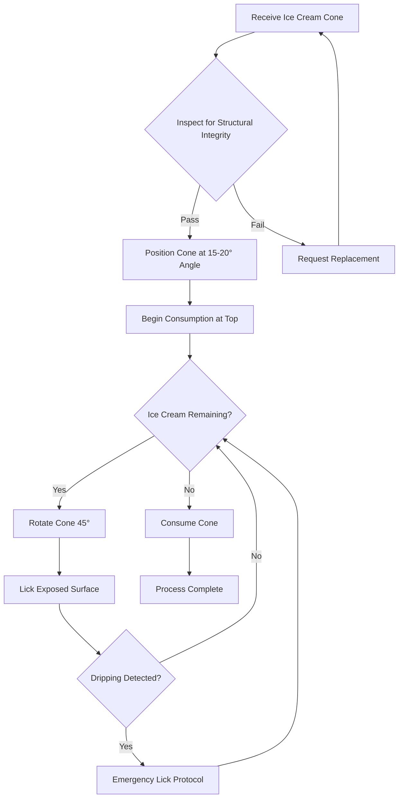
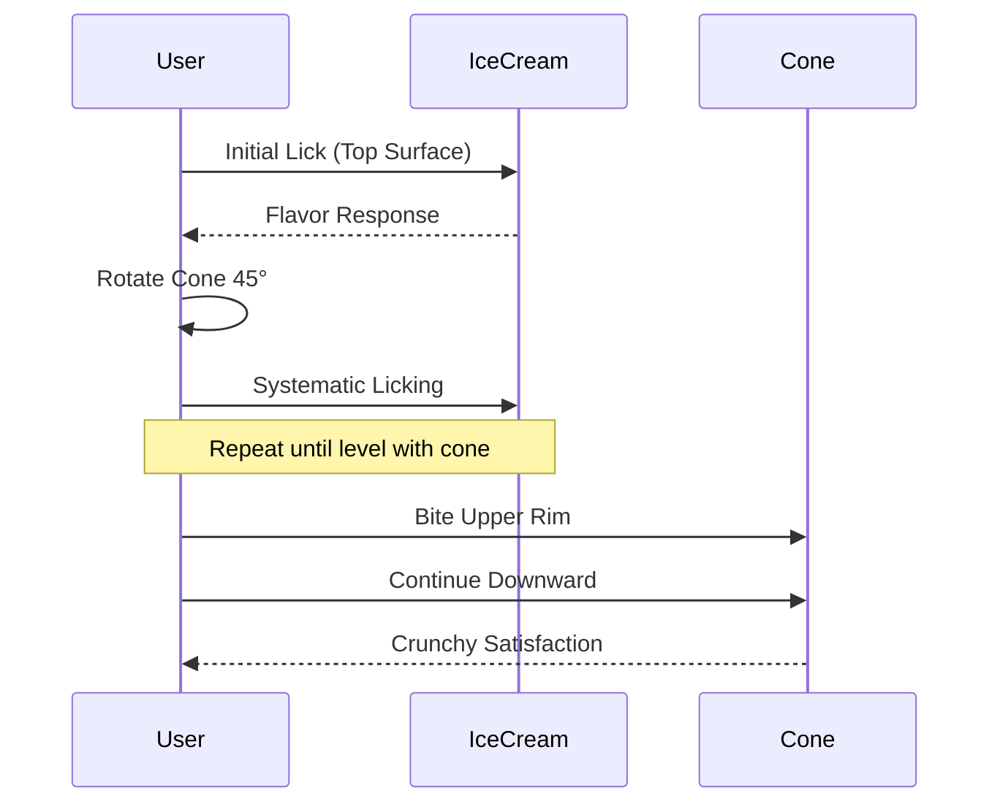
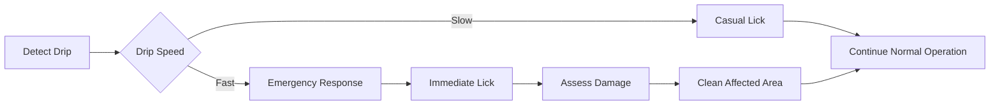

# How to Eat Ice Cream

## Overview
This technical documentation provides a comprehensive guide to the proper consumption of ice cream cones, including process flows, safety considerations, and optimal techniques.

## Prerequisites
- One (1) ice cream cone
- Ice cream (flavor of choice)
- Napkins (recommended quantity: 2-3)
- Stable environmental conditions (temperature < 80°F recommended)

## Process Flow

## Consumption Methodology

### Phase 1: Initial Assessment
1. **Visual Inspection**: Examine cone for cracks or structural weaknesses
2. **Weight Distribution**: Verify ice cream is properly balanced
3. **Environmental Scan**: Check for optimal consumption conditions

### Phase 2: Strategic Positioning
- Hold cone at **15-20 degree angle** from vertical
- Maintain firm but gentle grip on cone base
- Position napkins within immediate reach

### Phase 3: Consumption Sequence

## Safety Protocols

### Drip Management System

### Emergency Procedures
- **Code Yellow**: Minor dripping - rotate cone and accelerate consumption
- **Code Orange**: Major dripping - napkin deployment authorized
- **Code Red**: Structural failure - immediate consumption or disposal

## Quality Metrics

### Success Indicators
- ≥95% ice cream consumption
- ≤2 napkins used
- Zero clothing contamination
- Complete cone consumption

### Performance Optimization
1. **Temperature Management**: Consume in shaded areas when possible
2. **Timing**: Complete consumption within 8-12 minutes of receipt
3. **Technique**: Maintain consistent licking pattern for even consumption

## Equipment Specifications

### Cone Requirements
- **Material**: Sugar cone (preferred) or waffle cone
- **Structural Integrity**: Must support 150g+ ice cream load
- **Dimensions**: Standard commercial size

### Environmental Parameters
- **Ambient Temperature**: 65-75°F optimal
- **Humidity**: <60% preferred
- **Wind Speed**: <5 mph recommended

## Troubleshooting Guide

| Issue | Cause | Solution |
|-------|-------|----------|
| Rapid melting | High temperature | Accelerate consumption |
| Cone cracking | Structural weakness | Support with napkin wrap |
| Brain freeze | Rapid consumption | Pause 30 seconds, resume |
| Flavor mixing | Multiple scoops | Strategic licking pattern |

## Conclusion
Following these documented procedures ensures optimal ice cream cone consumption with minimal waste and maximum enjoyment. Regular practice of these techniques will improve efficiency and overall satisfaction metrics.

---
*Document Version: 1.0*  
*Last Updated: Technical Documentation Team*