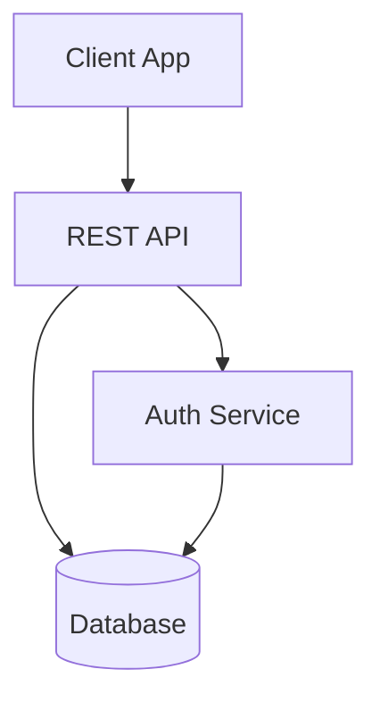
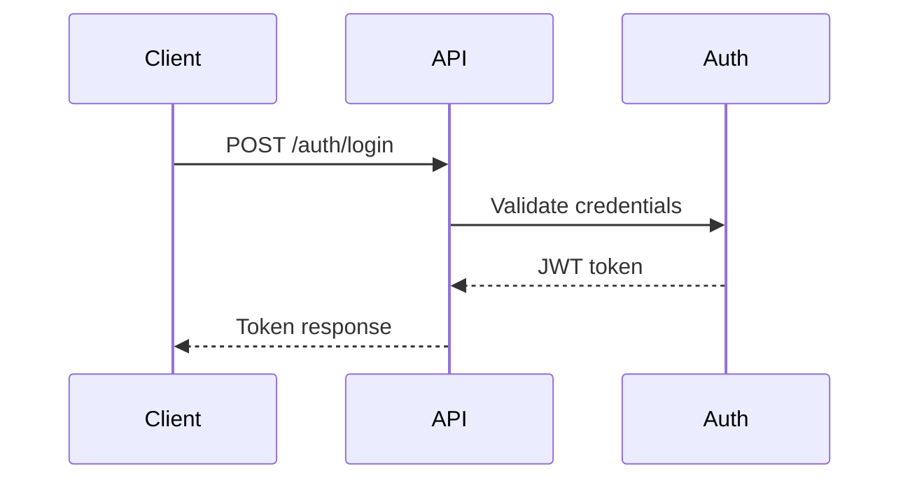
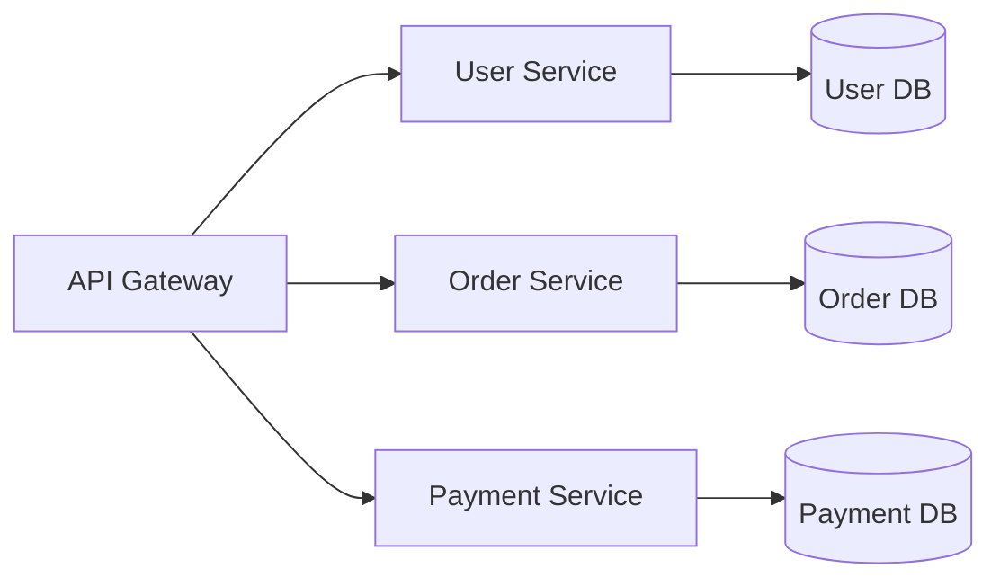
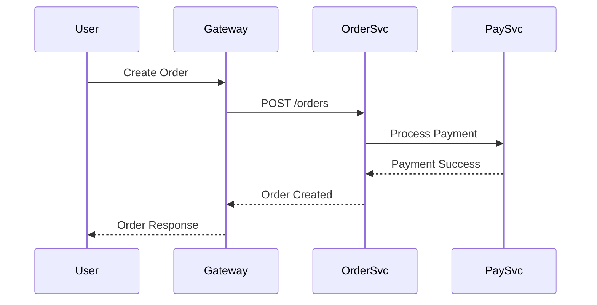

# Mermaid to PDF MCP Server

🚀 **Model Context Protocol (MCP) server** for converting Markdown documents with Mermaid diagrams to professional PDFs. Perfect for LLMs that want to create rich, visual documentation.

## Features

- 📄 **Convert Markdown to PDF** with embedded Mermaid diagrams
- 🎨 **Multiple diagram types**: Flowcharts, sequence diagrams, class diagrams, ER diagrams, and more
- 🤖 **LLM-optimized**: Built-in custom instructions guide LLMs on best practices
- ⚡ **High performance**: Browser pooling and diagram caching
- 🔧 **Configurable**: Quality levels, themes, page sizes, margins
- 🛡️ **Secure**: Input validation and sandboxed rendering

## Installation

### Option 1: Install via NPM (Recommended)

```bash
npm install -g @mermaid-to-pdf/mcp-server
```

### Option 2: Install from Source

```bash
git clone https://github.com/costajohnt/mermaid-to-pdf-vscode.git
cd mermaid-to-pdf-vscode/mermaid-to-pdf-mcp
npm install
npm run build
npm link
```

## MCP Server Configuration

### For Claude Code

Add to your Claude Code settings (`.claude/settings.json`):

```json
{
  "mcpServers": {
    "mermaid-to-pdf": {
      "command": "mermaid-to-pdf-mcp",
      "description": "Convert Markdown with Mermaid diagrams to PDF"
    }
  }
}
```

Then restart Claude Code to load the MCP server.

### For VSCode with MCP Extension

Add to your VSCode settings:

```json
{
  "mcp.servers": [
    {
      "name": "mermaid-to-pdf",
      "command": "mermaid-to-pdf-mcp",
      "description": "Markdown + Mermaid to PDF converter"
    }
  ]
}
```

### For Custom MCP Clients

Connect via stdio transport:

```javascript
import { StdioClientTransport } from '@modelcontextprotocol/sdk/client/stdio.js';
import { Client } from '@modelcontextprotocol/sdk/client/index.js';

const transport = new StdioClientTransport({
  command: 'mermaid-to-pdf-mcp'
});

const client = new Client(
  { name: 'my-client', version: '1.0.0' },
  { capabilities: {} }
);

await client.connect(transport);
```

## Available Tools

### 1. `convert_markdown_to_pdf`
Convert Markdown content to PDF (returns base64).

```json
{
  "name": "convert_markdown_to_pdf",
  "arguments": {
    "markdown": "# My Document\n\n```mermaid\nflowchart TD\n    A[Start] --> B[End]\n```",
    "options": {
      "title": "My Document",
      "quality": "high",
      "theme": "light",
      "pageSize": "A4"
    }
  }
}
```

### 2. `convert_markdown_file_to_pdf`
Convert Markdown file to PDF file.

```json
{
  "name": "convert_markdown_file_to_pdf", 
  "arguments": {
    "inputPath": "/path/to/document.md",
    "outputPath": "/path/to/output.pdf",
    "options": {
      "quality": "high",
      "theme": "dark"
    }
  }
}
```

### 3. `extract_mermaid_diagrams`
Extract diagrams as individual images.

```json
{
  "name": "extract_mermaid_diagrams",
  "arguments": {
    "markdown": "# Doc\n\n```mermaid\nflowchart TD\n    A --> B\n```",
    "format": "png"
  }
}
```

### 4. `validate_mermaid_syntax`
Validate Mermaid diagram syntax.

```json
{
  "name": "validate_mermaid_syntax",
  "arguments": {
    "mermaidCode": "flowchart TD\n    A --> B"
  }
}
```

### 5. `get_custom_instructions`
Get LLM guidance for optimal usage.

```json
{
  "name": "get_custom_instructions",
  "arguments": {}
}
```

## Custom Instructions for LLMs

This MCP server includes built-in custom instructions that guide LLMs on:

- **When to use the server**: Technical docs, system designs, process flows
- **Recommended workflow**: Create Markdown first, then convert to PDF
- **Best practices**: Diagram selection, content structure, quality settings
- **Example scenarios**: API docs, architecture designs, process documentation

LLMs can call `get_custom_instructions` to receive comprehensive guidance.

## Example Usage Scenarios

### API Documentation
```markdown
# REST API Documentation

## Architecture Overview



## Authentication Flow


```

### System Design
```markdown
# Microservices Architecture

## Service Architecture



## Data Flow


```

## Configuration Options

### Quality Levels
- `draft`: Fast rendering, lower quality
- `standard`: Balanced quality and speed (default)
- `high`: Maximum quality, slower rendering

### Themes
- `light`: Professional documents (default)
- `dark`: Developer-focused content
- `auto`: System preference

### Page Sizes
- `A4`: International standard (default)
- `Letter`: US standard
- `Legal`: US legal documents

### Margins
```json
{
  "margins": {
    "top": "20mm",
    "right": "20mm", 
    "bottom": "20mm",
    "left": "20mm"
  }
}
```

## Supported Diagram Types

- **Flowcharts**: `flowchart`, `graph`
- **Sequence Diagrams**: `sequenceDiagram`
- **Class Diagrams**: `classDiagram`
- **State Diagrams**: `stateDiagram`
- **Entity Relationship**: `erDiagram`
- **User Journey**: `journey`
- **Gantt Charts**: `gantt`
- **Pie Charts**: `pie`
- **Git Graph**: `gitGraph`

## Requirements

- **Node.js**: 18.x or higher
- **System Memory**: 2GB+ recommended
- **Disk Space**: 100MB for dependencies

## Troubleshooting

### Common Issues

**"Command not found: mermaid-to-pdf-mcp"**
```bash
# Reinstall globally
npm uninstall -g @mermaid-to-pdf/mcp-server
npm install -g @mermaid-to-pdf/mcp-server
```

**"Failed to render Mermaid diagram"**
- Check diagram syntax with `validate_mermaid_syntax`
- Try with simpler diagram first
- Verify sufficient system memory

**"MCP server connection failed"**
- Verify server is installed globally
- Check command path in MCP client config
- Review client logs for detailed errors

### Debug Mode

Enable detailed logging:
```bash
DEBUG=mcp:* mermaid-to-pdf-mcp
```

## Development

### Building from Source
```bash
git clone https://github.com/costajohnt/mermaid-to-pdf-vscode.git
cd mermaid-to-pdf-vscode/mermaid-to-pdf-mcp
npm install
npm run build
```

### Testing
```bash
# Test MCP server directly
echo '{"jsonrpc":"2.0","id":1,"method":"tools/list"}' | node dist/index.js

# Test with custom instructions
echo '{"jsonrpc":"2.0","id":1,"method":"tools/call","params":{"name":"get_custom_instructions","arguments":{}}}' | node dist/index.js
```

## License

MIT License - see [LICENSE](LICENSE) file for details.

## Links

- **Repository**: [GitHub](https://github.com/costajohnt/mermaid-to-pdf-vscode)
- **CLI Tool**: [Mermaid to PDF CLI](https://github.com/costajohnt/mermaid-to-pdf-vscode)
- **Issues**: [GitHub Issues](https://github.com/costajohnt/mermaid-to-pdf-vscode/issues)
- **MCP Protocol**: [Model Context Protocol](https://modelcontextprotocol.io)

---

**Made with ❤️ for the MCP and LLM community**