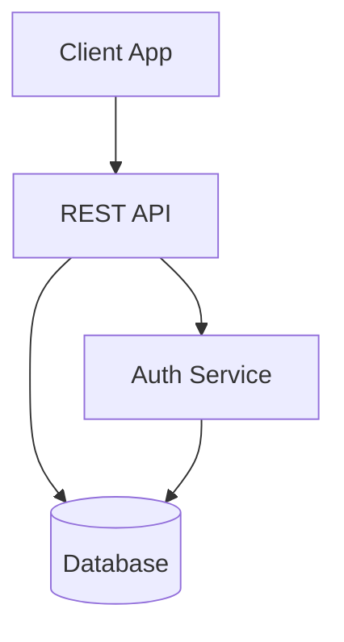
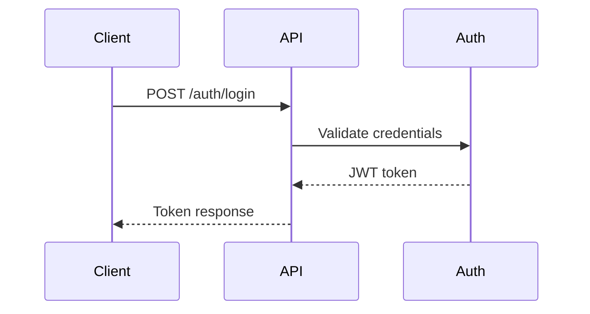
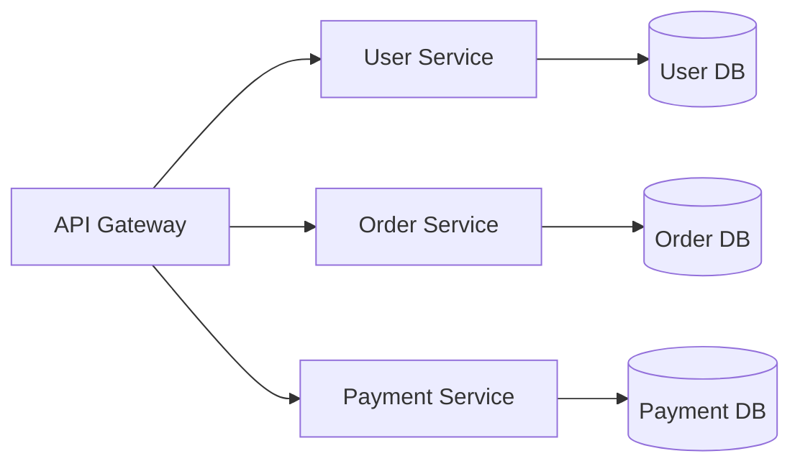

# Markdown Mermaid Converter MCP Server

**Model Context Protocol (MCP) server** for converting Markdown documents with Mermaid diagrams to PDF. Designed for use with LLMs and AI-powered development tools.

## Features

- **Convert Markdown to PDF** with rendered Mermaid diagrams
- **Multiple diagram types**: Flowcharts, sequence diagrams, class diagrams, ER diagrams, and more
- **SVG-based rendering**: Diagrams are rendered as SVGs with measured layout for accurate sizing
- **Configurable**: Themes and page sizes
- **CLI-backed**: Thin wrapper around the `markdown-mermaid-converter` CLI for reliable, consistent output

## Installation

### Option 1: Install via npm (Recommended)

```bash
npm install -g markdown-mermaid-converter-mcp
```

**Note:** The MCP server requires the `markdown-mermaid-converter` CLI to be installed and available on your PATH:

```bash
npm install -g markdown-mermaid-converter
```

### Option 2: Install from Source

```bash
git clone https://github.com/costajohnt/markdown-mermaid-converter.git
cd markdown-mermaid-converter

# Build the CLI
npm install
npm run build

# Build the MCP server
cd mermaid-to-pdf-mcp
npm install
npm run build
npm link
```

## MCP Server Configuration

### For Claude Desktop

Add to your Claude Desktop config (`claude_desktop_config.json`):

```json
{
  "mcpServers": {
    "markdown-mermaid-converter": {
      "command": "markdown-mermaid-converter-mcp",
      "args": []
    }
  }
}
```

Then restart Claude Desktop.

### For Claude Code

Use Claude Code's built-in MCP management to add the server:

**Option A: User scope (available across all projects):**
```bash
claude mcp add --scope user markdown-mermaid-converter markdown-mermaid-converter-mcp
```

**Option B: Project scope (for a specific project, creates `.mcp.json`):**
```bash
# Navigate to your project directory first
claude mcp add --scope project markdown-mermaid-converter markdown-mermaid-converter-mcp
```

**Option C: Local scope (private to you in current project):**
```bash
# Navigate to your project directory first
claude mcp add --scope local markdown-mermaid-converter markdown-mermaid-converter-mcp
```

Verify the server is configured:
```bash
claude mcp list
```

**Alternative: Manual Configuration**

You can also create a `.mcp.json` file in your project root:

```json
{
  "mcpServers": {
    "markdown-mermaid-converter": {
      "command": "markdown-mermaid-converter-mcp",
      "args": []
    }
  }
}
```

### For Other MCP Clients

Connect via stdio transport:

```javascript
import { StdioClientTransport } from '@modelcontextprotocol/sdk/client/stdio.js';
import { Client } from '@modelcontextprotocol/sdk/client/index.js';

const transport = new StdioClientTransport({
  command: 'markdown-mermaid-converter-mcp'
});

const client = new Client(
  { name: 'my-client', version: '1.0.0' },
  { capabilities: {} }
);

await client.connect(transport);
```

## Available Tools

### 1. `convert_markdown_to_pdf`

Convert Markdown content (as a string) to a PDF file saved on disk. If no `outputPath` is provided, the file is saved to `~/Desktop/<title>.pdf`.

**Parameters:**

| Parameter | Type | Required | Description |
|-----------|------|----------|-------------|
| `markdown` | string | Yes | Markdown content to convert |
| `options.outputPath` | string | No | File path for the output PDF |
| `options.title` | string | No | Document title (also used to generate default filename) |
| `options.theme` | string | No | `"light"` or `"dark"` |
| `options.pageSize` | string | No | `"A4"`, `"Letter"`, or `"Legal"` |

**Example:**

```json
{
  "name": "convert_markdown_to_pdf",
  "arguments": {
    "markdown": "# My Document\n\n```mermaid\nflowchart TD\n    A[Start] --> B[End]\n```",
    "options": {
      "title": "My Document",
      "outputPath": "/Users/me/Documents/my-doc.pdf",
      "theme": "light",
      "pageSize": "A4"
    }
  }
}
```

**Response:**

```json
{
  "path": "/Users/me/Documents/my-doc.pdf",
  "size": 45231,
  "diagrams": 1
}
```

### 2. `convert_markdown_to_pdf_data`

Convert Markdown content to a PDF returned as base64-encoded data. Best for short documents. For large content (over 10,000 characters), a warning is included suggesting `convert_markdown_to_pdf` instead.

**Parameters:**

| Parameter | Type | Required | Description |
|-----------|------|----------|-------------|
| `markdown` | string | Yes | Markdown content to convert |
| `options.title` | string | No | Document title |
| `options.theme` | string | No | `"light"` or `"dark"` |
| `options.pageSize` | string | No | `"A4"`, `"Letter"`, or `"Legal"` |

**Example:**

```json
{
  "name": "convert_markdown_to_pdf_data",
  "arguments": {
    "markdown": "# Quick Note\n\nSome content here.",
    "options": {
      "title": "Quick Note",
      "theme": "light",
      "pageSize": "Letter"
    }
  }
}
```

**Response:**

```json
{
  "pdf": "JVBERi0xLjQK...",
  "size": 12045,
  "diagrams": 0
}
```

### 3. `convert_markdown_file_to_pdf`

Convert a Markdown file on disk to a PDF file. If no `outputPath` is provided, the output file is placed alongside the input with a `.pdf` extension (e.g., `doc.md` becomes `doc.pdf`).

**Parameters:**

| Parameter | Type | Required | Description |
|-----------|------|----------|-------------|
| `inputPath` | string | Yes | Path to the input Markdown file |
| `outputPath` | string | No | Path for the output PDF file |
| `options.theme` | string | No | `"light"` or `"dark"` |
| `options.pageSize` | string | No | `"A4"`, `"Letter"`, or `"Legal"` |

**Example:**

```json
{
  "name": "convert_markdown_file_to_pdf",
  "arguments": {
    "inputPath": "/path/to/document.md",
    "outputPath": "/path/to/output.pdf",
    "options": {
      "theme": "dark",
      "pageSize": "A4"
    }
  }
}
```

**Response:**

```json
{
  "path": "/path/to/output.pdf",
  "size": 89012,
  "diagrams": 3
}
```

## Configuration Options

### Themes

- `light` -- Clean, professional look suitable for printed documents (default)
- `dark` -- Dark background, suited for developer-focused content

### Page Sizes

- `A4` -- International standard (210 x 297 mm)
- `Letter` -- US standard (8.5 x 11 in)
- `Legal` -- US legal (8.5 x 14 in)

## Example Usage Scenarios

### API Documentation

```markdown
# REST API Documentation

## Architecture Overview


```mermaid
flowchart TD
    Client[Client App] --> API[REST API]
    API --> Auth[Auth Service]
    API --> DB[(Database)]
    Auth --> DB
```

## Authentication Flow


```mermaid
sequenceDiagram
    Client->>API: POST /auth/login
    API->>Auth: Validate credentials
    Auth-->>API: JWT token
    API-->>Client: Token response
```
```

### System Design

```markdown
# Microservices Architecture

## Service Map


```mermaid
flowchart LR
    Gateway[API Gateway] --> UserSvc[User Service]
    Gateway --> OrderSvc[Order Service]
    Gateway --> PaySvc[Payment Service]

    UserSvc --> UserDB[(User DB)]
    OrderSvc --> OrderDB[(Order DB)]
    PaySvc --> PayDB[(Payment DB)]
```
```

## Supported Diagram Types

- **Flowcharts**: `flowchart`, `graph`
- **Sequence Diagrams**: `sequenceDiagram`
- **Class Diagrams**: `classDiagram`
- **State Diagrams**: `stateDiagram`
- **Entity Relationship**: `erDiagram`
- **User Journey**: `journey`
- **Gantt Charts**: `gantt`
- **Pie Charts**: `pie`
- **Git Graph**: `gitGraph`

## Requirements

- **Node.js**: 18.x or higher
- **CLI dependency**: The `markdown-mermaid-converter` CLI must be installed and on your PATH

## Troubleshooting

### Common Issues

**"Command not found: markdown-mermaid-converter-mcp"**
```bash
# Reinstall globally
npm install -g markdown-mermaid-converter-mcp
```

**"CLI tool not found"**

The MCP server delegates to the `markdown-mermaid-converter` CLI. Make sure it is installed:

```bash
npm install -g markdown-mermaid-converter
```

If installing from source, build the CLI package first (`npm run build` in the repo root).

**"MCP server connection failed"**
- Verify the server is installed globally or linked via `npm link`
- Check that the command path in your MCP client config is correct
- Review client logs for detailed error messages

## Development

### Building from Source

```bash
git clone https://github.com/costajohnt/markdown-mermaid-converter.git
cd markdown-mermaid-converter/mermaid-to-pdf-mcp
npm install
npm run build
```

### Testing

```bash
# List available tools
echo '{"jsonrpc":"2.0","id":1,"method":"tools/list"}' | node dist/index.js
```

## License

MIT License - see [LICENSE](LICENSE) file for details.

## Links

- **Repository**: [GitHub](https://github.com/costajohnt/markdown-mermaid-converter)
- **CLI Tool**: [Markdown Mermaid Converter](https://github.com/costajohnt/markdown-mermaid-converter)
- **Issues**: [GitHub Issues](https://github.com/costajohnt/markdown-mermaid-converter/issues)
- **MCP Protocol**: [Model Context Protocol](https://modelcontextprotocol.io)
