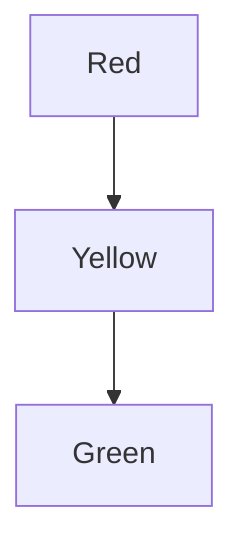
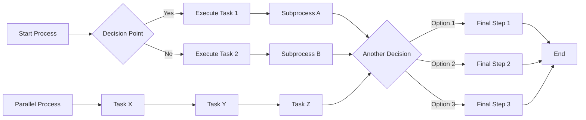
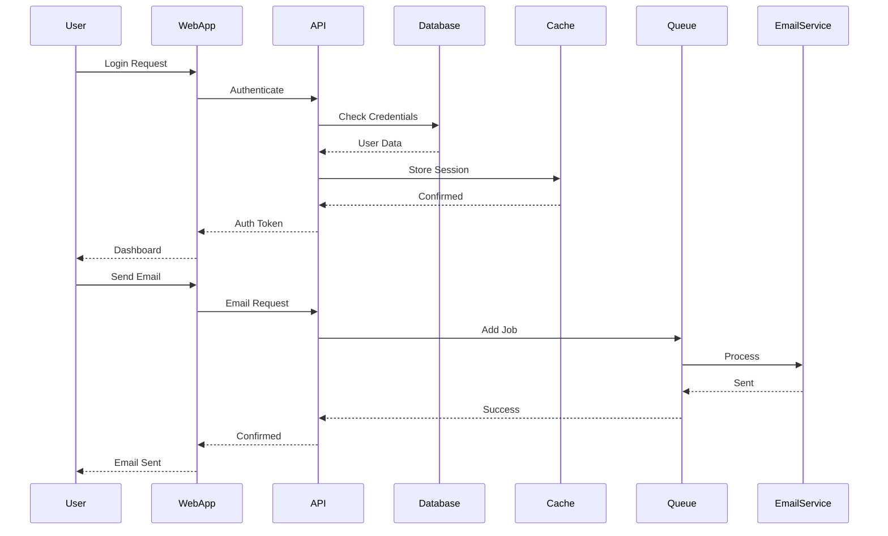
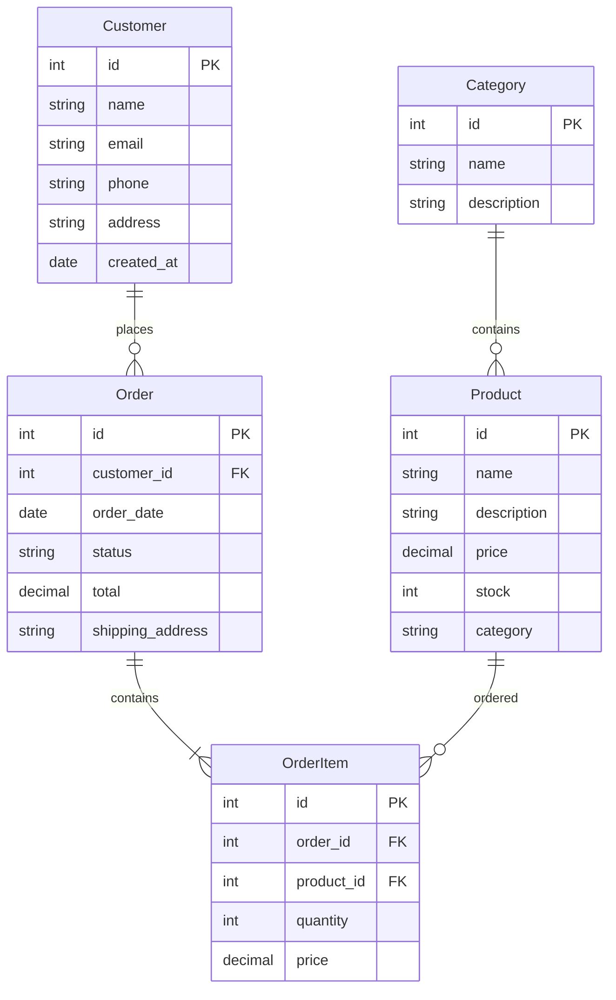

# Dynamic Sizing Test Document

## Simple Flowchart (Should be small)

## Complex Flowchart (Should be larger)

## Wide Sequence Diagram (Should auto-width)

## Entity Relationship Diagram (Should be tall)

