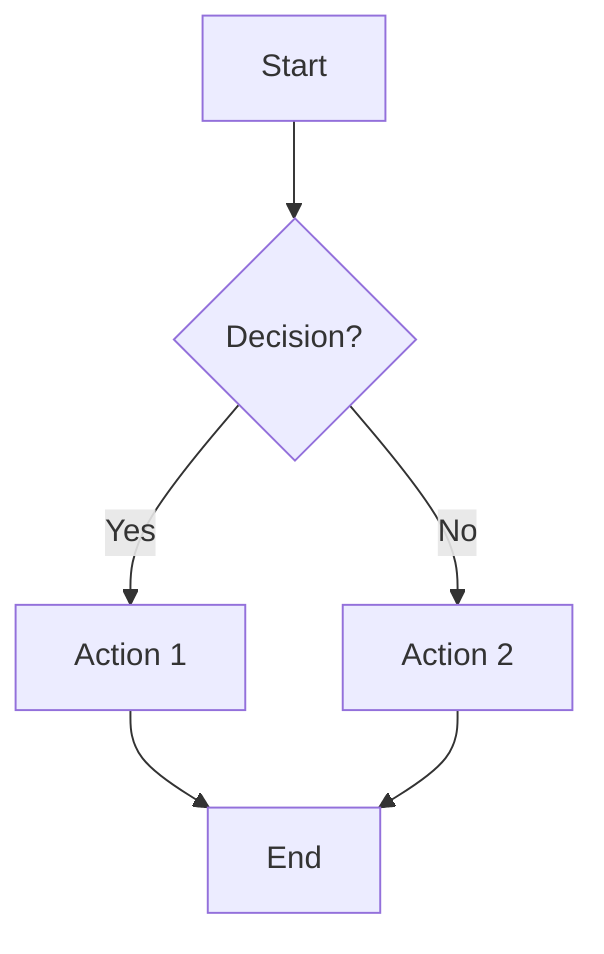
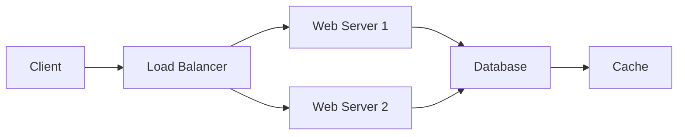

# Test Presentation

This is a test presentation to verify Google Slides integration.

## Introduction

Welcome to our test presentation. This document will be converted into a Google Slides presentation with the following features:

- Automatic slide generation from markdown structure
- Embedded Mermaid diagrams
- Proper content organization

## Sample Diagram

Here's a simple flowchart to test diagram rendering:



## Key Features

Our conversion system supports:

- **Heading-based slide creation**: H1 creates sections, H2 creates content slides
- **Diagram integration**: Mermaid diagrams are rendered as images on dedicated slides
- **List formatting**: Bullet points are preserved and formatted
- **Code blocks**: Source code gets its own slide

## Code Example

Here's a sample Python function:

```python
def fibonacci(n):
    if n <= 1:
        return n
    return fibonacci(n-1) + fibonacci(n-2)

# Generate first 10 Fibonacci numbers
for i in range(10):
    print(f"F({i}) = {fibonacci(i)}")
```

## Network Architecture

Let's look at a more complex diagram:



## Conclusion

This test demonstrates the Google Slides integration capabilities:

1. ✅ Markdown to slides conversion
2. ✅ Diagram rendering and embedding  
3. ✅ Content structure preservation
4. ✅ Multiple slide types support

Thank you for testing our system!