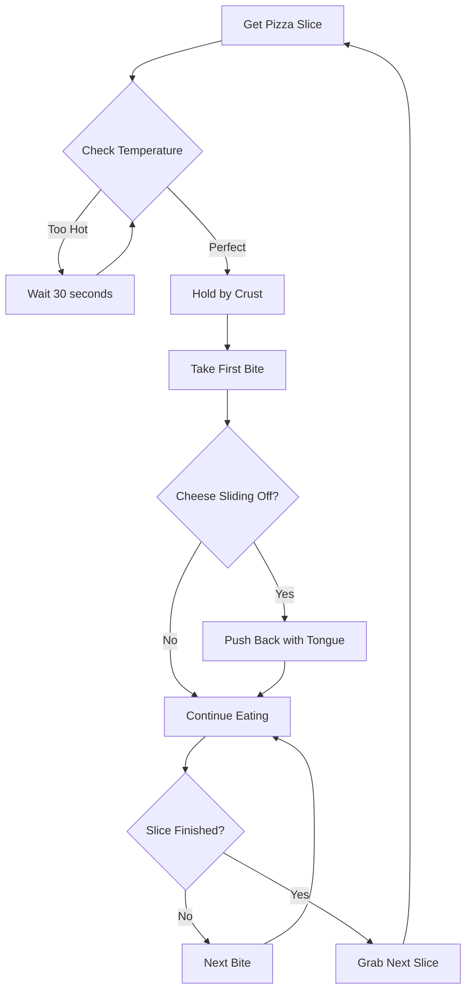
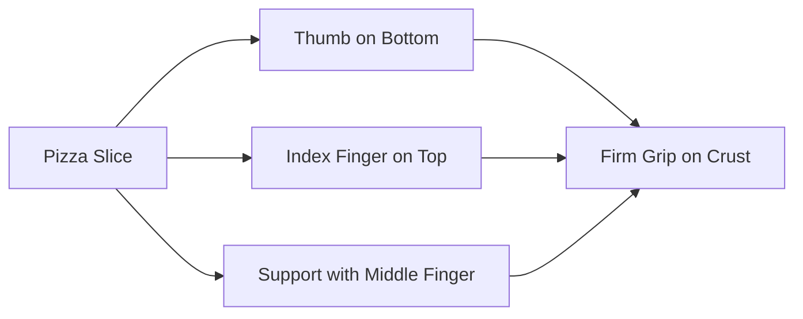
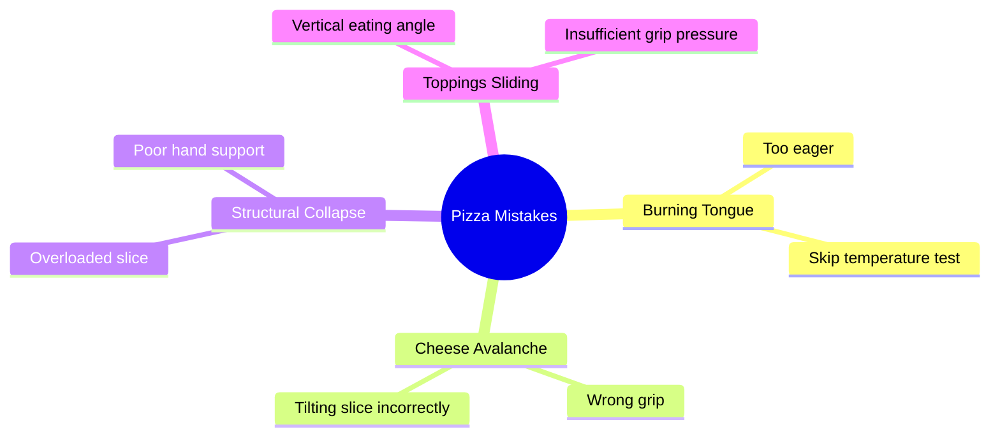

# How to Eat a Pizza: A Visual Guide

Pizza eating is an art form that requires proper technique and timing. Follow these simple steps for the optimal pizza consumption experience.

## The Pizza Eating Process

## Proper Hand Positioning

## Steps to Perfect Pizza Consumption

1. **Select Your Slice** - Choose a slice with good structural integrity
2. **Temperature Check** - Ensure it's not molten lava hot
3. **Proper Grip** - Hold by the crust, never the toppings
4. **Strategic Biting** - Start at the tip, work toward the crust
5. **Cheese Management** - Keep runaway cheese under control
6. **Crust Decision** - To eat or not to eat the crust (personal choice)

## Common Mistakes to Avoid

## Conclusion

Mastering pizza consumption takes practice. Remember: patience for temperature, firmness of grip, and strategic bite placement are key to pizza eating success.

*Enjoy your pizza responsibly!*