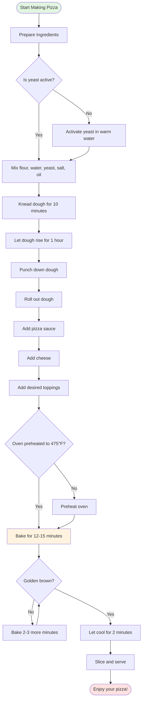

# How to Make Pizza 🍕

Making homemade pizza is a fun and delicious activity! Follow this guide to create your perfect pizza.

## Ingredients

### For the Dough:
- 500g all-purpose flour
- 325ml warm water
- 7g active dry yeast
- 10g salt
- 2 tbsp olive oil

### For the Toppings:
- Pizza sauce
- Mozzarella cheese
- Your favorite toppings (pepperoni, mushrooms, bell peppers, etc.)

## Process Flow

Here's a visual guide to the pizza-making process:

## Step-by-Step Instructions

1. **Activate the yeast**: Mix yeast with warm water and a pinch of sugar. Let sit for 5 minutes until foamy.

2. **Make the dough**: Combine flour and salt in a large bowl. Add the yeast mixture and olive oil. Mix until a dough forms.

3. **Knead**: Transfer to a floured surface and knead for 10 minutes until smooth and elastic.

4. **First rise**: Place in an oiled bowl, cover, and let rise for 1 hour until doubled in size.

5. **Shape**: Punch down the dough and roll it out to your desired thickness.

6. **Add toppings**: Spread sauce, sprinkle cheese, and add your favorite toppings.

7. **Bake**: Bake at 475°F (245°C) for 12-15 minutes until the crust is golden and cheese is bubbly.

8. **Enjoy**: Let cool slightly, slice, and enjoy your homemade pizza!

## Tips for Success

- Use high-quality mozzarella for the best melt
- Don't overload with toppings - less is more!
- For a crispier crust, pre-bake the dough for 5 minutes before adding toppings
- Experiment with different sauces: traditional tomato, pesto, or white sauce

---

*Happy Pizza Making! 🍕*