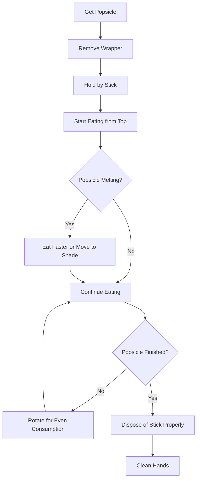
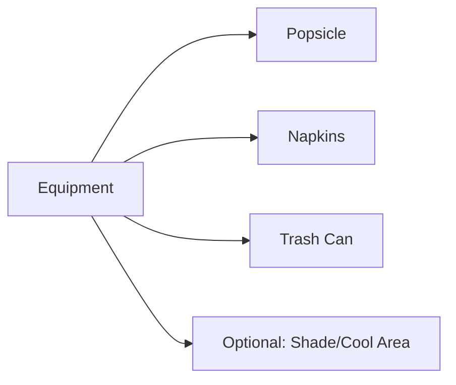
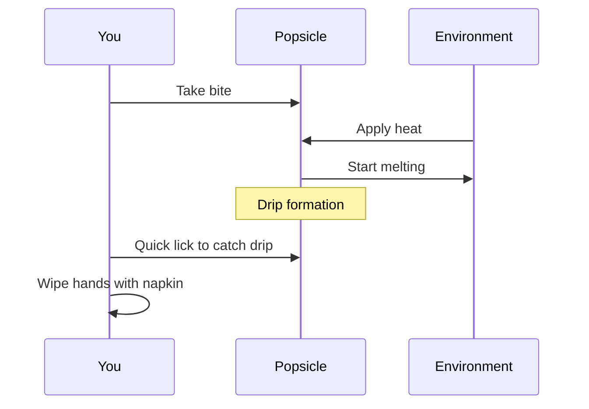
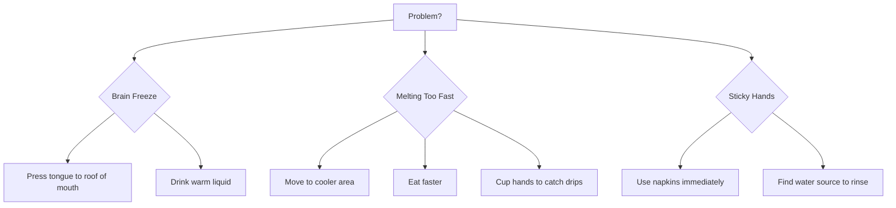

# How to Eat a Popsicle: A Complete Guide

This comprehensive guide will walk you through the proper technique for consuming a popsicle safely and enjoyably.

## Overview

A popsicle is a frozen treat on a stick that requires careful handling to avoid mess and maximize enjoyment. Follow these steps for the optimal popsicle-eating experience.

## Step-by-Step Process

## Equipment Needed

## Detailed Instructions

### 1. Preparation
- Select your popsicle from freezer
- Find a suitable eating location (preferably with shade)
- Have napkins ready

### 2. Opening
- Carefully tear wrapper from the top
- Avoid touching the frozen portion with bare hands
- Keep wrapper for disposal

### 3. Eating Technique
- Hold firmly by the stick (never by the frozen part)
- Start eating from the top
- Use small bites or licks to control melting
- Rotate the popsicle regularly for even consumption

### 4. Managing Drips

## Safety Tips

### Temperature Considerations
- **Too Cold**: Can cause brain freeze - eat slowly
- **Too Warm**: Will melt quickly - eat in cool area

### Handling Precautions
- Never bite too hard (risk of breaking teeth on frozen treat)
- Keep napkins handy at all times
- Don't let children eat unsupervised

## Troubleshooting Common Issues

## Disposal

### Proper Cleanup
1. Dispose of stick in appropriate trash container
2. Dispose of wrapper properly
3. Clean hands with water or wet wipes
4. Clean any surfaces that may have gotten sticky

## Pro Tips

- **Timing**: Eat popsicles during hottest part of day for maximum refreshment
- **Sharing**: Break popsicle in half to share (only works with certain types)
- **Storage**: If you must pause, place popsicle back in freezer immediately

## Conclusion

Following these guidelines will ensure a pleasant and mess-free popsicle eating experience. Remember: patience and preparation are key to popsicle success!

---

*Safety First: Always supervise children when eating popsicles, and be mindful of allergies or dietary restrictions.*