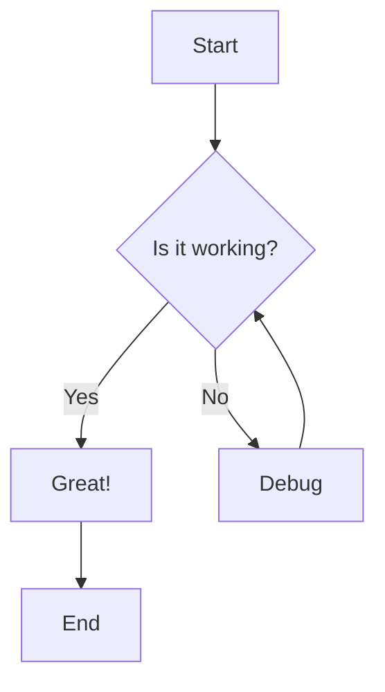
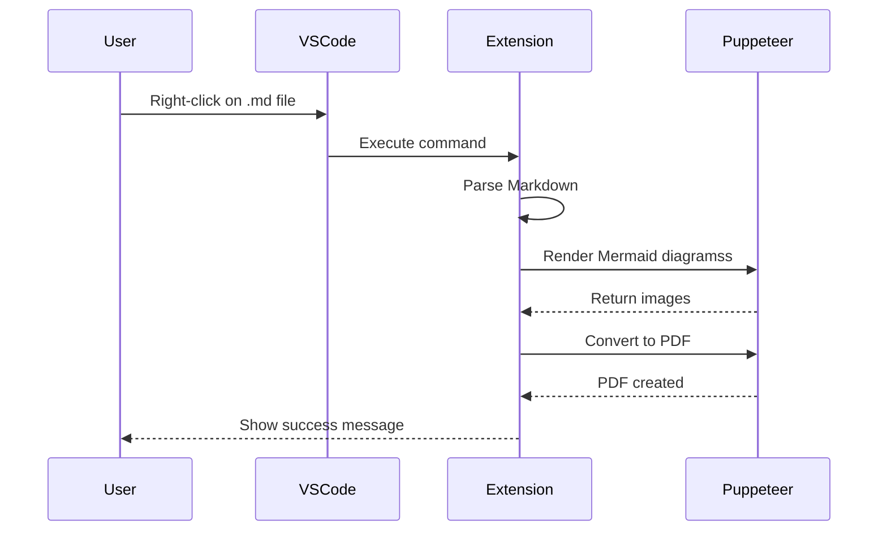
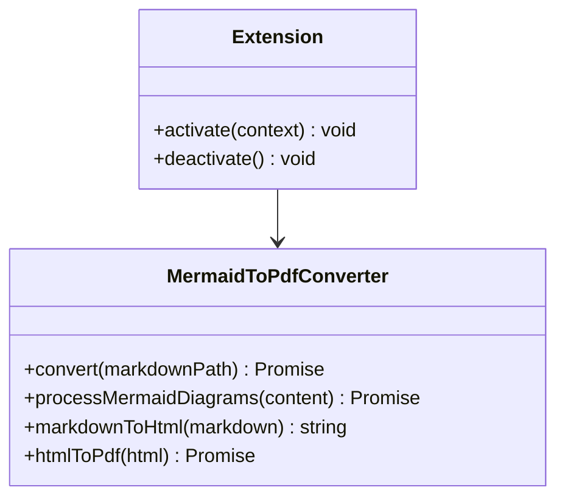

# Sample Document with Mermaid Diagrams

This document demonstrates the conversion of Markdown with Mermaid diagrams to PDF.

## Flow Chart Example



## Sequence Diagram Example



## Class Diagram Example



## Regular Markdown Content

This extension also handles regular Markdown content:

- **Bold text**
- *Italic text*
- `Code snippets`

### Code Block Example

```javascript
function hello() {
    console.log("Hello, World!");
}
```

### Table Example

| Feature | Status |
|---------|--------|
| Markdown to HTML | ✅ |
| Mermaid to Image | ✅ |
| HTML to PDF | ✅ |
| VSCode Integration | ✅ |

## Conclusion

This demonstrates how the extension converts Markdown files with embedded Mermaid diagrams into PDFs with the diagrams rendered as images.