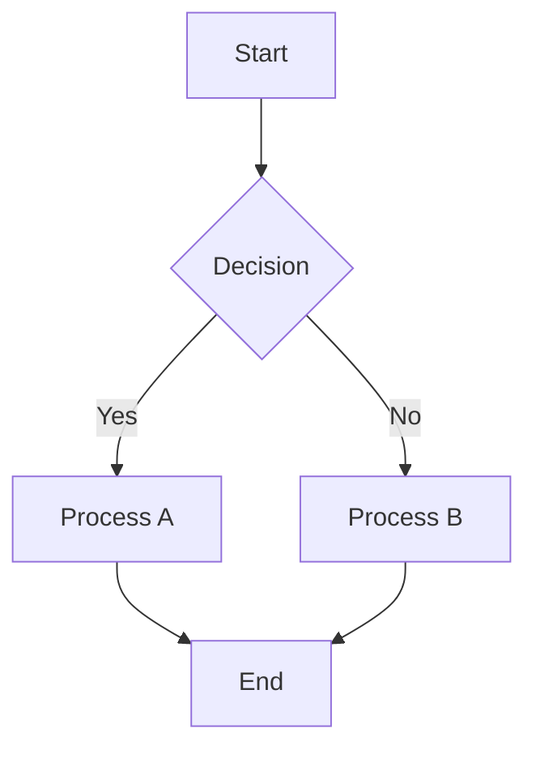

# Test Document for Confluence

This is a test document to verify the Confluence conversion functionality.

## Features

- **Bold text** and *italic text*
- `Inline code` formatting
- [External link](https://example.com)

### Code Block

```javascript
function hello() {
  console.log("Hello, Confluence!");
}
```

### Mermaid Diagram



### Table

| Column 1 | Column 2 | Column 3 |
|----------|----------|----------|
| Row 1    | Data A   | Data B   |
| Row 2    | Data C   | Data D   |

### List

1. First item
2. Second item
   - Sub item A
   - Sub item B
3. Third item

> This is a blockquote with some important information.

---

That concludes our test document!