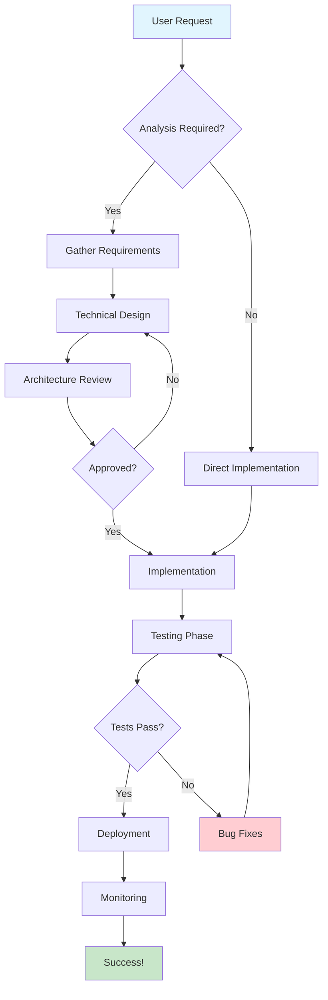
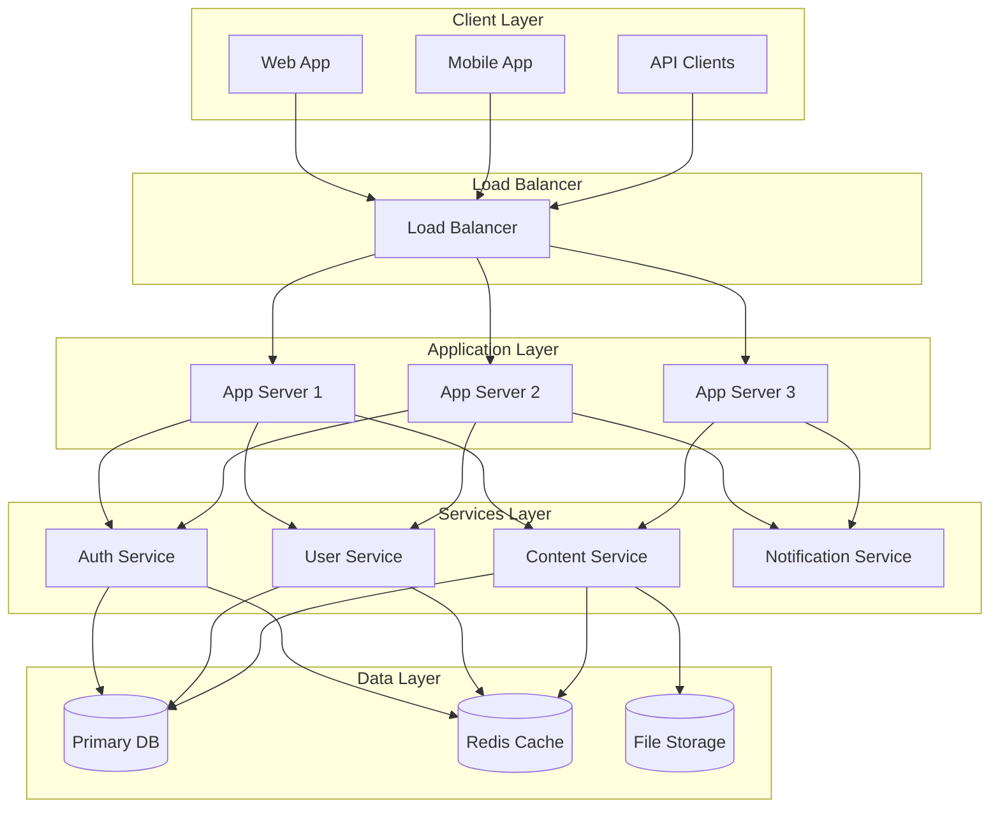

# Test Diagram Sizing

This tests the improved diagram sizing in PDF conversion.

## Complex Flowchart

```mermaid
flowchart TD
    A[User Request] --> B{Analysis Required?}
    B -->|Yes| C[Gather Requirements]
    B -->|No| D[Direct Implementation]
    
    C --> E[Technical Design]
    E --> F[Architecture Review]
    F --> G{Approved?}
    G -->|Yes| H[Implementation]
    G -->|No| E
    
    D --> H
    H --> I[Testing Phase]
    I --> J{Tests Pass?}
    J -->|Yes| K[Deployment]
    J -->|No| L[Bug Fixes]
    L --> I
    
    K --> M[Monitoring]
    M --> N[Success!]
    
    style A fill:#e1f5fe
    style N fill:#c8e6c9
    style L fill:#ffcdd2
```

## System Architecture

```mermaid
graph TB
    subgraph "Client Layer"
        Web[Web App]
        Mobile[Mobile App]
        API[API Clients]
    end
    
    subgraph "Load Balancer"
        LB[Load Balancer]
    end
    
    subgraph "Application Layer"
        App1[App Server 1]
        App2[App Server 2]
        App3[App Server 3]
    end
    
    subgraph "Services Layer"
        Auth[Auth Service]
        User[User Service]
        Content[Content Service]
        Notify[Notification Service]
    end
    
    subgraph "Data Layer"
        DB[(Primary DB)]
        Cache[(Redis Cache)]
        Files[(File Storage)]
    end
    
    Web --> LB
    Mobile --> LB
    API --> LB
    
    LB --> App1
    LB --> App2
    LB --> App3
    
    App1 --> Auth
    App1 --> User
    App1 --> Content
    App2 --> Auth
    App2 --> User
    App2 --> Notify
    App3 --> Content
    App3 --> Notify
    
    Auth --> DB
    User --> DB
    Content --> DB
    Content --> Files
    
    Auth --> Cache
    User --> Cache
    Content --> Cache
```

This should render much larger and clearer in the PDF!