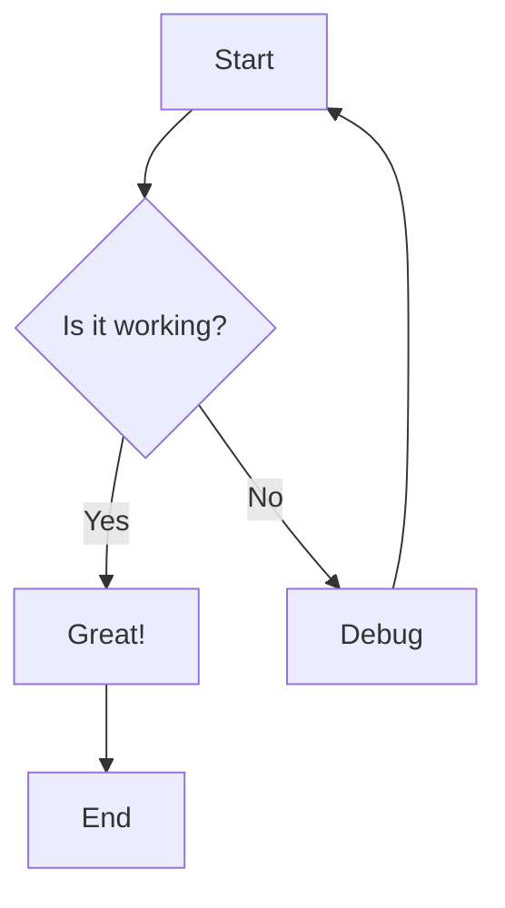
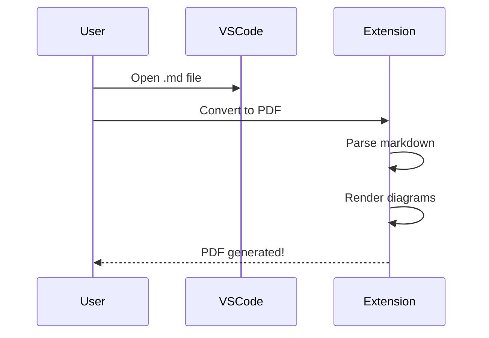

# Test Document

This is a test document to verify the VSCode extension still works correctly.

## Simple Diagram

## Sequence Diagram

## Conclusion

If you can convert this document to PDF successfully, everything is working correctly!