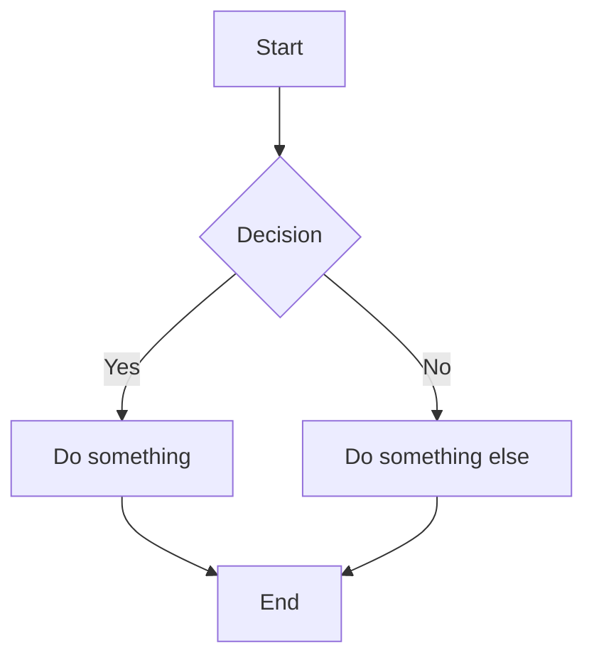
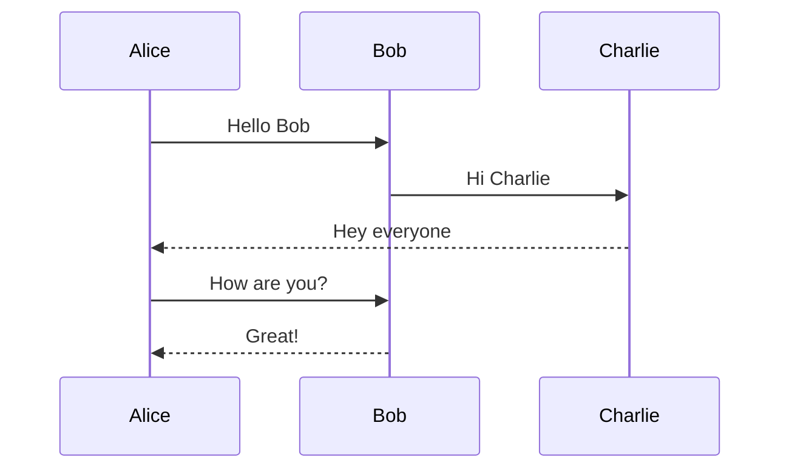
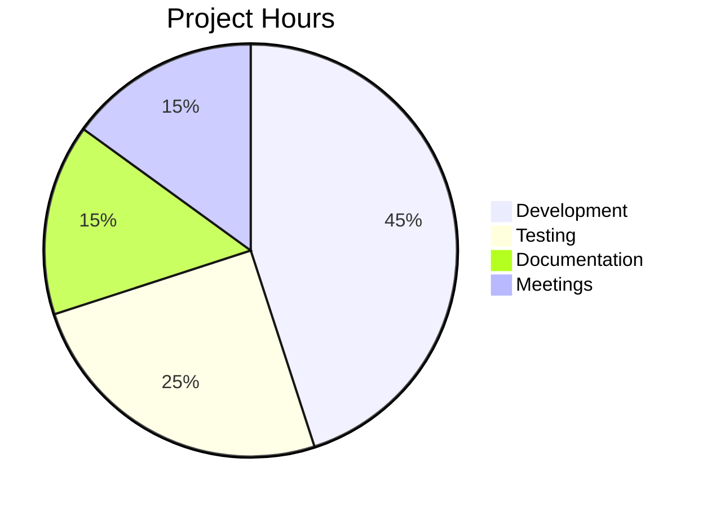
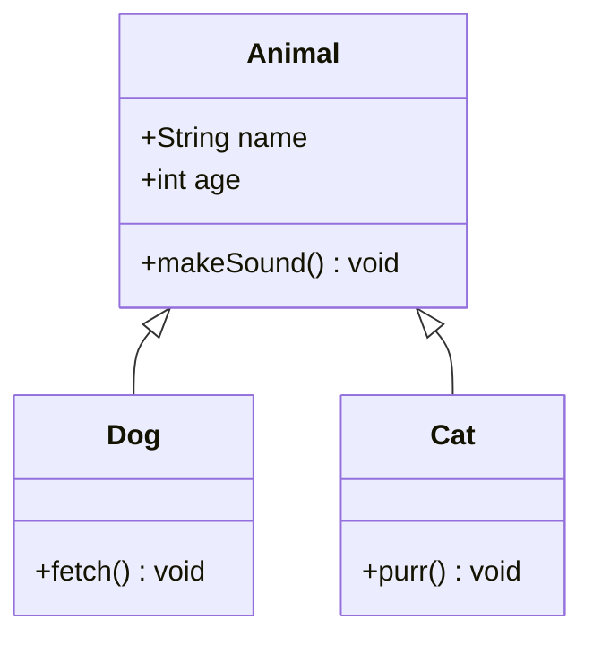

# Sample Document

This is a test document with multiple Mermaid diagram types.

## Flowchart

Some text between diagrams to verify proper spacing.

## Sequence Diagram

## Simple Pie Chart

## Class Diagram

## Regular Content

This section has no diagrams. It should render normally.

- Item 1
- Item 2
- Item 3

> A blockquote for good measure.

| Column A | Column B |
|----------|----------|
| Value 1  | Value 2  |
| Value 3  | Value 4  |

The end.
