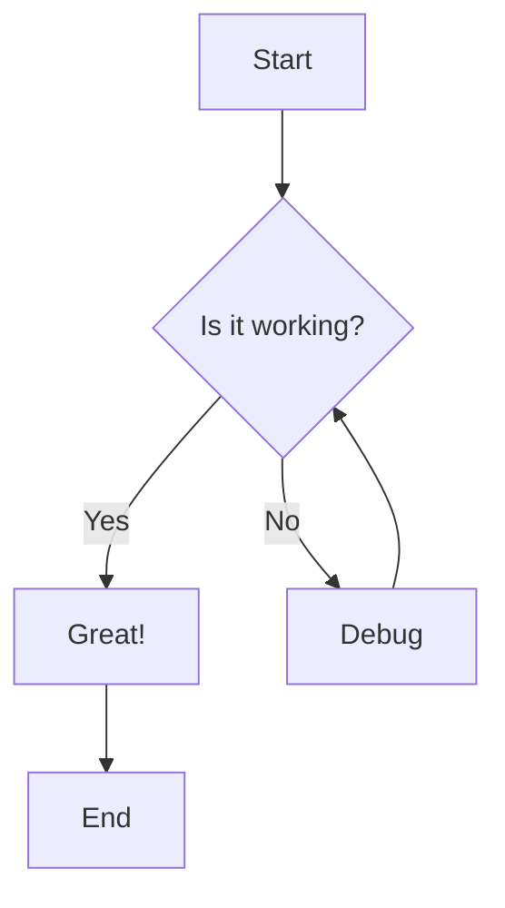
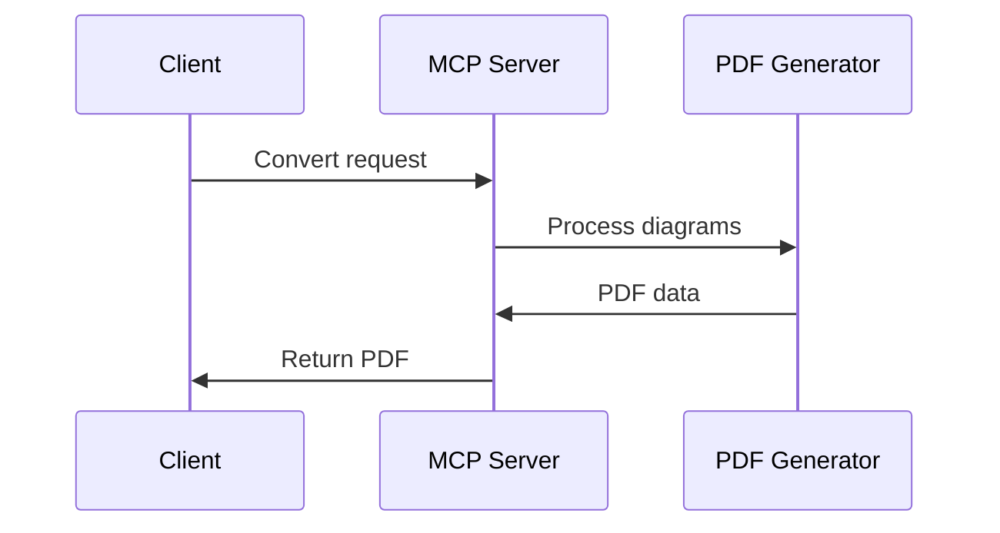
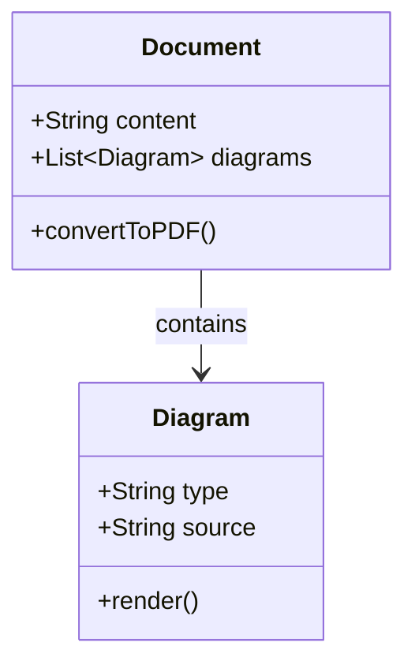

# Test MCP Integration

This is a test file to verify the MCP server integration.

## Simple Flowchart

```mermaid
graph TD
    A[Start] --> B{Is it working?}
    B -->|Yes| C[Great!]
    B -->|No| D[Debug]
    D --> B
    C --> E[End]
```

## Sequence Diagram

```mermaid
sequenceDiagram
    participant Client
    participant MCP Server
    participant PDF Generator
    
    Client->>MCP Server: Convert request
    MCP Server->>PDF Generator: Process diagrams
    PDF Generator->>MCP Server: PDF data
    MCP Server->>Client: Return PDF
```

## Class Diagram

```mermaid
classDiagram
    class Document {
        +String content
        +List~Diagram~ diagrams
        +convertToPDF()
    }
    
    class Diagram {
        +String type
        +String source
        +render()
    }
    
    Document --> Diagram : contains
```