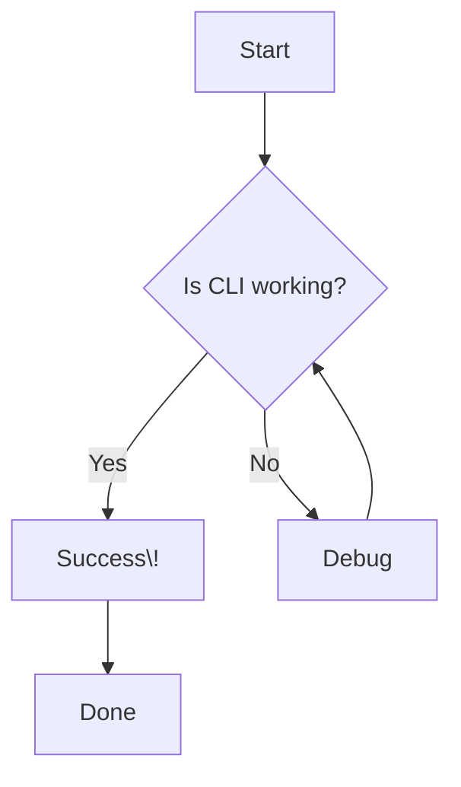

# Test Document

This is a test document for the CLI tool.

## Features
- Basic markdown support
- **Bold text**
- *Italic text*
- `Inline code`

## Mermaid Diagram



## Code Block

```javascript
function test() {
    console.log("CLI is working\!");
}
```

That's it\!
EOF < /dev/null