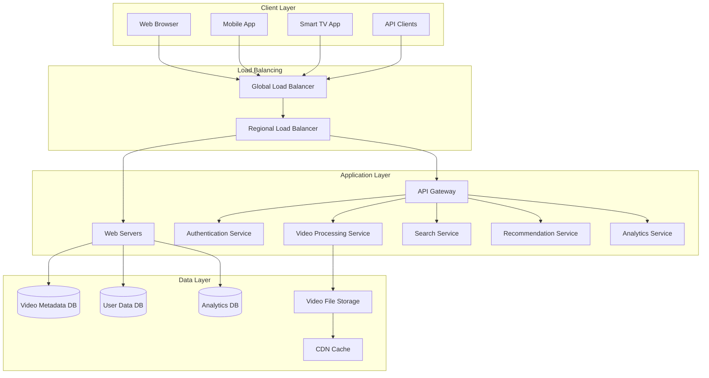
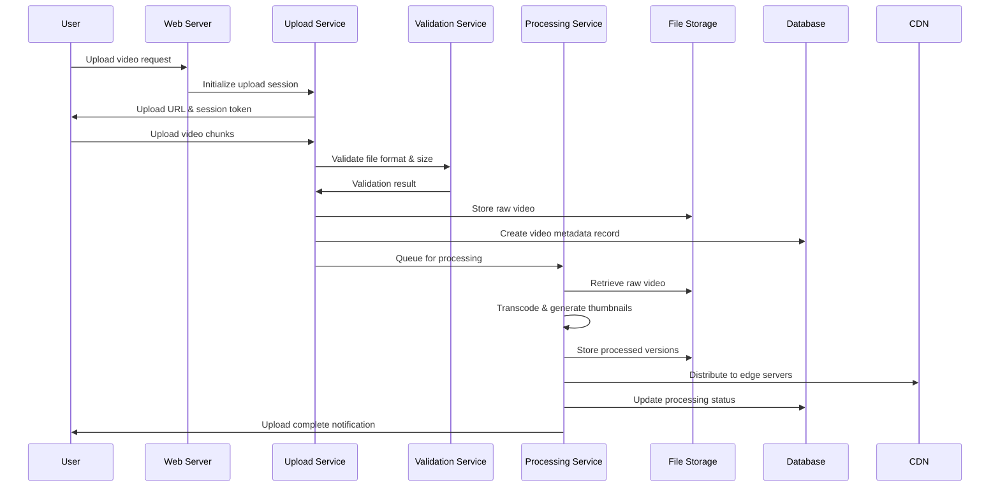
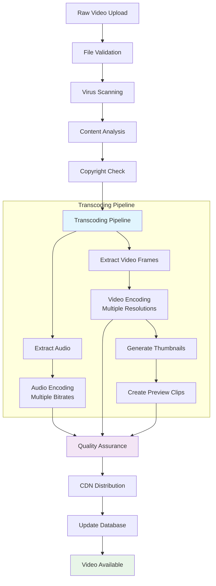
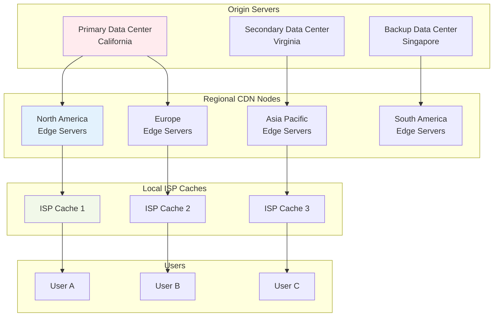
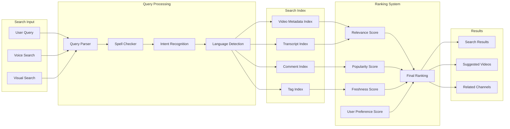
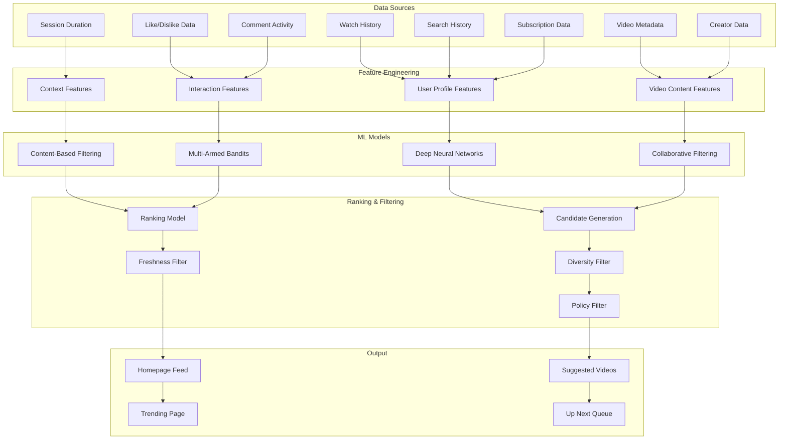
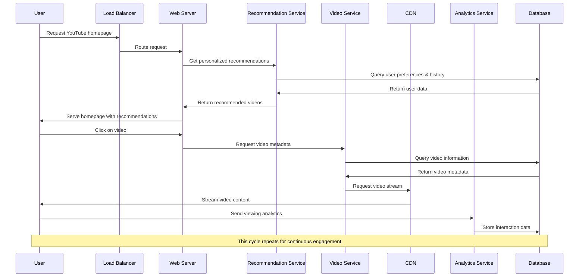
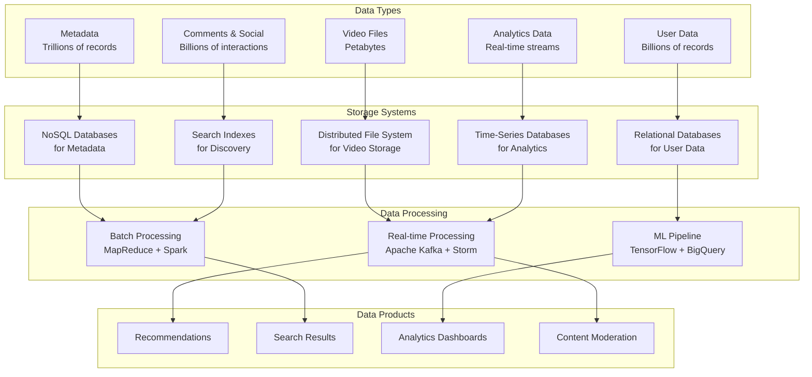
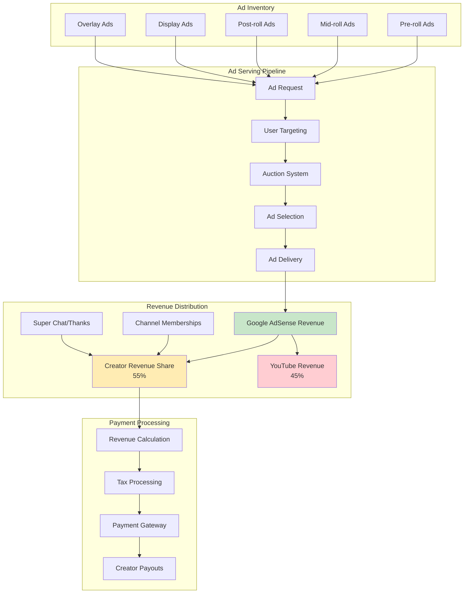

# How YouTube Works: Architecture and Systems Overview

## Table of Contents
1. [Introduction](#introduction)
2. [High-Level Architecture](#high-level-architecture)
3. [Video Upload Process](#video-upload-process)
4. [Video Processing Pipeline](#video-processing-pipeline)
5. [Content Delivery Network (CDN)](#content-delivery-network-cdn)
6. [Search and Discovery](#search-and-discovery)
7. [Recommendation System](#recommendation-system)
8. [User Interaction Flow](#user-interaction-flow)
9. [Data Management](#data-management)
10. [Monetization System](#monetization-system)

## Introduction

YouTube is one of the world's largest video-sharing platforms, serving billions of users globally. This document provides a comprehensive overview of YouTube's architecture, covering the key systems and processes that enable the platform to handle massive scale operations including video upload, processing, storage, delivery, and user interactions.

## High-Level Architecture

YouTube's architecture is built on a distributed, microservices-based approach that can handle billions of requests and petabytes of data.

## Video Upload Process

The video upload process involves multiple stages from user upload to final availability on the platform.

## Video Processing Pipeline

YouTube processes uploaded videos through multiple stages to optimize for different devices and network conditions.

## Content Delivery Network (CDN)

YouTube uses a global CDN to ensure fast video delivery worldwide.

## Search and Discovery

YouTube's search system processes billions of queries and uses machine learning for relevance ranking.

## Recommendation System

YouTube's recommendation engine is powered by machine learning algorithms that analyze user behavior and content characteristics.

## User Interaction Flow

This diagram shows the typical user journey and system interactions when watching videos.

## Data Management

YouTube manages massive amounts of structured and unstructured data across multiple storage systems.

## Monetization System

YouTube's monetization involves complex ad serving, creator payments, and revenue optimization.

## Key Performance Metrics

YouTube operates at massive scale with impressive performance metrics:

- **Video Upload Rate**: 500+ hours of video uploaded every minute
- **Daily Views**: Over 5 billion hours watched daily
- **Global Reach**: Available in 100+ countries and 80+ languages
- **CDN**: 1000+ edge servers worldwide
- **Mobile Usage**: 70%+ of watch time on mobile devices
- **Live Streaming**: Supports millions of concurrent live streams

## Technology Stack

YouTube leverages a diverse technology stack:

- **Frontend**: JavaScript, HTML5, Progressive Web App technologies
- **Backend**: Java, Python, C++, Go
- **Databases**: BigTable, Spanner, MySQL, Vitess
- **Video Processing**: FFmpeg, custom transcoding solutions
- **Machine Learning**: TensorFlow, custom neural networks
- **Infrastructure**: Google Cloud Platform, Kubernetes
- **CDN**: Google Global Cache, third-party CDN partners

## Conclusion

YouTube's architecture represents one of the most complex and scalable video platforms ever built. The system handles unprecedented scale through:

1. **Distributed Architecture**: Microservices and horizontal scaling
2. **Advanced Caching**: Multi-tier CDN with global distribution
3. **Machine Learning**: Sophisticated recommendation and search algorithms
4. **Real-time Processing**: Immediate content availability and interaction
5. **Global Infrastructure**: Worldwide data centers and edge servers

The platform continues to evolve with new features, improved performance, and enhanced user experiences while maintaining reliability at massive scale.